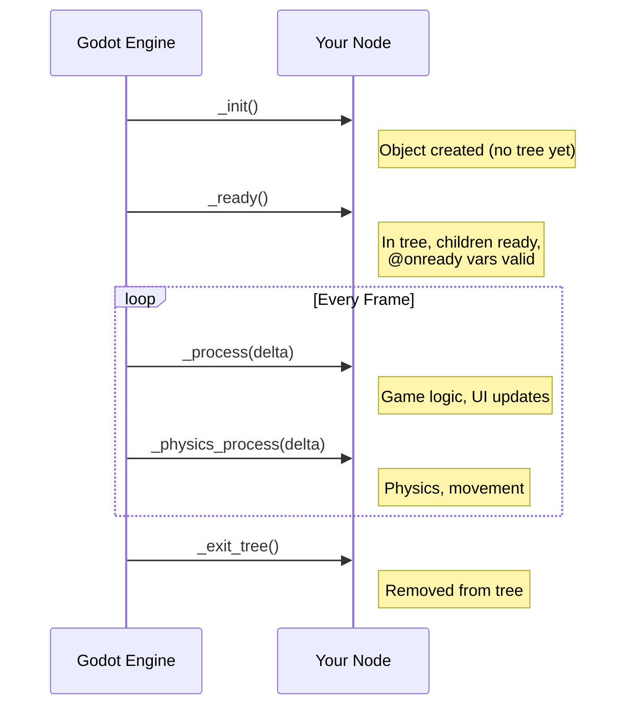

# Module 2: GDScript for Programmers

## What We Have So Far

A Godot project called Crystal Saga with a single scene containing a Sprite2D, configured for pixel-perfect rendering.

## What We're Building This Module

A script attached to our sprite that responds to keyboard input and moves around the screen. Along the way, we'll learn GDScript's syntax, Godot's virtual function system, and how input works.

## GDScript at a Glance

This module assumes you already know how to program. The goal is not to teach variables, loops, or functions from scratch; it is to give you the GDScript and Godot-specific deltas that matter when you start attaching behavior to nodes.

GDScript is Godot's built-in scripting language. It looks like Python, but it is a separate language with engine-aware features: typed node references, exported Inspector properties, virtual callbacks, signals, Resources, and autoload access.

Here's a quick taste:

```gdscript
extends Sprite2D

var speed: float = 200.0
var health: int = 100

func _ready() -> void:
    print("Hello from Crystal Saga!")

func _process(delta: float) -> void:
    if health <= 0:
        print("Game over!")
```

The important deltas:

- **One script extends one Godot class.** `extends Sprite2D` means the script is the behavior for a `Sprite2D` node.
- **Static typing is optional but required in this series.** Use explicit types for public APIs, exports, onready variables, and function signatures.
- **Virtual callbacks are engine entrypoints.** Godot calls `_ready()`, `_process(delta)`, `_physics_process(delta)`, `_unhandled_input(event)`, and similar methods for you.
- **Node paths are runtime references.** `$ChildNode` is shorthand for `get_node("ChildNode")`; use `@onready` so the child exists before you cache it.
- **Editor and runtime are connected.** `@export` makes a variable editable per scene instance in the Inspector.

> **See:** [GDScript reference](https://docs.godotengine.org/en/stable/tutorials/scripting/gdscript/gdscript_basics.html), the complete language reference covering syntax, types, and features.

## Creating and Attaching a Script

We'll add behavior to our Sprite2D from Module 1.

1. Open your `main.tscn` scene.
2. Select the `Sprite2D` node in the scene tree.
3. Click the **Attach Script** button (the scroll icon with a green `+` at the top of the scene dock), or right-click the node and choose **Attach Script**.
4. In the dialog that appears:
   - **Language:** GDScript
   - **Path:** `res://sprite_2d.gd` (default is fine for now)
   - **Template:** Default
5. Click **Create**.

The editor switches to the **Script** workspace, showing your new script:

```gdscript
extends Sprite2D


# Called when the node enters the scene tree for the first time.
func _ready() -> void:
    pass # Replace with function body.


# Called every frame. 'delta' is the elapsed time since the previous frame.
func _process(delta: float) -> void:
    pass
```

This template gives us the two most important virtual functions. Here's what they do.

## Virtual Functions: `_ready()` and `_process()`

Godot doesn't ask you to write a game loop or manage update timing. Instead, it calls specific functions on your scripts at specific moments. These are called **virtual functions** (or callbacks).

### `_ready()`

Called **once**, when the node and all its children have entered the scene tree. This is where you initialize things: set starting values, cache references to other nodes, connect signals.

```gdscript
func _ready() -> void:
    print("I'm alive! My position is: ", position)
```

Try it now: replace the `pass` in `_ready()` with that print line, save the script, and press F5. You should see the message appear in the **Output** panel at the bottom of the editor. Stop the game (F8) and continue.

### `_process(delta)`

Called **every frame**, typically 60 times per second (or more, depending on the display). The `delta` parameter is the time in seconds since the last frame. This is where you handle movement, input, animation updates, and anything that needs to happen continuously.

Why `delta`? Because frame rates vary. If your game runs at 60 FPS on one machine and 30 FPS on another, moving 5 pixels per frame would make the player move twice as fast on the faster machine. By multiplying movement by `delta`, you make motion **frame-rate independent**:

```gdscript
func _process(delta: float) -> void:
    # Without delta: moves 5 pixels per frame (speed depends on FPS)
    # position.x += 5

    # With delta: moves 200 pixels per second (consistent regardless of FPS)
    position.x += 200.0 * delta
```

> **See:** [Idle and physics processing](https://docs.godotengine.org/en/stable/tutorials/scripting/idle_and_physics_processing.html), which explains `_process()`, `_physics_process()`, and when to use each.



There's also **`_physics_process(delta)`**, which is called at a fixed rate (60 times per second by default, regardless of frame rate). We'll use this in Module 3 when we add physics-based movement. For now, `_process()` is all we need.

> **See:** [Overridable functions](https://docs.godotengine.org/en/stable/tutorials/scripting/overridable_functions.html), the full list of virtual functions Godot provides, including `_enter_tree()`, `_exit_tree()`, and `_input()`.

## Types and Data Shapes

GDScript supports dynamic typing, but we use static typing throughout the tutorial because the editor can catch API mismatches while you are wiring scenes together. That matters more than the syntax itself: most Godot bugs in this series come from the wrong node, Resource, or Dictionary shape crossing a boundary.

### Declaring Variables

```gdscript
# Explicit type annotation (our preferred style)
var speed: float = 200.0
var player_name: String = "Aiden"
var health: int = 100
var is_alive: bool = true

# Type inference with := (the type is inferred from the value)
var speed := 200.0          # float
var player_name := "Aiden"  # String

# No type (dynamic typing, works but we avoid it)
var speed = 200.0  # could be anything
```

### Common Engine Types

| Type | Example | Notes |
|------|---------|-------|
| `int` | `42` | Whole numbers |
| `float` | `3.14` | Decimal numbers |
| `bool` | `true`, `false` | |
| `String` | `"hello"` | Use double quotes |
| `Vector2` | `Vector2(10, 20)` | 2D position/direction (you'll use this *constantly*) |
| `Array[T]` | `[1, 2, 3]` | Ordered list; use typed arrays when the element type is known |
| `Dictionary` | `{hp = 100}` | Key-value pairs; useful for command payloads and save data |
| `NodePath` | `^"Sprite2D"` | Serialized path to a node |
| `Resource` | `load("res://data/items/potion.tres")` | Data asset loaded from disk |

### Constants

```gdscript
const MAX_SPEED: float = 300.0
const PLAYER_NAME: String = "Aiden"
```

Constants use `UPPER_SNAKE_CASE` and cannot be changed after declaration.

## Functions and Boundaries

```gdscript
# A function with parameters and a return type
func calculate_damage(attack: int, defense: int) -> int:
    return max(1, attack - defense)

# A function that returns nothing (void)
func take_damage(amount: int) -> void:
    health -= amount
    if health <= 0:
        die()

# A function with a default parameter
func heal(amount: int = 10) -> void:
    health = min(health + amount, max_health)
```

Notice the return type annotation (`-> int`, `-> void`). In tutorial code, a function's return type is part of its contract: if `remove_item()` returns `bool`, callers should be able to trust that `false` means nothing changed.

## Control Flow Differences

The syntax is familiar, but a few details are worth locking in:

```gdscript
# If / elif / else
if health <= 0:
    print("Dead")
elif health < 20:
    print("Critical!")
else:
    print("Fine")

# For loops
for i in range(5):          # 0, 1, 2, 3, 4
    print(i)

for item in inventory:      # iterate over an array
    print(item.name)

# While loops
while health > 0:
    health -= 1

# Match (like switch/case)
match direction:
    "up":
        velocity.y = -speed
    "down":
        velocity.y = speed
    _:
        velocity = Vector2.ZERO  # default case
```

The `match` statement routes behavior when a value can be one of several named options. That becomes important when we build state machines in Module 6 and battle command dispatch in Module 15.

> **Note:** GDScript uses `and`, `or`, and `not` instead of `&&`, `||`, and `!`. Both work, but `and`/`or`/`not` are the idiomatic choice and what we'll use throughout.

## The `@export` and `@onready` Annotations

These two annotations are GDScript-specific and very handy.

### `@export`: Edit in the Inspector

Think about Dragon Quest's towns. Every NPC shares the same basic behavior (stand in place, say a line of dialogue when you talk to them) but each one says something different. Without `@export`, you would need a separate script for every NPC: `guard_npc.gd`, `baker_npc.gd`, `child_npc.gd`, dozens of nearly identical files that differ only in their dialogue text. With `@export`, you write one `npc.gd` script and set each NPC's dialogue, name, and portrait directly in the editor. One script, dozens of unique characters.

`@export` exposes a variable in the Inspector panel, so you can tweak it per-instance without editing code:

```gdscript
@export var speed: float = 200.0
@export var player_name: String = "Aiden"
```

After adding these, select the node in the editor and look at the Inspector. You'll see `Speed` and `Player Name` as editable fields. This is how we'll customize NPCs, items, and other game objects without writing separate scripts for each one.

### `@onready`: Cache Node References

In a JRPG battle scene like Chrono Trigger's, you might update the HP bar, the character sprite, and the status icons every single frame, potentially hundreds of node lookups per second. Each `get_node()` call walks the scene tree by name, which is slow compared to using a cached reference. `@onready` grabs the reference once when the node loads and stores it in a variable, so every subsequent access is instant. It also guarantees the reference is valid; without it, you might try to grab a child node before it exists and get a null crash at startup.

`@onready` initializes a variable when `_ready()` is called, which is when the node tree is guaranteed to be built:

```gdscript
@onready var sprite: Sprite2D = $Sprite2D
@onready var health_bar: ProgressBar = $UI/HealthBar
```

The `$` operator is shorthand for `get_node()`. `$Sprite2D` means "find the child node named Sprite2D." `$UI/HealthBar` means "find the child named UI, then find its child named HealthBar."

> **Warning:** If you try to access `$Sprite2D` in a plain `var` declaration (outside `@onready`), it will fail because the node tree hasn't been built yet when `var` initializers run. Always use `@onready` for node references.

There's also `%UniqueName`, which finds a node by its **unique name** regardless of where it is in the tree. We'll use this later for UI elements that need to be found from anywhere.

## Input: Making Things Move

Now for the fun part: making our sprite respond to keyboard input.

### The Input Map

When Undertale launched, players immediately wanted to rebind controls. Some preferred WASD, others used gamepads, and accessibility needs varied. If Toby Fox had hard-coded "check if the Z key is pressed" throughout the codebase, adding gamepad support would have meant hunting down every key check and adding a parallel gamepad check beside it. Input actions solve this by putting a name between your code and the physical keys.

Godot doesn't check for raw key codes directly (though it can). Instead, it uses **actions**, named inputs that can be mapped to multiple keys, buttons, or axes. This means your game automatically works with both keyboard and gamepad without extra code.

The default project includes several built-in actions:

| Action | Default Keys |
|--------|-------------|
| `ui_up` | Arrow Up |
| `ui_down` | Arrow Down |
| `ui_left` | Arrow Left |
| `ui_right` | Arrow Right |
| `ui_accept` | Enter, Space |
| `ui_cancel` | Escape |

You can view and edit these in **Project → Project Settings → Input Map**.

> **Note:** The `ui_*` actions only map to arrow keys by default; WASD is **not** included. To add WASD support: open **Project → Project Settings → Input Map**, find `ui_up`, click the **+** button next to it, press **W**, and click **OK**. Repeat for `ui_down` (S), `ui_left` (A), and `ui_right` (D). Now both arrow keys and WASD will work.

> **Note:** `Input` is a Godot-provided global singleton. In Module 7, we will create our own project autoload, which is a script or scene Godot registers under `/root` for the lifetime of the game. Both are globally accessible by name, but engine singletons and project autoloads are different mechanisms.

### Checking Input

There are several ways to check input. The most common:

```gdscript
# Is the action currently held down? (returns true every frame it's held)
Input.is_action_pressed("ui_up")

# Was the action just pressed this frame? (returns true for one frame only)
Input.is_action_just_pressed("ui_accept")

# Was the action just released this frame?
Input.is_action_just_released("ui_accept")

# Get a value between -1 and 1 for an axis (useful for analog sticks)
Input.get_axis("ui_left", "ui_right")
```

> **See:** [Input examples](https://docs.godotengine.org/en/stable/tutorials/inputs/input_examples.html), the official tutorial covering input handling patterns.

### Moving the Sprite

Replace the contents of `sprite_2d.gd` with:

```gdscript
extends Sprite2D

@export var speed: float = 200.0


func _process(delta: float) -> void:
    var direction := Vector2.ZERO

    if Input.is_action_pressed("ui_right"):
        direction.x += 1.0
    if Input.is_action_pressed("ui_left"):
        direction.x -= 1.0
    if Input.is_action_pressed("ui_down"):
        direction.y += 1.0
    if Input.is_action_pressed("ui_up"):
        direction.y -= 1.0

    # Normalize to prevent faster diagonal movement
    if direction != Vector2.ZERO:
        direction = direction.normalized()

    position += direction * speed * delta
```

Here's what each part does:

1. **`var direction := Vector2.ZERO`**: We start with no movement. `Vector2.ZERO` is `Vector2(0, 0)`.
2. **Input checks**: We check each direction independently. Using `if` (not `elif`) allows diagonal movement.
3. **`direction.normalized()`**: Without this, moving diagonally would be ~41% faster than moving horizontally or vertically (because the diagonal of a unit square is √2 ≈ 1.414). Normalizing makes the vector length exactly 1 in all directions.
4. **`position += direction * speed * delta`**: Move the sprite by `speed` pixels per second in the input direction, scaled by `delta` for frame-rate independence.

Save the script and press F5. Use the arrow keys to move the sprite around (or WASD if you added those bindings above). The Godot icon slides smoothly across the screen.

> **JRPG Pattern:** This is "free movement," where the character moves smoothly in any direction. Some JRPGs use "grid-based movement" instead, where the character snaps from tile to tile. We'll discuss this tradeoff in Module 6 and implement free movement for Crystal Saga.

## `print()` Debugging

The simplest debugging tool is `print()`. It outputs to the **Output** panel at the bottom of the editor.

```gdscript
func _ready() -> void:
    print("Game started!")
    print("Speed is: ", speed)
    print("Position: ", position)

func _process(delta: float) -> void:
    # This will flood the output, so use sparingly!
    # print("Frame! Delta: ", delta)
    pass
```

Other useful output functions:

```gdscript
print("Normal message")              # White text in Output
push_warning("Something seems off")  # Yellow warning
push_error("Something broke!")        # Red error (doesn't crash)
printerr("Also an error")            # Error output
```

> **Warning:** Don't leave `print()` calls inside `_process()` in production code. Printing 60+ messages per second will slow your game down. Use them for debugging, then remove them.

## The Script Editor

A few tips for working in Godot's built-in script editor:

- **Ctrl+Click** on a function or variable name to jump to its definition.
- **F1** opens the built-in documentation search. Type any class name to see its full API.
- **Ctrl+Shift+D** duplicates the current line.
- **Ctrl+/** toggles comment on the selected lines.
- **Ctrl+Space** triggers autocompletion.

The built-in docs (F1) are very thorough. When you look up `Sprite2D`, you'll see every property, method, and signal the class has. We'll refer to these frequently.

## Common Gotchas

If you're coming from another language, watch for these:

### From Python
- GDScript is **not Python**. Many things look similar but work differently under the hood.
- GDScript has a `self` keyword, but you rarely need it. Member variables are accessed directly without it (`health`, not `self.health`). `self` exists for disambiguation when a local variable shadows a member variable.
- Dictionaries use `{"key": value}` syntax (with colons), not `{key: value}` without quotes (though GDScript also supports the `{key = value}` form).

### From JavaScript/TypeScript
- **Indentation matters.** Inconsistent tabs/spaces will cause errors.
- No semicolons. No braces for blocks.
- `null` is called `null` (same as JS), but types often use specific "empty" values like `Vector2.ZERO` or `""`.

### From C#/Java
- No class declarations; each `.gd` file is implicitly a class.
- `extends` instead of `: BaseClass` or `extends BaseClass`.
- No access modifiers (`public`, `private`). By convention, prefix private members with `_` (e.g., `_internal_var`).
- Arrays and dictionaries are dynamic, with no generics syntax (though typed arrays exist: `Array[int]`).

### Universal
- **Tabs for indentation**, not spaces. Godot enforces this by default.
- **Double quotes** for strings (single quotes work but double is convention).
- **Two blank lines** between functions. One blank line between logical sections within a function.

> **See:** [GDScript style guide](https://docs.godotengine.org/en/stable/tutorials/scripting/gdscript/gdscript_styleguide.html), the official style conventions for GDScript code.

## Putting It Together: A Complete First Script

Replace our movement code with a cleaner version. Copy this complete script into `sprite_2d.gd`, **replacing everything** that was there:

```gdscript
extends Sprite2D
## A simple movable sprite, our first step toward a player character.

@export var speed: float = 200.0


func _ready() -> void:
    print("Crystal Saga: sprite loaded at ", position)


func _process(delta: float) -> void:
    var direction := _get_input_direction()

    if direction != Vector2.ZERO:
        direction = direction.normalized()

    position += direction * speed * delta


func _get_input_direction() -> Vector2:
    return Vector2(
        Input.get_axis("ui_left", "ui_right"),
        Input.get_axis("ui_up", "ui_down"),
    )
```

Notice two improvements:

1. **`Input.get_axis()`**: This is a cleaner way to get directional input. It returns a float between -1 and 1, handling both keyboard and analog sticks automatically. We replaced four `if` blocks with a single `Vector2`.

2. **Extracted `_get_input_direction()`**: The input logic is now in its own function. The `_` prefix signals that it's a private helper. This is a habit worth building early; small functions with clear names make your code much easier to read and modify.

> **See:** [InputEvent](https://docs.godotengine.org/en/stable/tutorials/inputs/inputevent.html), a deep dive into Godot's input event system, including how events propagate through the scene tree.

## What We've Learned

- **GDScript** is Godot's scripting language, with Python-like syntax designed for game development.
- **Static typing** (`var x: int = 5`) catches bugs early and enables better autocompletion.
- **`_ready()`** runs once when the node enters the scene. **`_process(delta)`** runs every frame.
- **`delta`** makes movement frame-rate independent. Always multiply speed by `delta`.
- **Input actions** abstract away raw keys. `Input.is_action_pressed("ui_right")` works with keyboard and gamepad.
- **`Input.get_axis()`** is a clean way to get -1/0/1 directional input.
- **`@export`** exposes variables in the Inspector. **`@onready`** caches node references safely.
- **`$NodeName`** finds child nodes by path.
- **`print()`** is your basic debugging tool.

## Engineering Contract

- **New artifact:** `res://sprite_2d.gd`
- **Public editor surface:** exported `speed: float`
- **Runtime contract:** `_process(delta)` moves the sprite by pixels per second, not pixels per frame
- **Failure behavior:** bad node paths and type mismatches surface in the editor or Output panel
- **Boundary rule:** input is read through named actions, not raw key codes

## Engine Gotcha

`@onready` variables are initialized during `_ready()`. Plain member variable initializers run earlier, before child nodes are guaranteed to exist, so do not cache `$ChildNode` references without `@onready`.

## What You Should See

When you press F5:
- The sprite responds to arrow keys (and WASD if you added those bindings)
- Movement is smooth and consistent
- Diagonal movement is the same speed as cardinal movement (thanks to `normalized()`)
- The Output panel shows the startup print message

## Next Module

We have a moving sprite, but it's just a floating icon. In **Module 3: Thinking in Scenes**, we'll build a proper Player scene with collision physics, learn when to use `CharacterBody2D` vs other body types, and understand scene composition, the architectural principle that makes complex games manageable.
