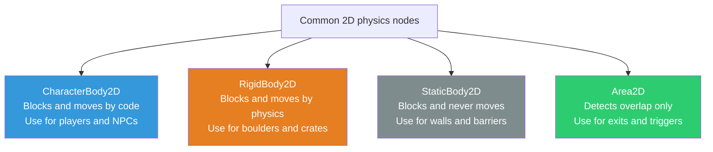
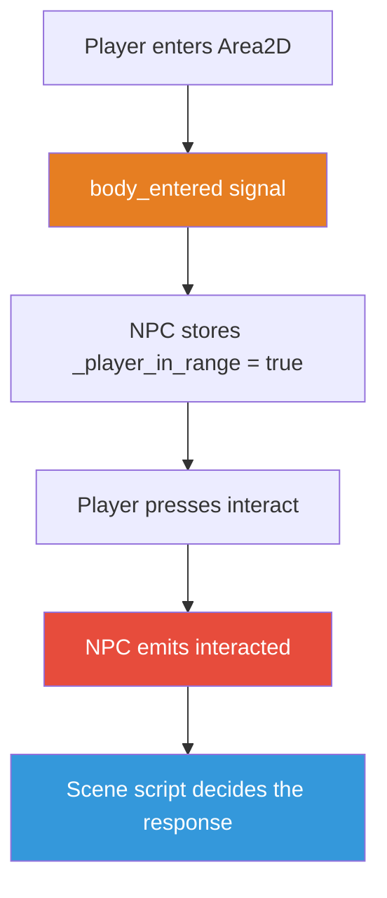

# Module 3: Thinking in Scenes

## What We Have So Far

A project with a Sprite2D that moves with keyboard input. But it's just a floating image: no collision, no physics, and if we wanted two players, we'd have to duplicate everything manually.

## What We're Building This Module

A proper Player **scene**, a reusable, self-contained character with physics-based movement and collision. We'll also learn the most important architectural principle in Godot: **scene composition**.

## Why Scenes, Not Scripts

In many engines, you think in terms of scripts: "I need a player script, an enemy script, a bullet script." In Godot, you think in terms of **scenes**: "I need a player scene, an enemy scene, a bullet scene."

A scene is a saved tree of nodes. It's a `.tscn` file on disk. When you instance a scene into another scene, it appears as a single node with its entire internal structure hidden. This means:

- The Player scene handles its own movement, animation, and collision. The Town scene just says "put a Player here."
- You can test each scene in isolation. Press F6 to run just the Player scene and verify it works before putting it in a level.
- Changes to the Player scene propagate everywhere it's instanced. Fix a bug once, and it's fixed in every level.

This is **composition over inheritance**, Godot's core design principle. It's what keeps complex games manageable.

> **See:** [Nodes and scene instances](https://docs.godotengine.org/en/stable/tutorials/scripting/nodes_and_scene_instances.html), the official guide to instancing scenes and thinking compositionally.

## Physics Bodies: Choosing the Right One

Before we build the Player scene, we need to understand the three types of physics bodies in Godot 2D. Each serves a different purpose:

### CharacterBody2D

A body you control directly with code. It moves where you tell it, and it handles collision detection and response through `move_and_slide()`. **This is what we use for the player character and NPCs.**

Use when: You want full control over movement. The character doesn't bounce or get pushed; you decide exactly how it responds to collisions.

For NPCs, choose based on intent. A shopkeeper who never moves can be a `StaticBody2D` with an `Area2D` interaction zone. An NPC who may walk, turn, join the party, or participate in cutscenes should be a `CharacterBody2D`. We use `CharacterBody2D` for actors that might later need movement behavior.

### RigidBody2D

A body governed by Godot's physics engine. It has mass, friction, and responds to forces. It bounces off walls, gets pushed by other bodies, and is affected by gravity.

Use when: You want realistic physics: a rolling boulder, a falling crate, a bouncing ball.

### StaticBody2D

A body that never moves. It exists purely for other bodies to collide with.

Use when: You need invisible walls, floors, or barriers. (In practice, we'll use TileMap collision instead, but the concept is the same.)

### Area2D

Not technically a physics body. It's a **detection zone**. It doesn't block movement; it detects when other bodies enter or exit it. We'll use these extensively for exit zones, interaction triggers, and encounter regions.

> **See:** [Physics introduction](https://docs.godotengine.org/en/stable/tutorials/physics/physics_introduction.html), which covers all body types, collision layers, and physics concepts.



For our player character, **CharacterBody2D** is the right choice. It gives us pixel-perfect collision without the unpredictability of a physics simulation. JRPGs need precise, deterministic movement, not bouncy physics.

## Building the Player Scene

We'll create a proper Player scene that we can reuse throughout the game.

### Step 1: Create a New Scene

1. Go to **Scene → New Scene** (or press `Ctrl+N`).
2. Click **Other Node** in the Scene dock.
3. Search for `CharacterBody2D` and create it.
4. Rename it to `Player`.
5. In the Inspector, find **Motion Mode** and set it to **Floating**. (The default, Grounded, is for side-scrollers. Floating is correct for top-down games because there is no floor or ceiling; every collision is treated as a wall, exactly what you want for a body that slides freely in all directions.)

### Step 2: Add Child Nodes

With `Player` selected, add these children (click `+` or press `Ctrl+A`):

1. **Sprite2D**, for displaying the character's image
2. **CollisionShape2D**, for defining the collision hitbox

Your scene tree should look like:

```
Player (CharacterBody2D)
├── Sprite2D
└── CollisionShape2D
```

### Step 3: Configure the Sprite

Select the `Sprite2D` node. In the Inspector, set the **Texture** to `icon.svg` (the Godot logo; we'll replace this with real character art in Module 6).

### Step 4: Configure the Collision Shape

Select the `CollisionShape2D` node. In the Inspector:
1. Click the **Shape** property (currently `<empty>`).
2. Select **New RectangleShape2D**.
3. In the viewport, you'll see a blue rectangle. Drag its handles to roughly match the size of the sprite.

Alternatively, set the shape's **Size** in the Inspector to match your sprite dimensions. For the Godot icon, `Vector2(64, 64)` works. (We'll resize this to something much smaller in Module 5 when we switch to 16x16 tile-based environments.)

> **Warning:** A CollisionShape2D with no shape assigned will show a yellow warning triangle in the scene tree. Always assign a shape; otherwise, your CharacterBody2D can't detect collisions.

### Step 5: Save the Scene

Save as `res://player/player.tscn`. Create the `player` folder first: right-click in the **FileSystem** dock and choose **New Folder**, name it `player`. Keeping scenes organized in folders is a habit worth building now.

> **Note:** The convention is to name folders and files in `snake_case`. The scene file and its primary script should share a name: `player.tscn` and `player.gd`.

## `move_and_slide()`: Physics-Based Movement

In Module 2, we moved the sprite by directly modifying `position`. That works for a floating image, but it ignores collisions entirely; the sprite would pass through walls. `CharacterBody2D` gives us `move_and_slide()`, which moves the body and automatically handles collisions.

Attach a new script to the Player node. Save it as `res://player/player.gd`:

```gdscript
extends CharacterBody2D
## The player character. Handles input-based movement with collision.

@export var speed: float = 200.0


func _physics_process(delta: float) -> void:
    var direction := Vector2(
        Input.get_axis("ui_left", "ui_right"),
        Input.get_axis("ui_up", "ui_down"),
    )

    if direction != Vector2.ZERO:
        direction = direction.normalized()

    velocity = direction * speed
    move_and_slide()
```

This looks similar to our Module 2 script, but with key differences:

### `_physics_process()` instead of `_process()`

We switched from `_process()` to `_physics_process()`. Here's why:

- **`_process(delta)`** runs every *rendering* frame. The rate varies based on GPU load and display refresh rate.
- **`_physics_process(delta)`** runs at a *fixed* rate, 60 times per second by default, regardless of frame rate.

For physics-based movement (anything using `move_and_slide()`), always use `_physics_process()`. It ensures consistent collision detection. If physics runs at variable rates, objects can clip through walls during frame rate drops.

> **See:** [Idle and physics processing](https://docs.godotengine.org/en/stable/tutorials/scripting/idle_and_physics_processing.html), which explains the difference in depth and when to use each.

### `velocity` and `move_and_slide()`

`CharacterBody2D` has a built-in `velocity` property (a `Vector2`). We set it to our desired direction × speed, then call `move_and_slide()`. This function:

1. Moves the body along the velocity vector
2. Detects collisions
3. Slides along surfaces instead of stopping dead
4. Automatically handles `delta` internally (which is why we don't multiply by `delta` ourselves)

> **Note:** `move_and_slide()` handles delta time internally. You set `velocity` in pixels per second, and the method figures out how far to move this physics tick. Don't multiply by `delta` when setting `velocity` for `move_and_slide()`.

> **See:** [CharacterBody2D](https://docs.godotengine.org/en/stable/classes/class_characterbody2d.html), the full API reference for the class, including all properties and methods.

## Instancing the Player into a Scene

Now we need a scene to put our Player in. Go back to `main.tscn`:

1. Open `main.tscn`.
2. Delete the old `Sprite2D` node (select it, press **Delete** or right-click → **Delete Node**). Also delete the `sprite_2d.gd` file from the **FileSystem** dock (right-click → **Delete**). We won't need it anymore.
3. You should have just the `Main` (Node2D) root.
4. Drag `player/player.tscn` from the FileSystem dock into the viewport, or right-click `Main` and choose **Instance Child Scene** and select `player.tscn`.

Your scene tree now shows:

```
Main (Node2D)
└── Player (player.tscn instance)
```

Notice that the Player node has a little "link" icon, which indicates it's an **instance** of another scene. If you click the arrow next to it, you can expand it to see its children (Sprite2D, CollisionShape2D), but they're grayed out because they belong to the instanced scene.

Press F5. You should be able to move around, but there's nothing to collide with yet. We'll add walls in Module 5 when we build the tilemap.

## The Scene Tree at Runtime

When the game runs, every node exists in a single **scene tree**. The tree has a root (always called `root`), and everything branches from there:

```
root (Window)
└── Main (Node2D)
    └── Player (CharacterBody2D)
        ├── Sprite2D
        └── CollisionShape2D
```

You can navigate this tree in code:

```gdscript
# From any node, get the scene tree:
get_tree()

# Get the root:
get_tree().root

# Get a specific node by path:
get_node("/root/Main/Player")

# Get the parent of the current node:
get_parent()

# Get a child by name (shorthand with $):
$Sprite2D          # same as get_node("Sprite2D")
$"Long Node Name"  # use quotes for names with spaces
```

> **See:** [Scene tree](https://docs.godotengine.org/en/stable/tutorials/scripting/scene_tree.html), covering how the scene tree works at runtime, including node ordering and groups.

## Signals: A First Look

Signals are Godot's event system, a way for nodes to communicate without knowing about each other. A node emits a signal ("something happened"), and other nodes can connect to it ("when that happens, run this function").

Here's a simple example. Add an **Area2D** node to `main.tscn`:

1. Select the `Main` node.
2. Add a child **Area2D** node. Rename it to `TestZone`.
3. Add a **CollisionShape2D** as a child of `TestZone`.
4. Set the shape to a `RectangleShape2D` and make it reasonably large (e.g., 100x100 pixels).
5. Position it somewhere the player will walk into.

Before connecting the signal, the `Main` node needs a script. Right-click `Main` in the Scene dock and choose **Attach Script**. Accept the defaults (path: `res://main.gd`) and click **Create**.

Now connect the Area2D's signal:

1. Select the `TestZone` (Area2D) node.
2. Click the **Node** tab (right side of the editor, next to the Inspector tab; it has a signal icon).
3. Find `body_entered(body: Node2D)` in the signal list.
4. Double-click it. A connection dialog appears.
5. Select the `Main` node as the receiver and click **Connect**.

Godot creates a function in `Main`'s script:

```gdscript
func _on_test_zone_body_entered(body: Node2D) -> void:
    print("Something entered the zone: ", body.name)
```

Run the game and walk into the zone. The output panel prints the player's name. The Area2D detected the collision and told the Main node about it, without either node knowing the other's internal details.

> **Note:** This works because both the Player (CharacterBody2D) and the TestZone (Area2D) are on collision layer 1 by default. If `body_entered` doesn't fire, check that both nodes share a collision layer: select the node, expand **Collision** in the Inspector, and verify that at least one **Layer** bit matches the other node's **Mask** bit. All nodes default to layer 1 and mask 1, so this works out of the box. You only need to change layers when you want certain objects to ignore each other (e.g., letting projectiles pass through walls but hit enemies).

Before you delete the `TestZone`, walking into it prints a message; that confirms the signal fired. Once you've verified it in the **What You Should See** check below, delete the `TestZone` node from `main.tscn`. It was just for learning. We won't need it going forward.

This is the signal pattern we'll use throughout Crystal Saga:
- Exit zones signal "the player wants to leave" → the SceneManager handles the transition (Module 7)
- NPCs signal "interaction started" → the dialogue system displays text (Module 11)
- The battle system signals "turn started" → the UI updates (Module 14)

### Signal Auto-Disconnection

An important detail: when a node is **freed** (removed from the tree and deleted), all signal connections involving that node are automatically cleaned up. You don't need to manually disconnect signals in most cases.

This matters when we start changing scenes in Module 7. When we leave a town and enter a forest, all the town's nodes are freed, and all their signal connections disappear cleanly. No dangling references, no crashes.

> **See:** [Instancing with signals](https://docs.godotengine.org/en/stable/tutorials/scripting/instancing_with_signals.html), which connects scene instancing with signal-based communication.



## Scene Files: `.tscn` Under the Hood

Scene files (`.tscn`) are plain text. You can open one in any text editor. Here's a simplified look at what `player.tscn` might contain:

```ini
[gd_scene load_steps=3 format=3]

[ext_resource type="Script" path="res://player/player.gd" id="1"]
[ext_resource type="Texture2D" path="res://icon.svg" id="2"]

[node name="Player" type="CharacterBody2D"]
script = ExtResource("1")
speed = 200.0

[node name="Sprite2D" type="Sprite2D" parent="."]
texture = ExtResource("2")

[node name="CollisionShape2D" type="CollisionShape2D" parent="."]
shape = SubResource("RectangleShape2D_abc12")
```

You almost never need to edit these by hand, but knowing they're text files is useful:
- They diff well in version control (git).
- You can search for specific values if something seems wrong.
- Merge conflicts in `.tscn` files are manageable (if ugly).

## Organizing Your Project

Now is a good time to establish a folder structure. Here's the layout we'll use for Crystal Saga, growing as we add systems:

```
CrystalSaga/
├── project.godot         # Project configuration
├── icon.svg              # Default icon (we'll replace later)
├── player/
│   ├── player.tscn       # Player scene
│   └── player.gd         # Player script
└── main.tscn             # Test scene (will become our first level)
```

The pattern: **each "thing" gets a folder with its scene and script(s).** As the project grows, we'll add `npcs/`, `ui/`, `scenes/`, `resources/`, `autoloads/`, and more.

## What We've Learned

- **Scenes** are reusable node trees saved as `.tscn` files. They're Godot's primary organizational unit.
- **Scene composition**: complex behavior comes from combining simple, focused nodes, not from one monolithic script.
- **CharacterBody2D** is for player-controlled characters. **RigidBody2D** is for physics-driven objects. **Area2D** is for detection zones.
- **`move_and_slide()`** handles movement and collision response. Use it in `_physics_process()`.
- **`_physics_process()`** runs at a fixed rate for consistent physics. **`_process()`** runs every rendering frame.
- **Signals** let nodes communicate without tight coupling. `body_entered` on Area2D detects when bodies enter a zone.
- Signal connections are **automatically cleaned up** when a node is freed.
- **Instancing** lets you place one scene inside another, keeping internals hidden.

## Engineering Contract

- **New artifact:** reusable `Player` scene and `player.gd`
- **Public editor surface:** player speed and collision shape
- **Runtime contract:** movement uses `CharacterBody2D.move_and_slide()`; the player will be registered in the `player` group in Module 7
- **Failure behavior:** if no collision shape exists, movement works visually but collision will not block walls
- **Boundary rule:** levels find the player by group, not by hard-coded scene path

## Engine Gotcha

`CharacterBody2D` does not move automatically when you set `velocity`; you must call `move_and_slide()` during physics processing. For stationary collision, prefer `StaticBody2D` instead of writing a no-op movement body.

## What You Should See

When you press F5:
- The player (Godot icon) moves with arrow keys (and WASD if you added those bindings in Module 2)
- Walking into the TestZone prints a message in the Output panel
- The player moves smoothly with physics-based collision

## Next Module

We have a moving, collision-aware player, but the world is empty. Next, **Module 4** consolidates Part I with a cheat sheet and review of everything from the editor through scenes and signals. Then in **Module 5: TileMaps and Terrain**, we'll build the town of Willowbrook using Godot's TileMapLayer system. We'll create a tileset from a sprite sheet, paint a multi-layered map, and give our player actual walls to bump into.
