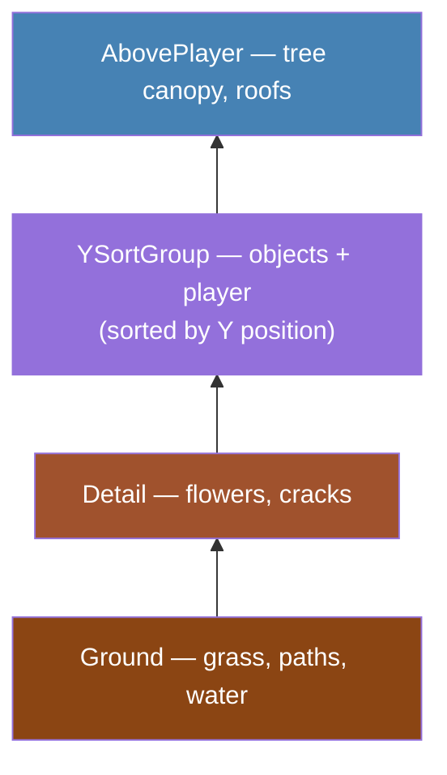

# Module 5: The Overworld: TileMaps and Terrain

## What We Have So Far

A Player scene (CharacterBody2D with sprite and collision) that moves with keyboard input and handles physics. But the world is empty, just a blank screen.

## What We're Building This Module

The town of **Willowbrook**, Crystal Saga's starting village. We'll build it using Godot's TileMapLayer system: painting ground, paths, buildings, and water onto a grid, with collision so the player can't walk through walls.

By the end, you'll have a real place to explore.

## How TileMaps Work: A Conceptual Model

Imagine drawing the entire overworld of Chrono Trigger as a single image. It would be enormous, impossible to edit without redrawing entire sections, and you could not add collision without manually painting invisible walls on top. Tilemaps solve all of this. Because every grass patch uses the same 16x16 tile, the game only stores that tile image once and stamps it across the map. Editing is fast: to widen a path, you repaint a few cells instead of redrawing a building. And collision is built in: you mark wall tiles as solid once, and every wall in the game blocks the player automatically. This is why nearly every 2D RPG from Final Fantasy to Stardew Valley uses tilemaps.

Before we touch any code, here's the core idea.

A tilemap is a grid of small images (tiles) assembled into a larger scene, like placing mosaic tiles to create a picture. Instead of drawing an entire town as one massive image, you draw it from reusable 16x16 or 32x32 pixel pieces: a grass tile, a path tile, a wall tile, a roof tile.

Think of it like transparent sheets stacked on top of each other:

```
Layer 4: AbovePlayer:  treetops, roof overhangs (drawn on top of the player)
Layer 3: Objects:      trees, rocks, signs, fences
Layer 2: Detail:       flowers, cracks, path borders
Layer 1: Ground:       grass, dirt, water
```

Each layer is a separate **TileMapLayer** node. The ground layer covers every tile. The detail layer has sparse decorations. The object layer has things the player walks behind. The above-player layer draws on top of everything, including the player.

This is exactly how professional 2D games are built, including most of the JRPGs you've played.

> **See:** [Using TileSets](https://docs.godotengine.org/en/stable/tutorials/2d/using_tilesets.html), creating TileSet resources from tile sheets.

> **See:** [Using TileMaps](https://docs.godotengine.org/en/stable/tutorials/2d/using_tilemaps.html), painting tiles, configuring layers, and adding physics to tiles.



## TileMapLayer, not TileMap

You may see older tutorials reference a node called `TileMap`. That node is **deprecated** as of Godot 4.3. The replacement is `TileMapLayer`, one node per layer, instead of one node with multiple internal layers.

`TileMapLayer` is simpler to use and gives you direct control over each layer as an independent node in the scene tree. Each layer can have its own z-order, visibility toggle, and physics settings.

Throughout this tutorial, we always use `TileMapLayer`.

> **See:** [TileMapLayer](https://docs.godotengine.org/en/stable/classes/class_tilemaplayer.html), the API reference for the current tilemap node.

## Getting a Tile Sheet

To build a tilemap, you need a **tile sheet**, an image file containing all your tiles arranged in a grid.

For this tutorial, we recommend **Kenney's Tiny Town pack**, a free, public-domain tileset that includes everything we need:

1. Go to [kenney.nl/assets/tiny-town](https://kenney.nl/assets/tiny-town) and click **Download**.
2. Extract the ZIP file.
3. In the extracted folder, find `tilemap_packed.png` (at the root of the ZIP, not in a subfolder).
4. Create a `tilesets` folder in your project: right-click in the **FileSystem** dock → **New Folder** → name it `tilesets`.
5. Copy `tilemap_packed.png` into `res://tilesets/` (drag it into the FileSystem dock, or copy it into the folder on disk).
6. Rename it to `town_tiles.png` if you like, or keep the original name.

This sheet contains grass, paths, water, walls, trees, buildings, and more, all in a 16x16 grid. It's everything we need for Willowbrook.

> **Alternatives:** If you can't download assets, you can create a minimal placeholder. Open any image editor, create a 80x16 PNG with five 16x16 colored squares: green (#4a7c3f) for grass, brown (#8b6914) for path, blue (#3b6bb5) for water, gray (#808080) for walls, and tan (#c4a882) for floor. Save as `res://tilesets/town_tiles.png`. You can replace it with real art later.

For Crystal Saga, we need at least these tile types:
- Grass (walkable ground)
- Path/dirt (walkable)
- Water (not walkable)
- Wall/building exterior (not walkable)
- Building interior floor (walkable)

> **JRPG Pattern:** Most classic JRPGs use 16x16 pixel tiles. Some use 32x32 for more detail. The choice affects the overall aesthetic. We'll use **16x16** tiles for an authentic retro feel. You can use 32x32 if you prefer a more detailed look.

## Creating the TileSet

A **TileSet** is a resource that tells Godot how to interpret your tile sheet: where each tile is, how big they are, and what properties they have (collision, animation, etc.).

### Step 1: Create the Town Scene

1. Create a new scene (Scene → New Scene).
2. Add a **Node2D** as the root. Rename it to `Willowbrook`.
3. Create the folder structure first: right-click in the **FileSystem** dock → **New Folder** → name it `scenes`. Then right-click `scenes` → **New Folder** → name it `willowbrook`. Save as `res://scenes/willowbrook/willowbrook.tscn`.

### Step 2: Add the First TileMapLayer

1. With `Willowbrook` selected, add a child **TileMapLayer** node.
2. Rename it to `Ground`.

### Step 3: Create a TileSet

1. Select the `Ground` node.
2. In the Inspector, find the **Tile Set** property.
3. Click it and choose **New TileSet**.
4. Click the TileSet resource to expand it in the **Inspector** (right panel). Find the **Tile Size** property and set it to `16x16` (or your tile size).

> **Warning:** You must set the tile size before creating an atlas source. If the tile size doesn't match your tile sheet's grid, Godot will slice the image incorrectly, and every tile coordinate will be wrong. Set it first, then add the atlas.

### Step 4: Create an Atlas Source

The TileSet panel appears at the bottom of the editor.

1. In the TileSet panel, click the **+** button to add a source.
2. Choose **Atlas**.
3. Drag your tile sheet image (`town_tiles.png`) into the **Texture** property.
4. Godot will ask if you want to **create tiles automatically**. Click **Yes**.

You should see your tile sheet with a grid overlay. Each grid cell is one tile, and Godot has created a tile entry for each one.

> **Note:** If Godot doesn't prompt you automatically, click the three-dot menu (⋮) in the TileSet panel and choose **Create Tiles in Non-Transparent Texture Regions**. If that option isn't available, make sure your Tile Size matches your tile sheet's grid.

> **Warning:** If the grid doesn't align with your tiles, double-check that the **Tile Size** in the TileSet matches your tile sheet's grid size. Misaligned grids are the #1 tileset setup problem.

### Step 5: Save the TileSet as an External Resource

If you leave the TileSet embedded in one layer, each additional layer gets its own separate copy. When you later add collision to a wall tile, you would have to add it in four separate TileSets (one per layer) and keeping them synchronized becomes a nightmare. Saving the TileSet as an external `.tres` file means all layers reference the same data. Change a tile's collision once, and it applies everywhere.

Right now, the TileSet is embedded inside the `Ground` node. We want to share it across multiple layers.

1. Click the dropdown arrow next to the TileSet property.
2. Choose **Save** (or **Save As**).
3. Save it to `res://tilesets/town_tileset.tres`.

Now we can assign this same TileSet to other TileMapLayer nodes.

## Setting Up Multiple Layers

Add three more TileMapLayer nodes as children of `Willowbrook`:

```
Willowbrook (Node2D)
├── Ground (TileMapLayer)
├── Detail (TileMapLayer)
├── Objects (TileMapLayer)
└── AbovePlayer (TileMapLayer)
```

For each new layer:
1. Set the **Tile Set** property to your saved `town_tileset.tres` (drag it from the FileSystem dock or click Load).

The layers are drawn in tree order: `Ground` first (bottom), `AbovePlayer` last (top). The player sprite should render between `Objects` and `AbovePlayer`. We'll handle this with Y-sorting in Module 6.

### Why Four Layers?

| Layer | Purpose | Example Tiles |
|-------|---------|---------------|
| Ground | Covers every cell. The base terrain. | Grass, dirt, water, stone |
| Detail | Sparse decorations on top of ground. | Flowers, path edges, cracks |
| Objects | Things the player walks behind (lower half) or in front of (upper half). | Trees, rocks, fences, signs |
| AbovePlayer | Drawn on top of everything, including the player. | Treetop canopy, roof overhangs, bridge railings |

This layering creates depth. The player walks on the ground, behind trees, and under overhanging roofs, all without any complex rendering tricks.


## Painting Tiles

Now for the fun part. Select a TileMapLayer node and start painting:

1. Select the `Ground` layer in the scene tree.
2. The TileMap editor panel appears at the bottom of the screen.
3. Select a tile from the tile palette (your tile sheet is shown as a grid of clickable tiles).
4. Click or click-and-drag in the viewport to paint tiles.

### Painting Tools

The TileMap editor toolbar offers several painting tools. All of them work in the **2D viewport**, not in the TileSet panel itself. Select a tile from the palette, then paint in the viewport.

| Tool | What It Does | Shortcut |
|------|-------------|----------|
| Paint | Place one tile at a time (click or drag) | Default mode |
| Line | Draw a straight line of tiles between two points | Hold **Shift** while in Paint mode |
| Rectangle | Fill a rectangular area with one drag | Hold **Ctrl+Shift** while in Paint mode |
| Bucket Fill | Fill a contiguous region with the selected tile | Separate tool button |
| Eraser | Remove tiles | **Right-click** in any mode |
| Picker | Grab a tile from the viewport to use as your brush | Hold **Ctrl** and click in Paint mode |

The Line and Rectangle modes are temporary holds, not separate tool buttons. You stay in Paint mode and hold the modifier keys when you need them. This is faster than switching tools constantly.

**Selecting multiple tiles:** In the TileSet palette at the bottom, click and drag to select a rectangular group of tiles. When you paint with a multi-tile selection, the entire group is placed as one unit. This is how you place multi-tile objects like buildings, large trees, or decorative structures that span several cells.

**Randomization:** If you select multiple individual tiles (Shift+click in the palette), the Paint tool randomly picks one of them for each cell you paint. This is useful for ground variation — select three or four grass variants, then paint freely and the ground gets natural-looking variety without you placing each variant by hand.

**Scattering:** Set the Scattering value above 0 in the TileMap toolbar to randomly skip cells while painting. Treat this as a rough-in tool only. For Crystal Saga, final decoration should be hand-edited: a few flowers by a path, cracks near old stone, grass tufts where they make visual sense. Do not leave broad percentage-painted decoration in the finished map.

> **See:** [Using TileMaps](https://docs.godotengine.org/en/stable/tutorials/2d/using_tilemaps.html), the official guide covering all painting tools, randomization, scattering, and patterns.

### Building Willowbrook

This is the creative part. You're designing a town by painting tiles directly in the Godot editor — there's no "right answer" and no grid template to follow. Think about what a small starting village looks like in the JRPGs you've played: a few buildings connected by paths, some trees and natural features, and a clear exit leading to the next area.

**Design goals for Willowbrook:**

- **Paths** that connect buildings and lead to an exit on the south edge (the player will walk to the forest in Module 7)
- **Two or three buildings** (a shop, an inn, and an elder's house are enough for now)
- **Some water** on one side — a pond or a stream running along an edge
- **Trees** around the perimeter to create natural boundaries and make the town feel nestled in the surrounding wilderness
- **Open space** — don't fill every cell. Leave room for the player to walk around, and leave some grass visible. Real towns have empty space.

**If you've never designed a tilemap before,** here's a starter layout to work from. You can modify it freely; the goal is to give you a concrete starting point rather than a blank canvas:

```
Key: . = grass, # = path, W = water, T = tree, B = building, _ = exit

          North
    T T T T T T T T T T
    T . . . B B . . . T
    T . . . # # . . . T
    T . B B # # . . . T
    T . . . # # B B . T
    T . . . # # . . . T
    T W W . # # . . . T
    T W W . # # . . . T
    T . . . # # . . . T
    T T T T _ _ T T T T
          South (exit)
```

Place buildings as 2x2 or 3x2 clusters of wall/roof tiles. The path runs north-south through town, with branches to each building. Water sits in the west. Trees ring the perimeter. The south edge has a gap for the exit to the forest (Module 7).

**Paint it layer by layer:**

1. **Ground layer first.** Select the `Ground` layer in the scene tree. Pick a grass tile from the palette. Use **Bucket Fill** to cover a generous area (around 30x20 tiles or larger — you can always shrink it later). Now switch to the **Paint** tool, select a path or dirt tile, and paint the paths by hand. Drag them in natural shapes: a main road through town, a few branches to the buildings. Add water tiles along one edge. Press **F6** to run the scene and walk around. Adjust until it feels like a good size — not so small that it's cramped, not so large that it's empty.

2. **Objects layer.** Select the `Objects` layer. Paint buildings as rectangular clusters of wall and roof tiles. Place trees around the edges and between buildings. Add fences, signs, or rocks where they make sense. Use **Ctrl+click** (Picker) to grab tiles from the viewport when you want to reuse something you already placed. If your tile sheet has multi-tile objects (like a 2x2 tree), select all the tiles as a group in the palette and place them together.

3. **Detail layer.** Select the `Detail` layer. This is for the finishing touches: flowers along paths, cracks in stone, grass variations over the base ground, path border tiles that soften the edge between dirt and grass. **Keep it sparse and intentional.** Place a few details where the player's eye should go. If you use Scattering to sketch ideas, immediately hand-edit the result so the final map does not look sprayed on.

4. **AbovePlayer layer.** If you have treetop canopy tiles or roof overhangs, place them on this layer. Anything here draws on top of the player sprite, which creates the illusion of walking under trees or into doorways.

After each layer, press **F6** to run and walk around. Does it look right? Is there enough room to move? Are the buildings visible? Adjust as you go.

> **Tip:** Middle-click and drag to pan the viewport. Scroll wheel to zoom. Right-click erases, and **Ctrl+click** picks a tile from the viewport. Get comfortable with these controls and painting goes fast.

## Adding Collision to Tiles

Right now, the player walks through everything. We need to mark certain tiles as solid.

### Step 1: Add a Physics Layer to the TileSet

1. Select any TileMapLayer node to access the TileSet.
2. In the Inspector, expand the TileSet resource.
3. Under **Physics Layers**, click **Add Element**.
4. This creates a physics layer that tiles can use for collision.

### Step 2: Mark Tiles as Solid

1. In the TileSet panel (bottom of editor), click the **Paint** tab (not "Setup" or "Select").
2. In the paint property dropdown (left side of the panel), select **Physics Layer 0**.
3. Now click on each tile that should be solid: wall tiles, water tiles, tree trunks, and building exteriors. Each click fills the tile with a blue collision rectangle.
4. If you need to remove collision from a tile, right-click it to clear it.

> **Alternative method:** If you prefer more control, switch to the **Select** tab instead. Click on a tile, then in the properties panel on the right, expand **Physics → Physics Layer 0**. Click **Add Collision Polygon**, or right-click the collision area and choose **Reset to default tile shape** to fill the entire tile. The Paint method above is faster for marking many tiles at once.

Repeat until every tile type that should block the player has collision: walls, water, tree trunks, building exteriors.

> **Note:** You only need to set collision on the tile *definition* in the TileSet, not on each placed tile individually. Once a tile type has collision, every instance of that tile on the map is solid.

> **Warning:** All four TileMapLayers share the same TileSet, so a tile marked as solid will block the player on *any* layer it appears. If the player seems stuck in open areas, check whether a ground tile (like grass or dirt) was accidentally given collision. Only mark tiles that should actually block movement: walls, water, tree trunks, and building exteriors.

### Step 3: Test It

First, resize the player's collision shape to fit the tile-based world. Open `player/player.tscn`, select the `CollisionShape2D` node, and in the Inspector set the shape's **Size** to `Vector2(14, 10)` and **Position** to `Vector2(0, 4)`. The 64x64 collision from Module 3 was sized for the Godot icon, and it's far too large for 16x16 tile corridors. The smaller shape represents the player's feet, so they can walk through tile-width paths.

Instance the Player scene into `Willowbrook` (drag `player/player.tscn` from the FileSystem dock into the viewport). Run with **F6** (which runs the current scene directly, not F5, which runs the main scene). Try walking into walls and water. The player should collide and slide along surfaces.

> **Note:** Your main scene is still `main.tscn` from Module 1. That's fine; we use F6 to test Willowbrook directly. In Module 7, we'll build a proper SceneManager and set up scene transitions.

## Camera2D: Following the Player

Play any early Legend of Zelda game and you will feel the camera snap rigidly to Link's position, where every pixel of movement translates directly to camera movement, which feels jittery at high speeds. Modern JRPGs like OMORI use camera smoothing so the viewport glides gently to follow the player, creating a more cinematic feel. Camera limits are equally important: without them, the camera reveals the void beyond the map edge when the player walks near a boundary, breaking the illusion that this is a real place. Pokemon never lets you see past the edge of a route for exactly this reason.

If your map is larger than the screen, you need a camera. Open the Player scene (`player.tscn`) and add a **Camera2D** node as a child:

```
Player (CharacterBody2D)
├── Sprite2D
├── CollisionShape2D
└── Camera2D
```

Select the Camera2D and set these properties in the Inspector:

- **Enabled:** `true` (should be by default)
- **Position Smoothing → Enabled:** `true`
- **Position Smoothing → Speed:** `5.0`

The camera now follows the player with a slight smoothing effect, which feels much better than rigid 1:1 tracking.

### Camera Limits

To prevent the camera from showing empty space beyond the map edges, set camera limits:

In the Camera2D Inspector:
- **Limit → Left:** `0`
- **Limit → Top:** `0`
- **Limit → Right:** your map's width in pixels (e.g., `640`)
- **Limit → Bottom:** your map's height in pixels (e.g., `480`)

To calculate your map's pixel dimensions: count the tiles you painted horizontally and vertically, then multiply by the tile size. For example, a 40×30 map with 16px tiles is 640×480 pixels. If you're unsure of your exact count, use a generous estimate like `800` × `600`. You can fine-tune later.

> **See:** [Camera2D](https://docs.godotengine.org/en/stable/classes/class_camera2d.html), covering all Camera2D properties including limits, zoom, smoothing, and drag margins.

## Pixel-Perfect Rendering Checklist

If your tiles look blurry, have gaps between them, or shimmer when the camera moves, check these settings:

1. **Project Settings → Rendering → Textures → Default Texture Filter:** `Nearest` (set in Module 1)
2. **Project Settings → Display → Window → Stretch → Mode:** `canvas_items`
3. **Camera2D → Position Smoothing:** Keep the speed moderate (3-8). Very high values can cause sub-pixel jitter.
4. **Import settings on tile sheet:** Select the PNG in FileSystem, go to the Import tab, ensure **Filter** is `Nearest` (or `Off`). Click **Reimport**.

> **See:** [Viewport and canvas transforms](https://docs.godotengine.org/en/stable/tutorials/2d/2d_transforms.html), explaining how coordinates, viewports, and rendering relate in 2D.

> **Warning:** Blurry tiles and "pixel swimming" (tiles that seem to jitter by one pixel as the camera scrolls) are the most common visual issues in pixel art games. The fix is almost always in the texture filter and viewport stretch settings.

## Organizing the Scene

Your Willowbrook scene should now look like this:

```
Willowbrook (Node2D)
├── Ground (TileMapLayer)
├── Detail (TileMapLayer)
├── Objects (TileMapLayer)
├── AbovePlayer (TileMapLayer)
└── Player (player.tscn instance)
```

Later (in Module 7), the Player will be spawned by the SceneManager rather than placed directly in the scene. But for now, having it here lets us test immediately.

## A Note on Tile Art

You're probably looking at your map and thinking it looks... rough. That's okay. Programmer art is a rite of passage. The important thing is that the *systems* work: the layers, the collision, the camera.

When you're ready, you can:
- Find free tile packs (Kenney, OpenGameArt, itch.io)
- Commission custom art
- Learn pixel art yourself (Aseprite is the standard tool)

Swapping the art is just changing the tile sheet image and reassigning it in the TileSet. The map layout, collision, and layer structure stay the same.

## Engineering Contract

- **Global state:** None; the map is scene-local content.
- **Public surface:** Named TileMapLayer nodes (`Ground`, `Detail`, `Objects`, `AbovePlayer`) that later modules can rely on.
- **Invariant:** Collision belongs on blocking tiles, visual decoration stays sparse and intentional, and player walkable space stays readable.
- **Failure behavior:** Bad tile coordinates or missing collision are corrected in the TileSet/scene before scripting depends on them.
- **Copy semantics:** TileSet and atlas resources are shared project assets; scene edits reference them rather than cloning them.

## Engine Gotcha

TileMapLayer is the Godot 4 workflow this series uses. Treat terrain painting and collision as editor-authored data: if a terrain set or collision layer is not configured in the TileSet, script calls cannot infer it for you.

TileMapLayer also serializes cell coordinates as 16-bit signed integers, so keep authored maps within -32768 to 32767 cells on each axis. Crystal Saga's areas are tiny compared with that limit, but it matters if you later build giant streamed worlds.

## What We've Learned

- **TileMapLayer** nodes render grids of tiles from a **TileSet** resource.
- **TileSets** are created from tile sheet images (atlases). Set the tile size before creating the atlas.
- **Multiple layers** (Ground, Detail, Objects, AbovePlayer) create depth and visual richness.
- **Physics layers** on the TileSet make tiles solid. Set collision on the tile definition, not on each placed tile.
- **Camera2D** follows the player. Use position smoothing and limits for a polished feel.
- **Pixel-perfect settings:** `Nearest` texture filter, `canvas_items` stretch mode, and consistent tile sizes prevent blurriness and jitter.
- `TileMapLayer` replaces the deprecated `TileMap` node, using one node per layer.

## What You Should See

When you press F6 (to run the Willowbrook scene directly):
- A tiled town with ground, paths, and objects
- The player character walks around with arrow keys
- The player collides with walls, water, and solid objects
- The camera follows the player smoothly
- Tiles are crisp and pixel-perfect (no blurriness)

## Next Module

We have a town, but our player is still the Godot icon sliding around lifelessly. In **Module 6: Bringing the Player to Life**, we'll add sprite animations (walk cycles in four directions), implement a proper enum-based state machine, and add Y-sorting so the player walks behind trees and in front of paths.
