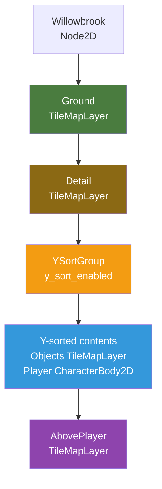
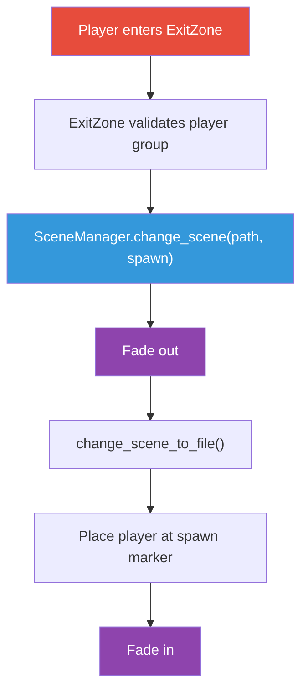

# Module 8: Part II Review and Cheat Sheet

This module is a review and quick reference for everything covered in Part II (Modules 5-7). No new code, no new features. Just a consolidated look at what you built and a cheat sheet you can flip back to when you need a reminder.

## Part II in Review

At the start of Part II, you had a Player scene (CharacterBody2D with a sprite and collision) that could move around and handle physics. But the "world" was a blank screen. There was nothing to see, nothing to collide with, and nowhere to go.

Over three modules, you turned that blank canvas into a real game world. You built the town of Willowbrook tile-by-tile using TileMapLayers, layering ground, paths, objects, and treetops into a scene with actual depth. You replaced the sliding Godot icon with a sprite-animated player character driven by a proper state machine, one that knows whether it's idle, walking, interacting, or disabled. You added Y-sorting so the player walks behind trees and in front of paths. And you connected Willowbrook to a second area, Whisperwood Forest, via exit zones and a SceneManager autoload that handles fade-to-black transitions and spawn point placement.

The result is the skeleton of a real JRPG: two connected areas you can walk between, with an animated hero, tile-based collision, camera smoothing, and clean scene transitions. Everything from here forward (NPCs, dialogue, inventory, combat) builds on this.

### Module 5: The Overworld — TileMaps and Terrain

- Built Willowbrook using **TileMapLayer** nodes (the replacement for the deprecated `TileMap` node), one per layer: Ground, Detail, Objects, and AbovePlayer.
- Created a **TileSet** resource from a tile sheet image, configured atlas sources, and shared the TileSet across all layers.
- Added **physics layers** to the TileSet so wall, water, and building tiles block the player, set once on the tile definition and applied to every instance automatically.
- Attached a **Camera2D** to the player with position smoothing and edge limits so the camera follows smoothly without showing empty space beyond the map.
- Configured **pixel-perfect rendering**: `Nearest` texture filter, `canvas_items` stretch mode, and consistent tile sizes to prevent blurriness and sub-pixel jitter.

### Module 6: Bringing the Player to Life

- Replaced the static Sprite2D with an **AnimatedSprite2D** driven by a **SpriteFrames** resource, with eight named animations: `idle_down/up/left/right` and `walk_down/up/left/right`.
- Implemented an **enum-based state machine** with four states (IDLE, WALK, INTERACT, DISABLED) and a `match` statement that routes each frame to the correct state handler.
- Added **public methods** (`set_disabled()`, `start_interaction()`, `end_interaction()`) so external systems can control the player without reaching into the state machine internals.
- Set up **Y-sorting** with a `YSortGroup` Node2D so the player renders in front of or behind objects based on vertical position, and used a **feet-only collision shape** for natural-feeling tile interaction.
- Tracked **facing direction** as a persistent Vector2 so idle animations face the last movement direction.

### Module 7: Connecting Worlds — Scene Transitions

- Built a **SceneManager autoload** that wraps `get_tree().change_scene_to_file()` with fade-out/fade-in transitions using a CanvasLayer, ColorRect, and AnimationPlayer.
- Learned what **autoloads** (singletons) are: nodes that load at startup, persist across scene changes, and are accessible by name from any script. Godot's built-in `Input`, `Engine`, and `Time` are autoloads; SceneManager is our first custom one.
- Created **exit zones** (Area2D nodes with a script) that detect the player entering and call `SceneManager.change_scene()` with a target scene path and spawn point name.
- Used **Marker2D nodes** in the `spawn_points` group as named spawn locations, so the SceneManager can place the player at the right spot after each transition.
- Used **`await`** to write the async fade-out / scene-change / fade-in sequence as readable linear code instead of a chain of callbacks.

## Key Concepts





| Concept | What It Is | Why It Matters | First Seen |
|---------|-----------|----------------|------------|
| TileMapLayer | A node that renders a grid of tiles from a TileSet | Builds entire game worlds from small, reusable tile images | Module 5 |
| TileSet | A resource defining tile properties (atlas, collision, size) | Single source of truth for tile behavior; shared across layers | Module 5 |
| Atlas source | A tile sheet image mapped to a grid within a TileSet | Lets you paint tiles from a sprite sheet | Module 5 |
| Physics layer (tiles) | Collision data on tile definitions | Makes tiles solid without per-instance configuration | Module 5 |
| Camera2D | A node that controls the viewport's visible area | Follows the player, prevents showing empty space | Module 5 |
| AnimatedSprite2D | A node that plays frame-based animations from SpriteFrames | Character walk cycles, idle poses, direction-based animation | Module 6 |
| SpriteFrames | A resource holding named animation sequences | Defines frame order, FPS, and looping for each animation | Module 6 |
| State machine (enum) | A pattern where an enum tracks the current state and a `match` routes behavior | Prevents conflicting behaviors; each state is self-contained | Module 6 |
| Facing direction | A persistent Vector2 remembering the last movement direction | Idle animations face the correct way when the player stops | Module 6 |
| Y-sort | Rendering children by Y position (lower = in front) | Creates depth illusion in top-down 2D games | Module 6 |
| Autoload (singleton) | A scene/script that loads at startup and persists across scene changes | Global systems (scene management, inventory, audio) that survive scene swaps | Module 7 |
| SceneManager | Our custom autoload that handles scene transitions | Fade effects, spawn point placement, transition-safe scene changes | Module 7 |
| Exit zone | An Area2D that triggers a scene change when the player enters | Connects areas together at map edges | Module 7 |
| Spawn point | A Marker2D node in the `spawn_points` group | Tells the SceneManager where to place the player in a new scene | Module 7 |
| `await` | A keyword that pauses a function until a signal fires | Makes async sequences (fade out, change scene, fade in) readable as linear code | Module 7 |
| CanvasLayer | A node that renders on a separate layer outside normal draw order | Overlays (fade effect, UI) that draw on top of everything | Module 7 |

## Cheat Sheet

### TileMapLayer Setup

The full workflow for creating a tilemap from scratch:

1. **Create a TileSet resource:**
   - Add a TileMapLayer node to your scene.
   - In the Inspector, click Tile Set and choose New TileSet.
   - Set Tile Size (e.g., `16x16`) **before** creating an atlas.

2. **Add an atlas source:**
   - In the TileSet panel (bottom of editor), click **+** and choose Atlas.
   - Drag your tile sheet PNG into the Texture property.
   - Click Yes when prompted to create tiles automatically.

3. **Save the TileSet externally:**
   - Click the dropdown arrow next to the TileSet property in the Inspector.
   - Choose Save As, and save to something like `res://tilesets/town_tileset.tres`.

4. **Add more layers:**
   - Add additional TileMapLayer nodes as siblings.
   - Assign the same saved TileSet to each one.

5. **Add collision:**
   - Expand the TileSet resource in the Inspector. Under Physics Layers, click Add Element.
   - In the TileSet panel, switch to the Paint tab, select Physics Layer 0, and click each tile that should be solid.

```
Willowbrook (Node2D)
├── Ground (TileMapLayer)        (tileset: town_tileset.tres)
├── Detail (TileMapLayer)        (tileset: town_tileset.tres)
├── Objects (TileMapLayer)       (tileset: town_tileset.tres)
└── AbovePlayer (TileMapLayer)   (tileset: town_tileset.tres)
```

### Tile Painting and Layers

**Layer organization:**

| Layer | Purpose | What Goes Here |
|-------|---------|----------------|
| Ground | Base terrain, covers every cell | Grass, dirt, water, stone |
| Detail | Sparse decorations over ground | Flowers, path edges, cracks |
| Objects | Things the player walks behind/in front of | Trees, rocks, fences, buildings |
| AbovePlayer | Always drawn on top of the player | Treetop canopy, roof overhangs |

**Collision setup:**
- Add a Physics Layer to the TileSet resource (Inspector, not per-node).
- Paint collision onto tile *definitions* in the TileSet panel's Paint tab.
- Every instance of that tile gets collision automatically.

**Painting tips:**
- Right-click while painting erases.
- Use **Ctrl+click** to eyedropper-pick a tile from the viewport.
- Use Bucket Fill for the ground layer first, then paint paths over it.
- Keep Detail sparse: a few flowers per area, not one on every tile.
- Scroll wheel zooms, middle-click-drag pans.

### Sprite Animations (AnimatedSprite2D)

**Setting up from a sprite sheet:**

1. Add an AnimatedSprite2D node. Create a New SpriteFrames resource on it.
2. In the SpriteFrames panel, rename `default` to `idle_down`.
3. Click the grid icon ("Add frames from Sprite Sheet"), select your sheet, set the grid size.
4. Click the frames you want, then Add Frames.
5. Repeat for all eight animations.

**Required animation names** (the script constructs these dynamically):

| Animation | Frames | Looping |
|-----------|--------|---------|
| `idle_down` | 1 frame (standing) | No |
| `idle_up` | 1 frame | No |
| `idle_left` | 1 frame | No |
| `idle_right` | 1 frame | No |
| `walk_down` | 3-4 frames | Yes |
| `walk_up` | 3-4 frames | Yes |
| `walk_left` | 3-4 frames | Yes |
| `walk_right` | 3-4 frames | Yes |

Set walk animation FPS to 8-10. Names must be **exact** (all lowercase, underscore separator) or the script won't find them.

**Playing animations from code:**

```gdscript
func _play_animation(action: String) -> void:
    var direction_name := _direction_to_string(facing_direction)
    var anim_name := action + "_" + direction_name
    if sprite.sprite_frames.has_animation(anim_name):
        sprite.play(anim_name)
```

### The State Machine Pattern (Enum-Based)

Define states as an enum, track the current state, and use `match` to route each frame to the correct handler. Each state is a separate function with clear responsibilities.

```gdscript
enum State { IDLE, WALK, INTERACT, DISABLED }

var current_state: State = State.IDLE


func _physics_process(_delta: float) -> void:
    match current_state:
        State.IDLE:
            _state_idle()
        State.WALK:
            _state_walk()
        State.INTERACT:
            _state_interact()
        State.DISABLED:
            _state_disabled()


func _change_state(new_state: State) -> void:
    current_state = new_state
```

**State handlers** are self-contained. IDLE checks for input and transitions to WALK. WALK moves the player and transitions back to IDLE when input stops. INTERACT and DISABLED do nothing; they wait for external systems to release them.

**Transition rules:**

| From | To | Trigger |
|------|----|---------|
| IDLE | WALK | Movement input detected |
| WALK | IDLE | Movement input released |
| IDLE | INTERACT | Player presses interact near an NPC |
| INTERACT | IDLE | Dialogue finishes |
| Any | DISABLED | Cutscene, battle, or menu starts |
| DISABLED | IDLE | Cutscene, battle, or menu ends |

**External control:** other systems change the player's state through public methods, never by setting the enum directly:

```gdscript
func set_disabled(disabled: bool) -> void:
    if disabled:
        _change_state(State.DISABLED)
    else:
        _change_state(State.IDLE)


func start_interaction() -> void:
    _change_state(State.INTERACT)


func end_interaction() -> void:
    _change_state(State.IDLE)
```

### Y-Sorting

Y-sort makes children of a node render sorted by their Y position: higher on screen (lower Y value) draws first (behind), lower on screen (higher Y value) draws last (in front). This creates the illusion that the player walks behind trees and in front of paths.

**Setup:**

1. Create a Node2D child named `YSortGroup`.
2. Enable **CanvasItem > Ordering > Y Sort Enabled** on it.
3. Move the Objects TileMapLayer and the Player instance into `YSortGroup`.
4. Enable **Y Sort Enabled** on the Objects TileMapLayer too (so individual tiles sort against the player, not the entire layer as a block).
5. Set the Objects layer's **Y Sort Origin** to your tile height (e.g., `16`) so tiles sort by their bottom edge.

**Scene structure with Y-sort:**

```
Willowbrook (Node2D)
├── Ground (TileMapLayer)
├── Detail (TileMapLayer)
├── YSortGroup (Node2D, y_sort_enabled = true)
│   ├── Objects (TileMapLayer, y_sort_enabled = true, y_sort_origin = 16)
│   └── Player (player.tscn instance)
└── AbovePlayer (TileMapLayer)
```

Ground and Detail are always behind everything. AbovePlayer is always on top. The YSortGroup handles the dynamic sorting between the player and objects.

### Scene Transitions and the SceneManager

**The SceneManager autoload** handles fade-out, scene change, and fade-in as a single async sequence. It lives at `res://autoloads/scene_manager.tscn` and is registered in Project Settings > Autoload.

**Changing scenes from any script:**

```gdscript
SceneManager.change_scene("res://scenes/whisperwood/whisperwood.tscn", "from_town")
```

The first argument is the scene file path. The second is the name of the Marker2D spawn point in the target scene. If omitted, it defaults to `"default"`.

**How it works internally:**

```gdscript
func change_scene(scene_path: String, spawn_point: String = "default") -> void:
    if _is_transitioning:
        return
    _is_transitioning = true
    _target_scene_path = scene_path
    _target_spawn_point = spawn_point

    transition_started.emit()
    _anim_player.play("fade_out")
    await _anim_player.animation_finished

    get_tree().change_scene_to_file(_target_scene_path)
    await get_tree().scene_changed

    _place_player_at_spawn()

    _anim_player.play("fade_in")
    await _anim_player.animation_finished

    _is_transitioning = false
    transition_finished.emit()
```

**Spawn point placement:** the SceneManager finds Marker2D nodes in the `spawn_points` group and teleports the player to the one whose name matches:

```gdscript
func _place_player_at_spawn() -> void:
    var spawn_markers := get_tree().get_nodes_in_group("spawn_points")
    for marker in spawn_markers:
        if marker.name == _target_spawn_point:
            var player := get_tree().get_first_node_in_group("player")
            if player:
                player.global_position = marker.global_position
            return
```

**Exit zones** are Area2D nodes with this script:

```gdscript
extends Area2D
## A zone that triggers a scene transition when the player enters.

@export_file("*.tscn") var target_scene: String
@export var target_spawn_point: String = "default"


func _ready() -> void:
    body_entered.connect(_on_body_entered)


func _on_body_entered(body: Node2D) -> void:
    if body.is_in_group("player"):
        SceneManager.change_scene(target_scene, target_spawn_point)
```

### Autoloads

**What they are:** A scene or script that loads when the game starts, persists across all scene changes, and is accessible globally by name. Godot's built-in `Input`, `Engine`, and `Time` are autoloads. SceneManager is our first custom one.

**How to register one:**

1. Go to Project > Project Settings > Autoload.
2. Click the folder icon and select your `.tscn` or `.gd` file.
3. The name auto-fills (e.g., `SceneManager`). Click Add.

**When to use them:** Systems that need to survive scene changes and be accessible from anywhere: scene management, inventory, audio, game state. If a system only matters within one scene, keep it local.

**Signal lifecycle:** When a scene is freed (during a scene change), all signal connections from its nodes are cleaned up automatically. Autoload signals persist because autoloads are never freed. This is why cross-scene systems belong in autoloads.

**Autoload reference card** (updated as we build more):

| Autoload | Module | Purpose |
|----------|--------|---------|
| SceneManager | 7 | Scene transitions with fade effects and spawn point placement |

### Camera2D

**Setup:** Add a Camera2D as a child of the Player node.

```
Player (CharacterBody2D)
├── Sprite (AnimatedSprite2D)
├── CollisionShape2D
└── Camera2D
```

**Key properties in the Inspector:**

| Property | Value | Why |
|----------|-------|-----|
| Enabled | `true` | Makes this the active camera |
| Position Smoothing > Enabled | `true` | Smooth follow instead of rigid tracking |
| Position Smoothing > Speed | `5.0` | Balance between responsive and smooth (3-8 is the sweet spot) |
| Limit > Left | `0` | Prevent showing empty space left of the map |
| Limit > Top | `0` | Prevent showing empty space above the map |
| Limit > Right | map width in pixels | e.g., `640` for a 40-tile-wide map with 16px tiles |
| Limit > Bottom | map height in pixels | e.g., `480` for a 30-tile-tall map with 16px tiles |

**Pixel-perfect checklist** (check all four if tiles look blurry or jittery):

1. Project Settings > Rendering > Textures > Default Texture Filter: **Nearest**
2. Project Settings > Display > Window > Stretch > Mode: **canvas_items**
3. Camera2D Position Smoothing Speed: moderate (3-8)
4. Tile sheet import settings: Filter set to **Nearest** (or Off)

## Common Mistakes and Fixes

| Mistake | Symptom | Fix |
|---------|---------|-----|
| TileSet tile size doesn't match the tile sheet grid | Grid overlay is misaligned; tiles are cut off or overlap | Set Tile Size in the TileSet resource **before** creating the atlas. Must match your sprite sheet's grid (e.g., 16x16). |
| Collision set on the wrong layer | Player walks through walls, or can't walk on paths | Verify you added collision to the tile *definition* in the TileSet panel's Paint tab, not to a specific placed tile. Check that the physics layer index matches. |
| Animation name mismatch | Player freezes or plays the wrong animation | Names must be exact: `idle_down`, `walk_left`, etc. All lowercase, underscore separator. No spaces, no capitals. |
| Player not in the `player` group | Exit zones don't trigger; SceneManager can't find the player | Select the Player root node, go to Node tab > Groups, type `player`, click Add. |
| Spawn point not in the `spawn_points` group | Player appears at (0, 0) after a scene transition | Select each Marker2D spawn point, add it to the `spawn_points` group. The marker's node name must match the spawn point string passed to `change_scene()`. |
| Y-sort not enabled on the Objects TileMapLayer | Player is always in front of (or always behind) all objects | Enable Y Sort Enabled on both the YSortGroup Node2D **and** the Objects TileMapLayer. Set Y Sort Origin on the Objects layer to your tile height. |
| Texture filter set to Linear | Tiles look blurry, pixel art is smeared | Project Settings > Rendering > Textures > Default Texture Filter: Nearest. Also check the import settings on each tile sheet PNG. |
| Exit zone collision shape missing or mis-sized | Walking to the map edge does nothing | Make sure the Area2D has a CollisionShape2D child with a shape (RectangleShape2D) that covers the exit area. Check that the Area2D's collision mask includes the player's layer. |

## Official Godot Documentation

Everything referenced in Part II, organized by category. Bookmark the ones you find yourself looking up repeatedly.

### Tilemap System

- [TileMapLayer](https://docs.godotengine.org/en/stable/classes/class_tilemaplayer.html): the node that renders a grid of tiles (replaces the deprecated TileMap)
- [TileSet](https://docs.godotengine.org/en/stable/classes/class_tileset.html): the resource that defines tile properties, atlas sources, and physics layers
- [Using TileSets](https://docs.godotengine.org/en/stable/tutorials/2d/using_tilesets.html): tutorial on creating and configuring TileSets
- [Using TileMaps](https://docs.godotengine.org/en/stable/tutorials/2d/using_tilemaps.html): tutorial on painting tiles and setting up layers

### Player and Animation

- [CharacterBody2D](https://docs.godotengine.org/en/stable/classes/class_characterbody2d.html): physics body for player movement with `move_and_slide()`
- [AnimatedSprite2D](https://docs.godotengine.org/en/stable/classes/class_animatedsprite2d.html): node that plays frame-based animations from a SpriteFrames resource
- [SpriteFrames](https://docs.godotengine.org/en/stable/classes/class_spriteframes.html): resource holding named animation sequences with frames, FPS, and loop settings
- [AnimationPlayer](https://docs.godotengine.org/en/stable/classes/class_animationplayer.html): alternative animation approach for keyframing arbitrary properties
- [2D Sprite Animation](https://docs.godotengine.org/en/stable/tutorials/2d/2d_sprite_animation.html): tutorial covering both AnimatedSprite2D and AnimationPlayer approaches
- [CollisionShape2D](https://docs.godotengine.org/en/stable/classes/class_collisionshape2d.html): defines the shape used for physics collision
- [RectangleShape2D](https://docs.godotengine.org/en/stable/classes/class_rectangleshape2d.html): rectangular collision shape used for player feet and exit zones

### Camera and Rendering

- [Camera2D](https://docs.godotengine.org/en/stable/classes/class_camera2d.html): viewport camera with smoothing, limits, zoom, and drag margins
- [Viewport and Canvas Transforms](https://docs.godotengine.org/en/stable/tutorials/2d/2d_transforms.html): how coordinates, viewports, and rendering relate in 2D

### Y-Sorting and Rendering Order

- [CanvasItem](https://docs.godotengine.org/en/stable/classes/class_canvasitem.html): base class for all 2D nodes; covers `y_sort_enabled`, visibility, modulate, and draw order
- [Node2D](https://docs.godotengine.org/en/stable/classes/class_node2d.html): 2D node used as the YSortGroup container

### Scene Transitions and Autoloads

- [Singletons (Autoload)](https://docs.godotengine.org/en/stable/tutorials/scripting/singletons_autoload.html): official guide to creating and registering autoloads
- [Change Scenes Manually](https://docs.godotengine.org/en/stable/tutorials/scripting/change_scenes_manually.html): the built-in `change_scene_to_file()` and why you often wrap it
- [SceneTree](https://docs.godotengine.org/en/stable/classes/class_scenetree.html): the tree that manages all nodes; provides `change_scene_to_file()`, `get_nodes_in_group()`, and `get_first_node_in_group()`
- [CanvasLayer](https://docs.godotengine.org/en/stable/classes/class_canvaslayer.html): renders on a separate layer; used for the fade overlay and UI
- [ColorRect](https://docs.godotengine.org/en/stable/classes/class_colorrect.html): solid-color rectangle used as the black fade overlay
- [Introduction to Animations](https://docs.godotengine.org/en/stable/tutorials/animation/introduction.html): creating property track animations in AnimationPlayer

### Interaction and Detection

- [Area2D](https://docs.godotengine.org/en/stable/classes/class_area2d.html): trigger zone for detecting overlapping bodies (used for exit zones)
- [Marker2D](https://docs.godotengine.org/en/stable/classes/class_marker2d.html): lightweight position marker used for spawn points

### Input

- [Input](https://docs.godotengine.org/en/stable/classes/class_input.html): the global input singleton; `get_axis()`, `is_action_pressed()`
- [InputEvent](https://docs.godotengine.org/en/stable/classes/class_inputevent.html): base class for all input events

### GDScript

- [@export_file](https://docs.godotengine.org/en/stable/tutorials/scripting/gdscript/gdscript_exports.html): export annotation that creates a filtered file picker in the Inspector
- [Awaiting Signals](https://docs.godotengine.org/en/stable/tutorials/scripting/gdscript/gdscript_basics.html#awaiting-signals): how `await` pauses a function until a signal fires

## What's Next

In Part III, we add interactivity. **Module 9: Resources, the Data Layer** introduces Godot's Resource system, where we build custom data types for items, characters, and NPCs. This data layer is what the dialogue, inventory, and combat systems all read from.
