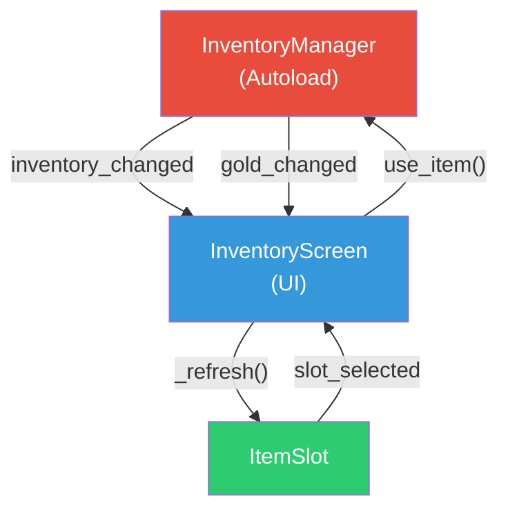
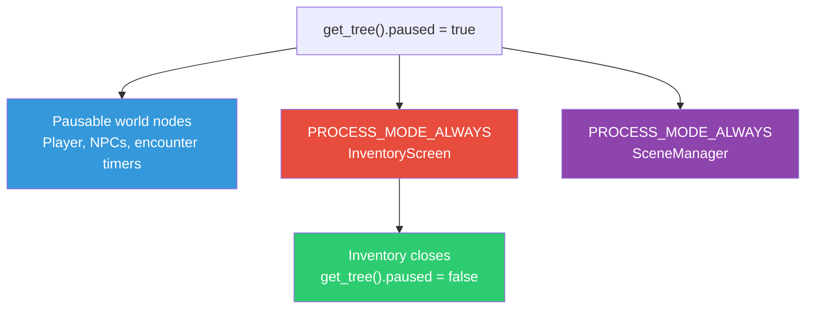

# Module 12: The Inventory System

## What We Have So Far

NPCs with a dialogue system, custom Resources for items and characters, scene transitions, and a connected two-area world. We've defined items like Potion and Iron Sword as `.tres` files, but the player can't actually carry or use them yet.

## What We're Building This Module

An inventory system with a global autoload for tracking items, a UI screen the player can open with a key, and the ability to use consumable items. We'll keep this focused; equipment and shops come in Module 21.

Inventory management is one of the defining verbs of the RPG genre. In Pokemon, deciding which six Pokemon to carry and which four moves each one knows is the core strategic layer. In Final Fantasy, choosing whether to spend your last Elixir on a random battle or save it for the boss creates tension that persists between fights. An inventory isn't just a list of stuff. It's a resource management puzzle that runs throughout the entire game.

## InventoryManager Autoload

The inventory needs to persist across scene changes, so it's an autoload.

Create `res://autoloads/inventory_manager.gd`:

```gdscript
extends Node
## Manages the player's inventory. Autoload, accessible as InventoryManager.

signal item_added(item: ItemData, new_count: int)
signal item_removed(item: ItemData, new_count: int)
signal inventory_changed
signal gold_changed(new_amount: int)

var gold: int = 100  # Starting gold
var _items: Array[Dictionary] = []  # [{item: ItemData, count: int}]


func add_item(item: ItemData, amount: int = 1) -> void:
    if amount <= 0:
        return

    for entry in _items:
        if entry.item.id == item.id:
            entry.count += amount
            item_added.emit(item, entry.count)
            inventory_changed.emit()
            return

    _items.append({item = item, count = amount})
    item_added.emit(item, amount)
    inventory_changed.emit()


func remove_item(item: ItemData, amount: int = 1) -> bool:
    if amount <= 0:
        return false

    for i in _items.size():
        if _items[i].item.id == item.id:
            var entry: Dictionary = _items[i]
            if entry.count < amount:
                return false

            entry.count -= amount
            var remaining: int = entry.count
            if remaining <= 0:
                _items.remove_at(i)
                remaining = 0
            else:
                _items[i] = entry
            item_removed.emit(item, remaining)
            inventory_changed.emit()
            return true
    return false


func has_item(item_id: String, amount: int = 1) -> bool:
    for entry in _items:
        if entry.item.id == item_id and entry.count >= amount:
            return true
    return false


func get_item_count(item_id: String) -> int:
    for entry in _items:
        if entry.item.id == item_id:
            return entry.count
    return 0


func get_all_items() -> Array[Dictionary]:
    return _items.duplicate(true)


func get_consumables() -> Array[Dictionary]:
    return _items.filter(
        func(entry: Dictionary) -> bool:
            return entry.item.item_type == ItemData.ItemType.CONSUMABLE
    ).duplicate(true)


func use_item(item: ItemData) -> bool:
    if not item or item.item_type != ItemData.ItemType.CONSUMABLE:
        return false
    if item.hp_restore <= 0 and item.mp_restore <= 0:
        return false
    return remove_item(item)


func add_gold(amount: int) -> void:
    gold += amount
    gold_changed.emit(gold)


func spend_gold(amount: int) -> bool:
    if gold >= amount:
        gold -= amount
        gold_changed.emit(gold)
        return true
    return false
```

Register it as an autoload: **Project → Project Settings → Autoload** → add `inventory_manager.gd` as `InventoryManager`.

### Design Notes

**Signal-driven updates:** Every change emits a signal (`item_added`, `item_removed`, `inventory_changed`, `gold_changed`). The UI listens to these signals and updates itself. The InventoryManager never touches UI directly.



**ID-based matching:** Items are matched by their `id` string (`item.id == item_id`), not by object reference. This means two different `ItemData` instances with the same `id` are treated as the same item, which is important when loading from saves.

**`remove_item` returns bool:** Callers can check if the removal succeeded. Trying to remove an item the player doesn't have returns `false`.

**Autoload reference card:**

| Autoload | Module | Purpose |
|----------|--------|---------|
| SceneManager | 7 | Scene transitions with fade effects |
| **InventoryManager** | **12** | **Item storage, add/remove, signals** |

## Adding a Menu Input Action

Before building the UI, define a `menu` action for opening the inventory:

1. **Project → Project Settings → Input Map**
2. Add a new action: `menu`
3. Bind it to **Tab** (or **I**) and the **Start/Menu** gamepad button

> **Note:** Avoid binding `menu` to Escape. Escape is already mapped to `ui_cancel`, which we'll use to *close* the inventory. Using the same key for both open and close works thanks to our `elif` structure in the script, but using different keys (Tab to open, Escape to close) is clearer and avoids confusion.

## The Inventory UI

Create `res://ui/inventory/inventory_screen.tscn`:

### Scene Tree

```
InventoryScreen (CanvasLayer, layer = 20)
└── PanelContainer (full screen, semi-transparent background)
    └── MarginContainer
        └── VBoxContainer
            ├── Header (HBoxContainer)
            │   ├── TitleLabel (Label: "Inventory")
            │   └── GoldLabel (Label: "Gold: 100")
            ├── ItemGrid (GridContainer, columns = 5)
            │   # ItemSlot scenes instanced here dynamically
            └── DescriptionLabel (RichTextLabel)
```

### The Item Slot Scene

Each slot in the grid is its own small scene. Create `res://ui/inventory/item_slot.tscn`:

```
ItemSlot (PanelContainer)
├── MarginContainer
│   └── VBoxContainer
│       ├── Icon (TextureRect)
│       └── CountLabel (Label)
```

Select the `Icon` (TextureRect) node and set **Custom Minimum Size** to `Vector2(32, 32)` so each slot has a reasonable size even without an icon texture.

> **Note:** Since we haven't set item icons in our `.tres` files yet, the inventory slots will show blank icon areas. That's expected. You'll see the count label (e.g., "3" for potions). To add placeholder icons, drag `res://icon.svg` into the `icon` field of each item `.tres` file.

Create `res://ui/inventory/item_slot.gd`:

```gdscript
extends PanelContainer
## A single item slot in the inventory grid.

signal slot_selected(item: ItemData)
signal slot_activated(item: ItemData)

var item_data: ItemData
var count: int = 0

@onready var _icon: TextureRect = $MarginContainer/VBoxContainer/Icon
@onready var _count_label: Label = $MarginContainer/VBoxContainer/CountLabel


func setup(item: ItemData, item_count: int) -> void:
    item_data = item
    count = item_count
    _icon.texture = item.icon
    _count_label.text = str(item_count) if item_count > 1 else ""

    # Make the slot focusable for keyboard/gamepad navigation
    focus_mode = Control.FOCUS_ALL


func _gui_input(event: InputEvent) -> void:
    if event.is_action_pressed("ui_accept") or event.is_action_pressed("interact"):
        slot_activated.emit(item_data)
        accept_event()


func _notification(what: int) -> void:
    if what == NOTIFICATION_FOCUS_ENTER:
        slot_selected.emit(item_data)
```

> **See:** [TextureRect](https://docs.godotengine.org/en/stable/classes/class_texturerect.html): displaying images in UI.

> **See:** [GridContainer](https://docs.godotengine.org/en/stable/classes/class_gridcontainer.html): automatic grid layout for child nodes.

### The Inventory Screen Script

Create `res://ui/inventory/inventory_screen.gd`:

```gdscript
extends CanvasLayer
## The inventory screen. Opens/closes with the menu key.

const ItemSlotScene := preload("res://ui/inventory/item_slot.tscn")

@onready var _panel: PanelContainer = $PanelContainer
@onready var _item_grid: GridContainer = $PanelContainer/MarginContainer/VBoxContainer/ItemGrid
@onready var _gold_label: Label = $PanelContainer/MarginContainer/VBoxContainer/Header/GoldLabel
@onready var _description_label: RichTextLabel = $PanelContainer/MarginContainer/VBoxContainer/DescriptionLabel

var _is_open: bool = false


func _ready() -> void:
    _panel.visible = false
    InventoryManager.inventory_changed.connect(_refresh)
    InventoryManager.gold_changed.connect(_on_gold_changed)
    _update_gold_display()


func _unhandled_input(event: InputEvent) -> void:
    if event.is_action_pressed("ui_cancel") and _is_open:
        close()
        get_viewport().set_input_as_handled()
    elif event.is_action_pressed("menu") and not _is_open:
        open()
        get_viewport().set_input_as_handled()


func open() -> void:
    _show()


func open_from_pause() -> void:
    _show()


func _show() -> void:
    _is_open = true
    _panel.visible = true
    get_tree().paused = true
    _refresh()


func close() -> void:
    _is_open = false
    _panel.visible = false
    get_tree().paused = false


func _refresh() -> void:
    for child in _item_grid.get_children():
        child.queue_free()

    await get_tree().process_frame

    # Create slots for each item
    var items := InventoryManager.get_all_items()
    for entry in items:
        var slot: PanelContainer = ItemSlotScene.instantiate()
        _item_grid.add_child(slot)
        slot.setup(entry.item, entry.count)
        slot.slot_selected.connect(_on_slot_selected)
        slot.slot_activated.connect(_on_slot_activated)

    # Focus the first slot (deferred so the slot is ready)
    if _item_grid.get_child_count() > 0:
        _item_grid.get_child(0).call_deferred("grab_focus")


func _on_slot_selected(item: ItemData) -> void:
    _description_label.text = item.description


func _on_slot_activated(item: ItemData) -> void:
    if item.item_type == ItemData.ItemType.CONSUMABLE:
        _use_consumable(item)


func _use_consumable(item: ItemData) -> void:
    # Temporary Module 12 behavior: no party target exists yet.
    # Module 21 replaces this with use_item_on_member(item, member).
    if item.hp_restore > 0:
        print("Restored ", item.hp_restore, " HP!")
    if item.mp_restore > 0:
        print("Restored ", item.mp_restore, " MP!")
    InventoryManager.use_item(item)


func _update_gold_display() -> void:
    _gold_label.text = "Gold: " + str(InventoryManager.gold)


func _on_gold_changed(_amount: int) -> void:
    _update_gold_display()
```

`open()` and `open_from_pause()` intentionally go through the same `_show()` helper. Module 25's PauseMenu will call the public API instead of toggling `visible` directly, so the inventory always refreshes its slots, tracks `_is_open`, and owns the pause state the same way no matter how it was opened.

## Pausing the Game

When you open the menu in any Final Fantasy game, the world freezes. Enemies stop moving, timers stop counting, and the music continues. This isn't just a convenience; it's a promise to the player: "You are safe while making decisions." Without pausing, an enemy could kill you while you're scrolling through your item list.

When the inventory opens, we **pause the game** so enemies, NPCs, and the player don't move while the menu is up.

```gdscript
get_tree().paused = true   # Pause everything
get_tree().paused = false  # Resume everything
```

But wait: if everything is paused, how does the inventory UI itself continue to work? Through **`process_mode`**.

Every node has a `process_mode` property that controls whether it runs while paused:

| Mode | Behavior |
|------|----------|
| `PROCESS_MODE_INHERIT` | Same as parent (default) |
| `PROCESS_MODE_PAUSABLE` | Pauses when tree is paused |
| `PROCESS_MODE_WHEN_PAUSED` | Only runs when tree is paused |
| `PROCESS_MODE_ALWAYS` | Always runs, regardless of pause state |
| `PROCESS_MODE_DISABLED` | Never runs |

> **IMPORTANT:** Select the `InventoryScreen` (CanvasLayer) root node in the editor and set **Process → Mode** to **`Always`** in the Inspector. Without this, the inventory will open but immediately freeze because the paused game prevents it from processing input. The only way to recover would be to force-quit.

The SceneManager should also be `PROCESS_MODE_ALWAYS`. Go back to `scene_manager.tscn` and set its root node's **Process → Mode** to **`Always`** too. It needs to work during transitions regardless of pause state.



> **See:** [Pausing games](https://docs.godotengine.org/en/stable/tutorials/scripting/pausing_games.html): the official guide to pausing and `process_mode`.

## Giving the Player Starting Items

To test the inventory, give the player some starting items. In `InventoryManager._ready()`:

```gdscript
func _ready() -> void:
    # Starting inventory for testing
    var potion: ItemData = load("res://data/items/potion.tres")
    if potion:
        add_item(potion, 3)
```

Or better, add items through game events. For now, the starting items are fine for testing.

## Integration: Adding the Inventory to Scenes

Add the inventory screen to each scene:

1. Open `willowbrook.tscn`. Right-click the root `Willowbrook` node → **Instance Child Scene** → select `res://ui/inventory/inventory_screen.tscn`.
2. Repeat for `whisperwood.tscn`.

Your scene tree should look like:

```
Willowbrook (Node2D)
├── Ground (TileMapLayer)
├── Detail (TileMapLayer)
├── YSortGroup (Node2D)
│   ├── Objects (TileMapLayer)
│   ├── Player
│   ├── Shopkeeper (NPC)
│   ├── Innkeeper (NPC)
│   ├── ElderMaren (NPC)
│   └── Fynn (NPC)
├── AbovePlayer (TileMapLayer)
├── DialogueBox (CanvasLayer)
└── InventoryScreen (CanvasLayer)
```

## Engineering Contract

- **Global state:** `InventoryManager` owns item stacks and gold as an autoload.
- **Public surface:** `add_item()`, `remove_item()`, `use_item()`, `get_all_items()`, `get_consumables()`, and inventory/gold signals.
- **Invariant:** Stack counts never go below zero; removal fails before mutation when the amount is invalid or unavailable.
- **Failure behavior:** Missing items, insufficient quantities, and non-positive amounts return `false`.
- **Copy semantics:** List getters return defensive array/dictionary copies; `ItemData` Resources inside entries remain shared definitions.

## Engine Gotcha

Autoload arrays are just normal mutable arrays. Returning the live array would let UI code accidentally mutate inventory internals, so read APIs return copies.

## What We've Learned

- **InventoryManager** autoload tracks items as `{item: ItemData, count: int}` entries with signal-driven updates.
- **Pausing** (`get_tree().paused = true`) freezes game logic. **`process_mode = ALWAYS`** lets UI continue during pause.
- **ItemSlot** scenes are instantiated dynamically in a **GridContainer** to form the inventory grid.
- **Focus-based navigation** (`focus_mode`, `grab_focus()`) makes UI work with keyboard and gamepad.
- **Signal pattern:** InventoryManager emits `inventory_changed` → UI refreshes. Manager never touches UI directly.
- **`_gui_input()`** handles input events on Control nodes. **`accept_event()`** prevents propagation (like `set_input_as_handled()` for UI).
- Items are consumed with `remove_item()`, and the grid refreshes automatically via the `inventory_changed` signal.

### Troubleshooting

| Problem | Likely Cause |
|---------|-------------|
| Inventory doesn't open when pressing Tab | `menu` input action not defined, or key not bound |
| Game freezes when inventory opens | `process_mode` not set to `Always` on the InventoryScreen CanvasLayer |
| Items stacking incorrectly or showing wrong item | Missing or duplicate `id` fields in `.tres` files (see Module 9) |
| Slots appear too small or empty | No icon set on items (expected; use Godot icon as placeholder), or TextureRect missing minimum size |
| Escape doesn't close inventory | `ui_cancel` not mapped to Escape (it is by default) |

## What You Should See

When you press F6 (running Willowbrook):
- Press Tab (or your menu key). The inventory screen opens
- The game world freezes behind the menu
- Items appear in a grid (3 Potions from starting inventory). Icons may be blank if you haven't set them
- Navigating slots with arrow keys highlights them and shows descriptions
- Pressing accept on a Potion uses it and decrements the count
- Pressing Escape closes the inventory and resumes the game

## Next Module

We have items and NPCs and dialogue. Now it's time for the biggest system in any JRPG: **combat**. In **Module 14: Battle Foundations**, we'll build the battle scene, implement a node-based state machine for battle flow, and create the turn order system. Combat is next.
