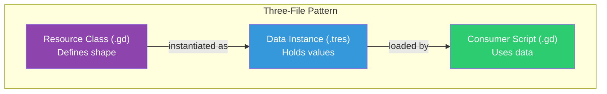
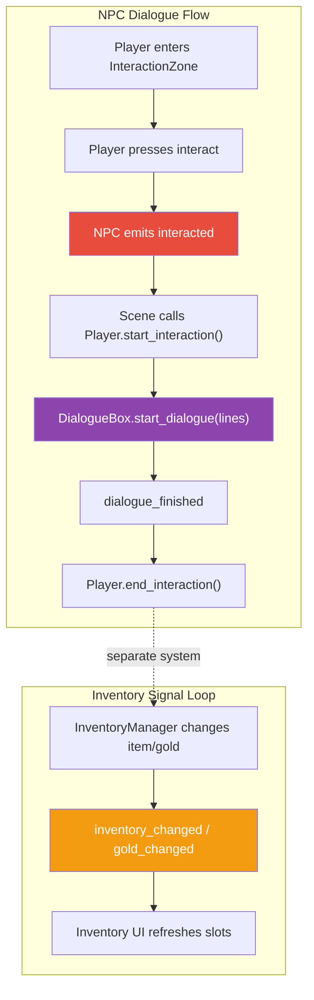

# Module 13: Part III Review and Cheat Sheet

This module is a review and quick-reference for everything covered in Part III (Modules 9-12). No new code here. Just a consolidated reference you can come back to when you need to remember how something works.

## Part III in Review

Part III is where Crystal Saga went from a world you walk through to a world you interact with. The central change was separating **data from logic** using Godot's Resource system. Instead of hardcoding item stats, NPC names, and dialogue text inside scripts, we defined structured data types (Resource classes), created instances of those types (`.tres` files), and wrote systems that consume the data without caring about specific values. This pattern (define a Resource class, populate `.tres` files, wire them into scripts) will repeat in every system we build from here forward.

With the data layer in place, we built three interconnected systems on top of it. NPCs use `NPCData` resources to configure their appearance and dialogue. The dialogue system reads `DialogueLine` resources and renders them in a typewriter-style textbox. The inventory system tracks `ItemData` resources and displays them in a navigable grid. Each system is decoupled from the others through signals: the NPC does not know about the dialogue box, the dialogue box does not know about the inventory, and the inventory does not know about either. They communicate through emit-and-connect wiring in the scene scripts.

The result is a working game architecture. Resources for data, signals for communication, autoloads for persistence, Control nodes for UI. These same patterns show up in the battle system, quest system, save/load, and everything else we build in the remaining parts. If any of these concepts feel shaky, this is a good place to review before moving into Part IV.

### Module 9: Resources, the Data Layer

- Learned that **Resources** are Godot's universal data container: type-safe, editor-friendly objects that can be saved as `.tres` files and shared across the project.
- Defined three custom Resource classes (`ItemData`, `CharacterData`, `NPCData`) using `class_name`, `@export`, `@export_group()`, `@export_multiline`, and enum-typed exports.
- Created `.tres` data files in the Inspector for potions, equipment, and the hero's stats, filling in typed fields through dropdown menus and text editors instead of writing raw data.
- Established the **three-file pattern**: a Resource class (`.gd`) defines the structure, a `.tres` file holds specific values, and a consumer script uses the data at runtime.
- Learned when to use `preload()` (compile-time, constant paths, no null check needed) versus `load()` (runtime, dynamic paths, always null-check the result).

### Module 10: NPCs and Interaction

- Built a reusable NPC scene (`CharacterBody2D` + `AnimatedSprite2D` + `Area2D` + `Label`) driven by an `@export var npc_data: NPCData`. Swapping the resource changes the NPC's identity without changing the script.
- Implemented the **Area2D interaction pattern**: the NPC's `InteractionZone` detects the player via `body_entered`/`body_exited` signals, toggles an interaction prompt, and listens for the `interact` input action.
- Used `_unhandled_input()` instead of `_input()` or `_process()` polling, so the NPC only responds to input that UI elements have not already consumed, and called `set_input_as_handled()` to prevent other nodes from double-processing the same press.
- Connected NPC signals to scene scripts (`willowbrook.gd`) to demonstrate **separation of concerns**: the NPC detects interaction and emits a signal; the scene script decides what to do with it.
- Defined a custom `interact` input action in Project Settings so the same code works for keyboard and gamepad.

### Module 11: The Dialogue System

- Created the `DialogueLine` Resource (speaker name, text, optional portrait, optional choices) and upgraded `NPCData` from `Array[String]` to `Array[DialogueLine]` for structured dialogue data.
- Built a dialogue box UI scene using **Control nodes** (`CanvasLayer` > `PanelContainer` > `MarginContainer` > `VBoxContainer` > `Label` + `RichTextLabel`) with anchors and containers for responsive layout.
- Implemented the **typewriter effect** by tweening `RichTextLabel.visible_ratio` from `0.0` to `1.0`, with proper tween lifecycle management (kill before creating a new one).
- Added the **two-press interaction** pattern (first press skips typing, second press advances or closes), the standard JRPG dialogue control.
- Extended dialogue with **branching choices**: dynamically creating `Button` nodes in a `ChoiceContainer`, using `grab_focus()` for keyboard navigation, and emitting `choice_made` signals.

### Module 12: The Inventory System

- Created the **InventoryManager autoload** to persist items across scene changes, tracking items as `{item: ItemData, count: int}` dictionaries matched by `item.id`.
- Built a signal-driven architecture: InventoryManager emits `item_added`, `item_removed`, `inventory_changed`, and `gold_changed`. The UI listens and refreshes, and the manager never touches UI directly.
- Constructed the inventory UI with dynamically instanced `ItemSlot` scenes in a `GridContainer`, each slot emitting `slot_selected` and `slot_activated` signals for description display and item use.
- Learned how **pausing** works: `get_tree().paused = true` freezes the game world, while `process_mode = PROCESS_MODE_ALWAYS` on the inventory's CanvasLayer lets the menu continue to function.
- Used `_gui_input()` and `accept_event()` for Control-node input handling, and `focus_mode = FOCUS_ALL` with `grab_focus()` for keyboard/gamepad-navigable item slots.

## Key Concepts





| Concept | What It Is | Why It Matters | First Seen |
|---------|-----------|---------------|------------|
| Custom Resource class | A GDScript file extending `Resource` with `class_name` and `@export` properties | Defines a reusable, type-safe data structure editable in the Inspector | Module 9 |
| `.tres` file | A text-based Resource instance saved to disk | Holds specific data values (one potion, one sword) separate from code | Module 9 |
| Three-file pattern | Resource class `.gd` + data `.tres` + consumer `.gd` | Separates structure, data, and behavior so each can change independently | Module 9 |
| `preload()` vs `load()` | Compile-time vs runtime resource loading | `preload` for known assets, `load` for dynamic paths (with null check) | Module 9 |
| Null-check pattern | `if resource == null: push_error(...)` after `load()` | Prevents silent crashes from missing or mistyped file paths | Module 9 |
| Area2D interaction zone | A collision area larger than the NPC body | Detects when the player is close enough to interact | Module 10 |
| `_unhandled_input()` | Input callback that fires only if no other node consumed the event | Respects UI focus; prevents game-world input from firing during menus | Module 10 |
| `set_input_as_handled()` | Marks an input event as consumed | Prevents multiple nodes from responding to the same button press | Module 10 |
| Custom input actions | Named actions (e.g., `interact`, `menu`) defined in Project Settings | Decouples game logic from specific keys; supports keyboard and gamepad | Module 10 |
| CanvasLayer | A node that renders its children on a separate drawing layer | Draws UI on top of the game world regardless of camera position | Module 11 |
| `visible_ratio` | A float (0.0 to 1.0) controlling how much of a RichTextLabel's text is shown | Powers the typewriter effect via tweening | Module 11 |
| Tween lifecycle | Creating, chaining, killing, and checking validity of Tweens | Prevents overlapping animations when the player advances dialogue quickly | Module 11 |
| `grab_focus()` | Programmatically gives keyboard/gamepad focus to a Control node | Makes UI navigable without a mouse, which is critical for JRPGs | Module 11 |
| Autoload | A node auto-instanced at startup, accessible globally by name | Persists data (inventory, gold) across scene changes | Module 12 |
| `process_mode` | Controls whether a node runs during pause | Lets the inventory UI function while the game world is frozen | Module 12 |
| `_gui_input()` | Input callback specific to Control nodes | Handles button presses, focus changes, and mouse events on UI elements | Module 12 |
| Signal-driven UI updates | Manager emits signals; UI listens and refreshes itself | Keeps the data layer and presentation layer fully decoupled | Module 12 |

## Cheat Sheet

### Custom Resource Classes

Define a class:

```gdscript
# res://resources/item_data.gd
extends Resource
class_name ItemData
## Data definition for an inventory item.

enum ItemType { CONSUMABLE, EQUIPMENT, KEY_ITEM }

@export var id: String = ""
@export var display_name: String = ""
@export_multiline var description: String = ""
@export var icon: Texture2D
@export var item_type: ItemType = ItemType.CONSUMABLE

@export_group("Consumable Effects")
@export var hp_restore: int = 0
@export var mp_restore: int = 0
```

Create an instance in code (for testing):

```gdscript
var potion := ItemData.new()
potion.id = "potion"
potion.display_name = "Potion"
potion.hp_restore = 50
```

Create an instance in the editor: right-click a folder in the FileSystem dock, select **New Resource**, search for `ItemData`, click **Create**, name the file, and fill in the exported fields in the Inspector.

Load a `.tres` file at compile time:

```gdscript
const POTION := preload("res://data/items/potion.tres")
```

Load a `.tres` file at runtime (dynamic path):

```gdscript
var item: ItemData = load("res://data/items/" + item_id + ".tres") as ItemData
if item == null:
    push_error("Failed to load item: " + item_id)
    return
```

Duplicate to avoid shared-reference mutations:

```gdscript
var my_copy: ItemData = shared_item.duplicate()
my_copy.hp_restore = 99  # Only affects the copy
```

### The Resource Pattern (Data vs Logic)

The point: separate **what the data is** from **what the code does with it**.

```
resources/item_data.gd        : defines the shape (fields, types, enums)
data/items/potion.tres        : holds specific values (Potion, 50 HP, 25 gold)
autoloads/inventory_manager.gd: manages a collection of items at runtime
```

This separation means:
- **Game designers** (or future you) can tweak values in the Inspector without touching code.
- **Consumer scripts** work with any `ItemData`; they do not care whether it is a potion or a sword.
- **Resource classes** change rarely; data instances change often. Changes to data never break code.

The same pattern applies everywhere: `CharacterData` for stats, `NPCData` for NPC configuration, `DialogueLine` for dialogue content.

### Area2D Interaction Pattern

The NPC's `InteractionZone` (an `Area2D` with a `CollisionShape2D` larger than the NPC's body) detects proximity:

```gdscript
# In the NPC script
@onready var _interaction_zone: Area2D = $InteractionZone
@onready var _interaction_prompt: Label = $InteractionPrompt

var _player_in_range: bool = false


func _ready() -> void:
    _interaction_zone.body_entered.connect(_on_player_entered)
    _interaction_zone.body_exited.connect(_on_player_exited)
    _interaction_prompt.visible = false


func _on_player_entered(body: Node2D) -> void:
    if body.is_in_group("player"):
        _player_in_range = true
        _interaction_prompt.visible = true


func _on_player_exited(body: Node2D) -> void:
    if body.is_in_group("player"):
        _player_in_range = false
        _interaction_prompt.visible = false
```

Then handle input only when in range:

```gdscript
func _unhandled_input(event: InputEvent) -> void:
    if not _player_in_range:
        return

    if event.is_action_pressed("interact"):
        _face_player()
        get_viewport().set_input_as_handled()
        interacted.emit(self)
```

The key points: use `_unhandled_input()` (not `_input()` or `_process()` polling), check the `_player_in_range` flag, call `set_input_as_handled()` to prevent other nodes from also reacting, and emit a signal instead of performing the action directly.

### NPC Architecture

The NPC scene tree:

```
NPC (CharacterBody2D)
├── Sprite (AnimatedSprite2D)
├── CollisionShape2D           : small, feet-only (makes the NPC solid)
├── InteractionZone (Area2D)
│   └── InteractionShape       : large circle (~24px radius, detection range)
└── InteractionPrompt (Label)  : "!" text, hidden by default
```

The NPC is driven by data, not hardcoded values:

```gdscript
@export var npc_data: NPCData

func _apply_npc_data() -> void:
    if npc_data.sprite_frames:
        _sprite.sprite_frames = npc_data.sprite_frames

    var dir_name := _direction_to_string(npc_data.facing_direction)
    var idle_anim := "idle_" + dir_name
    if _sprite.sprite_frames and _sprite.sprite_frames.has_animation(idle_anim):
        _sprite.play(idle_anim)
```

Different `NPCData` `.tres` files produce different NPCs from the same scene. The scene script (`willowbrook.gd`) wires the NPC's `interacted` signal to game systems like dialogue.

### The Dialogue System

**Data format:** a `DialogueLine` Resource per line of conversation:

```gdscript
extends Resource
class_name DialogueLine

@export var speaker_name: String = ""
@export_multiline var text: String = ""
@export var portrait: Texture2D
@export var choices: Array[String] = []
```

**Starting dialogue:** pass an array of `DialogueLine` resources:

```gdscript
_dialogue_box.start_dialogue(npc.npc_data.dialogue)
```

**Typewriter effect:** tween `visible_ratio` on a `RichTextLabel`:

```gdscript
func _start_typing() -> void:
    _is_typing = true
    var char_count: int = _text_label.get_total_character_count()
    var duration: float = char_count / characters_per_second

    if _current_tween and _current_tween.is_valid():
        _current_tween.kill()

    _current_tween = create_tween()
    _current_tween.tween_property(_text_label, "visible_ratio", 1.0, duration)
    _current_tween.finished.connect(_on_typing_finished)
```

**Two-press input:** skip typing on first press, advance on second:

```gdscript
func _unhandled_input(event: InputEvent) -> void:
    if not _panel.visible:
        return
    if _choice_container.visible:
        if event.is_action_pressed("interact") or event.is_action_pressed("ui_accept"):
            get_viewport().set_input_as_handled()
        return
    if event.is_action_pressed("interact") or event.is_action_pressed("ui_accept"):
        get_viewport().set_input_as_handled()
        if _is_typing:
            _skip_typing()
        else:
            _advance()
```

**Branching choices:** dynamically create buttons when a `DialogueLine` has choices:

```gdscript
func _show_choices(choices: Array[String]) -> void:
    _choice_container.visible = true
    for i in choices.size():
        var button := Button.new()
        button.text = choices[i]
        button.pressed.connect(_on_choice_pressed.bind(i))
        _choice_container.add_child(button)

    await get_tree().process_frame
    if _choice_container.get_child_count() > 0:
        _choice_container.get_child(0).grab_focus()
```

**Signal flow** for a complete dialogue interaction:

```
Player presses interact near NPC
  -> NPC emits interacted(self)
  -> Scene script calls player.start_interaction() and dialogue_box.start_dialogue()
  -> DialogueBox emits dialogue_started
  -> [Player advances through lines]
  -> DialogueBox emits dialogue_finished
  -> Scene script calls player.end_interaction()
```

### RichTextLabel and BBCode

[`RichTextLabel`](https://docs.godotengine.org/en/stable/classes/class_richtextlabel.html) is a text display node that supports BBCode formatting. Enable it by setting `bbcode_enabled = true` in the Inspector.

Common tags for dialogue:

| BBCode | Effect | Example |
|--------|--------|---------|
| `[b]...[/b]` | Bold | `[b]Important[/b]` |
| `[i]...[/i]` | Italic | `[i]whispers[/i]` |
| `[color=red]...[/color]` | Text color | `[color=red]Danger![/color]` |
| `[wave]...[/wave]` | Wavy text animation | `[wave]magical energy[/wave]` |
| `[shake]...[/shake]` | Shaking text | `[shake]earthquake![/shake]` |

These tags work inside `DialogueLine.text` and render correctly with the typewriter effect because `visible_ratio` reveals already-formatted text.

Key `RichTextLabel` properties:

- `bbcode_enabled`: must be `true` for tags to render
- `visible_ratio`: float 0.0 to 1.0, controls how much text is visible (used for typewriter)
- `visible_characters`: int, same idea but discrete (we use `visible_ratio` for smoother tweening)
- `fit_content`: auto-sizes the node to fit the text
- `scroll_active`: set to `false` for dialogue boxes (we handle paging manually)

### Inventory System Architecture

**InventoryManager** (autoload), which tracks items and emits signals:

```gdscript
signal item_added(item: ItemData, new_count: int)
signal item_removed(item: ItemData, new_count: int)
signal inventory_changed
signal gold_changed(new_amount: int)

var gold: int = 100
var _items: Array[Dictionary] = []  # [{item: ItemData, count: int}]
```

**Core operations:**

```gdscript
# Add items
InventoryManager.add_item(potion, 3)

# Remove items (returns false if player doesn't have enough)
var success: bool = InventoryManager.remove_item(potion, 1)

# Check for items
if InventoryManager.has_item("potion", 2):
    print("Player has at least 2 potions")

# Get count
var count: int = InventoryManager.get_item_count("potion")

# Get filtered lists
var consumables: Array[Dictionary] = InventoryManager.get_consumables()

# Gold management
InventoryManager.add_gold(50)
var could_afford: bool = InventoryManager.spend_gold(100)
```

**ID-based matching:** items are matched by their `id` string, not by object reference. Two different `ItemData` objects with `id = "potion"` are treated as the same item. Always set unique `id` values on `.tres` files.

### UI Patterns for Lists

The inventory uses a common pattern for displaying dynamic lists of data in Godot UI:

**Container hierarchy:**

```
PanelContainer (background)
└── MarginContainer (padding)
    └── VBoxContainer (vertical stack)
        ├── Header (HBoxContainer)
        │   ├── TitleLabel
        │   └── GoldLabel
        ├── ItemGrid (GridContainer, columns = 5)
        │   # Slots instanced dynamically
        └── DescriptionLabel (RichTextLabel)
```

**Dynamic slot creation:** clear old slots, create new ones from data:

```gdscript
const ItemSlotScene := preload("res://ui/inventory/item_slot.tscn")

func _refresh() -> void:
    for child in _item_grid.get_children():
        child.queue_free()

    await get_tree().process_frame

    # Create a slot for each inventory entry
    var items := InventoryManager.get_all_items()
    for entry in items:
        var slot: PanelContainer = ItemSlotScene.instantiate()
        _item_grid.add_child(slot)
        slot.setup(entry.item, entry.count)
        slot.slot_selected.connect(_on_slot_selected)
        slot.slot_activated.connect(_on_slot_activated)

    # Focus the first slot for keyboard navigation
    if _item_grid.get_child_count() > 0:
        _item_grid.get_child(0).call_deferred("grab_focus")
```

Why `queue_free()` plus `await process_frame`: deferred deletion is the safer UI default because it lets Godot finish the current frame before removing nodes. Waiting one frame before adding replacements keeps the refreshed grid clean without relying on immediate deletion.

**Pausing the game while the menu is open:**

```gdscript
func open() -> void:
    _is_open = true
    _panel.visible = true
    get_tree().paused = true   # Freeze the game world
    _refresh()

func close() -> void:
    _is_open = false
    _panel.visible = false
    get_tree().paused = false  # Resume the game world
```

Set `process_mode = PROCESS_MODE_ALWAYS` on the InventoryScreen's root `CanvasLayer` node in the Inspector. Without this, the menu itself will freeze along with everything else.

### Signal Patterns Recap

Part III introduced several signal patterns. Here is every signal connection used across Modules 9-12:

**NPC interaction (Module 10):**

```gdscript
# NPC detects player proximity
_interaction_zone.body_entered.connect(_on_player_entered)
_interaction_zone.body_exited.connect(_on_player_exited)

# NPC emits when player presses interact
signal interacted(npc: CharacterBody2D)

# Scene script connects all NPCs in a group
for npc in get_tree().get_nodes_in_group("npcs"):
    npc.interacted.connect(_on_npc_interacted)
```

**Dialogue events (Module 11):**

```gdscript
# Dialogue box lifecycle signals
signal dialogue_started
signal dialogue_finished
signal line_advanced
signal choice_made(choice_index: int)

# Scene script connects to dialogue_finished for cleanup
_dialogue_box.dialogue_finished.connect(_on_dialogue_finished)
```

**Inventory changes (Module 12):**

```gdscript
# InventoryManager emits on every change
signal item_added(item: ItemData, new_count: int)
signal item_removed(item: ItemData, new_count: int)
signal inventory_changed
signal gold_changed(new_amount: int)

# UI subscribes in _ready()
InventoryManager.inventory_changed.connect(_refresh)
InventoryManager.gold_changed.connect(_on_gold_changed)
```

**Item slot UI (Module 12):**

```gdscript
# Each slot emits when focused or activated
signal slot_selected(item: ItemData)
signal slot_activated(item: ItemData)

# Inventory screen connects after instancing each slot
slot.slot_selected.connect(_on_slot_selected)
slot.slot_activated.connect(_on_slot_activated)
```

The consistent pattern: the object that **knows something happened** emits a signal. The object that **needs to respond** connects to that signal. Neither needs a reference to the other's internals.

## Common Mistakes and Fixes

| Mistake | Symptom | Fix |
|---------|---------|-----|
| Forgetting `class_name` on a Resource class | The type does not appear in "New Resource" dialog or `@export` type hints | Add `class_name YourType` on the second line of the `.gd` file, then re-save |
| Using `load()` without a null check | Game crashes with a null-reference error when a path is wrong | Always check: `var res = load(path) as Type` then `if res == null: push_error(...)` |
| Duplicate or empty `id` fields on `.tres` files | Items stack incorrectly in inventory; wrong item gets removed | Give every `.tres` file a unique `id` that matches the filename (e.g., `"potion"` for `potion.tres`) |
| Not setting `process_mode` to `Always` on the inventory CanvasLayer | Game freezes permanently when the inventory opens (pause locks the menu too) | Select the InventoryScreen root node in the editor, set **Process > Mode** to **Always** |
| Using `_input()` instead of `_unhandled_input()` for NPC interaction | Interact button fires even when a UI menu is open | Switch to `_unhandled_input()` and call `get_viewport().set_input_as_handled()` |
| Not killing the previous tween before creating a new one | Text glitches when the player advances dialogue rapidly, causing overlapping animations | Check `if _current_tween and _current_tween.is_valid(): _current_tween.kill()` before `create_tween()` |
| Rebuilding a UI list without waiting a frame after `queue_free()` | Old nodes may still exist until the end of the frame | Call `queue_free()` on old children, then `await get_tree().process_frame` before adding replacements |
| Forgetting to add the player to the `"player"` group | NPC interaction zone never detects the player; `body_entered` fires but `is_in_group("player")` is false | Select the Player node, go to Node tab > Groups, add `player` |

## Official Godot Documentation

### Core Classes

- [Resource](https://docs.godotengine.org/en/stable/classes/class_resource.html): base class for all resources; `duplicate()`, `resource_path`
- [Node](https://docs.godotengine.org/en/stable/classes/class_node.html): `_ready()`, `_process()`, `_unhandled_input()`, `process_mode`, `get_tree()`
- [SceneTree](https://docs.godotengine.org/en/stable/classes/class_scenetree.html): `paused`, `get_nodes_in_group()`, `get_first_node_in_group()`, `create_timer()`
- [Viewport](https://docs.godotengine.org/en/stable/classes/class_viewport.html): `set_input_as_handled()`
- [InputEvent](https://docs.godotengine.org/en/stable/classes/class_inputevent.html): `is_action_pressed()`, `is_action_just_pressed()`

### Physics and Detection

- [CharacterBody2D](https://docs.godotengine.org/en/stable/classes/class_characterbody2d.html): solid body used for NPCs (and the player)
- [Area2D](https://docs.godotengine.org/en/stable/classes/class_area2d.html): `body_entered`, `body_exited` signals for proximity detection
- [CollisionShape2D](https://docs.godotengine.org/en/stable/classes/class_collisionshape2d.html): defines collision geometry
- [RectangleShape2D](https://docs.godotengine.org/en/stable/classes/class_rectangleshape2d.html): rectangular collision shape
- [CircleShape2D](https://docs.godotengine.org/en/stable/classes/class_circleshape2d.html): circular collision shape (used for interaction zones)
- [RayCast2D](https://docs.godotengine.org/en/stable/classes/class_raycast2d.html): alternative to Area2D for directional interaction detection

### Sprites and Animation

- [AnimatedSprite2D](https://docs.godotengine.org/en/stable/classes/class_animatedsprite2d.html): sprite with named animations; `play()`, `sprite_frames`
- [SpriteFrames](https://docs.godotengine.org/en/stable/classes/class_spriteframes.html): the resource that holds animation data; `has_animation()`

### UI and Control Nodes

- [Control](https://docs.godotengine.org/en/stable/classes/class_control.html): base UI node; `focus_mode`, `grab_focus()`, `_gui_input()`, anchors, margins
- [CanvasLayer](https://docs.godotengine.org/en/stable/classes/class_canvaslayer.html): renders children on a separate layer; `layer` property
- [PanelContainer](https://docs.godotengine.org/en/stable/classes/class_panelcontainer.html): styled background panel
- [MarginContainer](https://docs.godotengine.org/en/stable/classes/class_margincontainer.html): adds padding around its child
- [VBoxContainer](https://docs.godotengine.org/en/stable/classes/class_vboxcontainer.html): stacks children vertically
- [HBoxContainer](https://docs.godotengine.org/en/stable/classes/class_hboxcontainer.html): stacks children horizontally
- [GridContainer](https://docs.godotengine.org/en/stable/classes/class_gridcontainer.html): lays out children in a grid; `columns` property
- [Label](https://docs.godotengine.org/en/stable/classes/class_label.html): plain text display
- [RichTextLabel](https://docs.godotengine.org/en/stable/classes/class_richtextlabel.html): BBCode-formatted text; `visible_ratio`, `visible_characters`, `bbcode_enabled`, `fit_content`, `get_total_character_count()`
- [TextureRect](https://docs.godotengine.org/en/stable/classes/class_texturerect.html): displays an image in UI
- [Button](https://docs.godotengine.org/en/stable/classes/class_button.html): clickable button; `pressed` signal, `text`
- [StyleBoxFlat](https://docs.godotengine.org/en/stable/classes/class_styleboxflat.html): custom panel styles (bg color, border, corner radius)

### Animation and Tweening

- [Tween](https://docs.godotengine.org/en/stable/classes/class_tween.html): `tween_property()`, `kill()`, `is_valid()`, `finished` signal
- [Node.create_tween()](https://docs.godotengine.org/en/stable/classes/class_node.html#class-node-method-create-tween): creates a Tween bound to the node's lifetime

### Tutorials and Guides

- [Resources (tutorial)](https://docs.godotengine.org/en/stable/tutorials/scripting/resources.html): creating and using Resources
- [GDScript exports](https://docs.godotengine.org/en/stable/tutorials/scripting/gdscript/gdscript_exports.html): `@export`, `@export_group`, `@export_multiline`, enum exports
- [Input examples](https://docs.godotengine.org/en/stable/tutorials/inputs/input_examples.html): setting up custom input actions
- [Size and anchors](https://docs.godotengine.org/en/stable/tutorials/ui/size_and_anchors.html): positioning Control nodes
- [GUI containers](https://docs.godotengine.org/en/stable/tutorials/ui/gui_containers.html): automatic layout with VBox, HBox, Grid, Margin containers
- [Control node gallery](https://docs.godotengine.org/en/stable/tutorials/ui/control_node_gallery.html): visual catalog of all Control nodes
- [GUI navigation](https://docs.godotengine.org/en/stable/tutorials/ui/gui_navigation.html): keyboard/gamepad focus navigation
- [BBCode in RichTextLabel](https://docs.godotengine.org/en/stable/tutorials/ui/bbcode_in_richtextlabel.html): text formatting with BBCode tags
- [Pausing games](https://docs.godotengine.org/en/stable/tutorials/scripting/pausing_games.html): `SceneTree.paused` and `process_mode`

## What's Next

Part IV is combat. In Module 14 we build the battle scene, implement a node-based state machine for battle flow, and create the turn order system. Modules 15-18 add player actions, a dungeon, enemy AI, and a victory/leveling loop. Everything from Part III (Resources, signals, UI patterns) carries directly into it.
