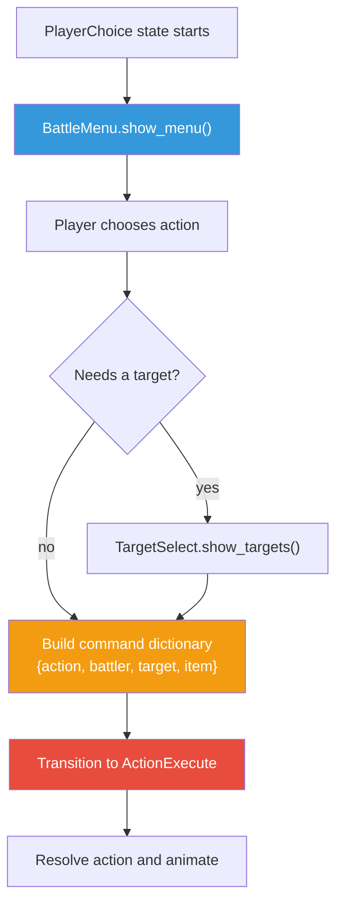
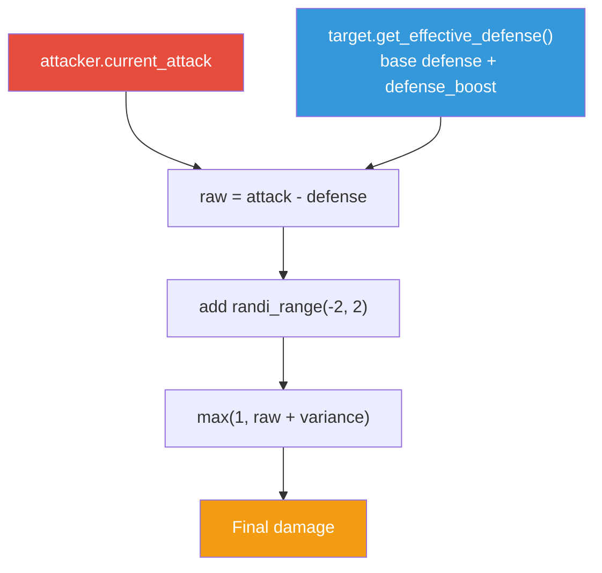

# Module 15: Player Actions: Attack, Defend, Magic, Items

## What We Have So Far

A battle system with a node-based state machine, turn order, and automatic combat. But the player can't make choices. Everything happens automatically.

## What We're Building This Module

The battle menu (Attack/Magic/Defend/Item), target selection, the damage formula, battle animations, and floating damage numbers. By the end, battles will be fully interactive.

## The Battle Menu UI

Create `res://ui/battle/battle_menu.tscn`:

```
BattleMenu (PanelContainer)
└── MarginContainer
    └── ActionList (VBoxContainer)
        ├── AttackButton (Button: "Attack")
        ├── MagicButton (Button: "Magic")
        ├── DefendButton (Button: "Defend")
        └── ItemButton (Button: "Item")
```

Script `res://ui/battle/battle_menu.gd`:

```gdscript
extends PanelContainer
## The main battle action menu.

signal action_chosen(action: String)

@onready var _attack_btn: Button = $MarginContainer/ActionList/AttackButton
@onready var _magic_btn: Button = $MarginContainer/ActionList/MagicButton
@onready var _defend_btn: Button = $MarginContainer/ActionList/DefendButton
@onready var _item_btn: Button = $MarginContainer/ActionList/ItemButton


func _ready() -> void:
    _attack_btn.pressed.connect(func() -> void: action_chosen.emit("attack"))
    _magic_btn.disabled = true
    _magic_btn.tooltip_text = "Magic is a future extension."
    _defend_btn.pressed.connect(func() -> void: action_chosen.emit("defend"))
    _item_btn.pressed.connect(func() -> void: action_chosen.emit("item"))


func show_menu() -> void:
    visible = true
    _attack_btn.grab_focus()


func hide_menu() -> void:
    visible = false
```

Attach this script to the `BattleMenu` root node of `battle_menu.tscn`.

> **See:** [GUI navigation](https://docs.godotengine.org/en/stable/tutorials/ui/gui_navigation.html): focus navigation between buttons with keyboard/gamepad.

## The Command Pattern

In Final Fantasy X, the game shows you a preview of the turn order before you commit to an action. Choosing Haste on yourself moves your icon up in the queue; choosing a slow spell pushes it back. This preview is only possible because actions are data objects that can be inspected before execution. If "Attack" were just a function call, there would be nothing to preview. By representing actions as data, we separate the decision from the execution.

Each battle action follows the same interface: an attacker does something to a target. We structure this as a dictionary command:

```gdscript
var command: Dictionary = {
    action = "attack",     # What to do
    battler = battler,     # Who does it
    target = target,       # Who receives it
    item = null,           # Optional: which item (for item use)
}
```

This pattern keeps the action execution generic. The `ActionExecute` state doesn't need to know the details of every possible action; it just reads the command dictionary.

For this tutorial, dictionaries are a low-friction teaching step. They do come with a tradeoff: a typo in `"target"` or `"action"` becomes a runtime bug. In a larger game, graduate this into a typed command object:

```gdscript
class_name BattleCommand
extends RefCounted

var action: StringName
var battler: BattlerData
var target: BattlerData
var item: ItemData
```

That typed object keeps the same command pattern while making the public fields explicit.



## Target Selection

Target selection is where strategy enters combat. In Earthbound, choosing to focus fire on the Territorial Oak instead of spreading damage across all enemies is often the difference between a clean fight and a party wipe. Without target selection, combat would be "press Attack and watch numbers happen." With it, every attack is a decision.

When the player chooses Attack, they need to pick which enemy to target. Create a target selection sub-system:

```gdscript
extends PanelContainer
## Shows a list of targets for the player to select.

signal target_selected(target: BattlerData)
signal cancelled

@onready var _target_list: VBoxContainer = $MarginContainer/TargetList


func show_targets(targets: Array[BattlerData]) -> void:
    visible = true

    for child in _target_list.get_children():
        child.queue_free()

    await get_tree().process_frame

    for target in targets:
        var button := Button.new()
        button.text = target.character_data.display_name + " (HP: " + str(target.current_hp) + ")"
        button.pressed.connect(func() -> void: target_selected.emit(target))
        _target_list.add_child(button)

    await get_tree().process_frame
    if _target_list.get_child_count() > 0:
        _target_list.get_child(0).grab_focus()


func hide_targets() -> void:
    visible = false


func _unhandled_input(event: InputEvent) -> void:
    if visible and event.is_action_pressed("ui_cancel"):
        cancelled.emit()
        get_viewport().set_input_as_handled()
```

Save this as `res://ui/battle/target_select.gd`, and create `res://ui/battle/target_select.tscn` with this scene tree:

```
TargetSelect (PanelContainer)
└── MarginContainer
    └── TargetList (VBoxContainer)
```

Attach `target_select.gd` to the `TargetSelect` root node of `target_select.tscn`.

## Integrating the Battle Menu into the Battle Scene

Open `battle.tscn` and instance both UI scenes under the `BattleUI` CanvasLayer:

```
BattleUI (CanvasLayer, layer = 10)
├── BattleMenu (instance of battle_menu.tscn)
└── TargetSelect (instance of target_select.tscn)
```

Set both to **visible = false** initially in the Inspector.

## Updating the PlayerChoice State

This is the critical wiring that connects the menu to the state machine. **Replace** the contents of `res://systems/battle/states/player_choice_state.gd` (the Module 14 placeholder that auto-attacked):

```gdscript
extends BattleState
## Waits for the player to choose an action from the battle menu.

var _active_battler: BattlerData
var _battle_menu: PanelContainer
var _target_select: PanelContainer


func enter(context: Dictionary = {}) -> void:
    _active_battler = context.get("battler")

    # Find UI nodes in the battle scene
    _battle_menu = get_tree().current_scene.get_node("BattleUI/BattleMenu")
    _target_select = get_tree().current_scene.get_node("BattleUI/TargetSelect")

    # Connect signals
    _battle_menu.action_chosen.connect(_on_action_chosen)
    _target_select.target_selected.connect(_on_target_selected)
    _target_select.cancelled.connect(_on_target_cancelled)

    _battle_menu.show_menu()


func exit() -> void:
    _battle_menu.hide_menu()
    _target_select.hide_targets()

    # Disconnect to avoid duplicate connections on re-entry
    if _battle_menu.action_chosen.is_connected(_on_action_chosen):
        _battle_menu.action_chosen.disconnect(_on_action_chosen)
    if _target_select.target_selected.is_connected(_on_target_selected):
        _target_select.target_selected.disconnect(_on_target_selected)
    if _target_select.cancelled.is_connected(_on_target_cancelled):
        _target_select.cancelled.disconnect(_on_target_cancelled)


func _on_action_chosen(action: String) -> void:
    match action:
        "attack":
            _battle_menu.hide_menu()
            _target_select.show_targets(battle_manager.get_alive_enemies())
        "defend":
            battle_manager.transition_to_state("ActionExecute", {
                battler = _active_battler,
                action = "defend",
            })
        "item":
            # Item use in battle (simplified for now)
            var consumables := InventoryManager.get_consumables()
            if consumables.is_empty():
                print("No items!")
                _battle_menu.show_menu()
            else:
                # Use first consumable on self (simplified)
                var item: ItemData = consumables[0].item
                battle_manager.transition_to_state("ActionExecute", {
                    battler = _active_battler,
                    action = "item",
                    target = _active_battler,
                    item = item,
                })


func _on_target_selected(target: BattlerData) -> void:
    _target_select.hide_targets()
    battle_manager.transition_to_state("ActionExecute", {
        battler = _active_battler,
        action = "attack",
        target = target,
    })


func _on_target_cancelled() -> void:
    _target_select.hide_targets()
    _battle_menu.show_menu()
```

This wires the complete flow: menu appears → player picks action → target selection if needed → command passed to ActionExecute.

> **Note:** Magic is visible in the menu but disabled. We keep the button because most JRPG battle menus reserve space for spells, but `AbilityData` is a future extension, not part of this core tutorial. Item use is simplified for now: it picks the first consumable automatically. In a full game, you'd show an item selection sub-menu.

## The Damage Formula

### Why Stats Exist

Before writing a formula, think about *why* stats exist at all. There are three good reasons to add a stat to your RPG:

1. **The simulation needs it.** If you want to calculate "who hits harder," you need a Strength stat. If you want "who acts first," you need Speed. Stats are numbers that feed your combat math.
2. **It defines characters by difference.** A dragon should feel different from a goblin. If you only have HP and Attack, every enemy is just a bag of hit points. Speed, Defense, and Magic create variety.
3. **It creates player choices.** Stats that the player can influence (through equipment, levels, or buffs) give strategic depth. "Do I boost Attack or Defense?" is only meaningful if both stats feed into the formula.

If a stat doesn't serve at least one of these purposes, it's clutter.

### Our Damage Formula

A damage formula should be simple to understand, produce meaningful numbers, and allow for strategic depth. Here's ours:

```gdscript
static func calculate_damage(attacker: BattlerData, target: BattlerData) -> int:
    var raw: int = attacker.current_attack - target.get_effective_defense()
    var variance: int = randi_range(-2, 2)
    return max(1, raw + variance)
```

This means:
- **Raw damage** = attacker's attack minus target's effective defense
- **Variance** adds ±2 randomness
- **Minimum damage** is always 1 (you always do at least something)

The Defend action increases `defense_boost`, making `get_effective_defense()` return a higher value, reducing incoming damage.



> **JRPG Pattern:** Most JRPGs keep their damage formula visible and understandable. Players should be able to reason about "if I equip this sword (+5 attack), I'll do roughly 5 more damage per hit." Complex formulas with hidden multipliers frustrate players.

### Alternative Formulas Used in Real RPGs

Our formula is subtractive: `attack - defense = damage`. This is the simplest family of damage formulas, and it works well for small number ranges. But it has a quirk: if defense is close to attack, damage drops to nearly zero and the `max(1)` floor kicks in constantly. With large stat growth, damage can also spike hard. Here are three other approaches real RPGs use:

**Multiplicative (Final Fantasy style):**
```
base_damage = random(attack, attack * 2)
damage = base_damage - defense
```
The random range between 1x and 2x attack adds drama. A lucky hit does double. Defense still subtracts, but the higher ceiling means defense rarely walls you completely.

**Ratio-based (Pokemon style):**
```
damage = (attack / defense) * base_power * modifier
```
The ratio means doubling your attack always doubles your damage, regardless of the target's defense. This produces stable, predictable scaling. The `modifier` term handles type effectiveness, critical hits, and random variance.

**Armor-as-percentage:**
```
reduction = defense / (defense + constant)
damage = attack * (1.0 - reduction)
```
Defense gives diminishing returns. The first 10 points of defense reduce a lot of damage; the next 10 reduce less. This prevents any character from becoming truly invincible through stacking defense. Many action RPGs use this.

Our subtractive formula is the right choice for Crystal Saga's scope. If you extend the game significantly, revisit the formula when you notice balance problems (damage too low at high levels, or defense becoming meaningless).

### Accuracy, Evasion, and Critical Hits

Our formula always hits. That's fine for a tutorial game, but commercial JRPGs usually layer accuracy on top of damage. Here's the general pattern:

```
1. Roll hit chance:   base_accuracy + (attacker.speed / max_speed) / 2
2. Roll dodge chance: base_evasion + (target.speed - attacker.speed) * 0.01
3. If miss: show "MISS", deal 0 damage
4. Roll critical:     small flat chance (5-10%)
5. If critical:       damage * 1.5 or damage + bonus roll
6. Otherwise:         normal damage
```

The key design insight: **speed should do double duty**. It determines turn order (Module 14) *and* influences hit/dodge rates. This makes Speed a meaningful stat without adding separate Accuracy and Evasion stats to your character sheet.

We won't implement this in Crystal Saga, but if you find battles feel too deterministic, adding a miss chance (even just 5-10%) adds tension. Players remember the time they dodged a killing blow.

### Isolate Your Formulas

Put all combat math in one file (we use `calculate_damage()` as a static function). When you start tuning your game's balance, you'll change these numbers constantly. Having them scattered across battle states, AI scripts, and item effects makes tuning painful. One file, one place to tweak.

## Implementing All Actions

Update the `ActionExecute` state to handle each action:

```gdscript
extends BattleState
## Executes the chosen action with animation.

func enter(context: Dictionary = {}) -> void:
    var battler: BattlerData = context.get("battler")
    var action: String = context.get("action", "attack")
    var target: BattlerData = context.get("target")
    var item = context.get("item")

    match action:
        "attack":
            await _execute_attack(battler, target)
        "defend":
            _execute_defend(battler)
        "item":
            _execute_item(battler, target, item)
        "enemy_turn":
            await _execute_enemy_turn(battler)

    await get_tree().create_timer(0.3).timeout
    battle_manager.transition_to_state("CheckResult")


func _execute_attack(attacker: BattlerData, target: BattlerData) -> void:
    var damage := max(1, attacker.current_attack - target.get_effective_defense() + randi_range(-2, 2))
    damage = max(1, damage)

    await _play_attack_animation(attacker)
    var actual := target.take_damage(damage)
    _spawn_damage_number(target, actual)
    battle_manager.action_executed.emit(attacker, target, actual)


func _execute_defend(battler: BattlerData) -> void:
    battler.defense_boost = battler.current_defense  # Double defense for one turn
    print(battler.character_data.display_name + " defends!")


func _execute_item(user: BattlerData, target: BattlerData, item: ItemData) -> void:
    if not item:
        return
    var changed := false
    if item.hp_restore > 0:
        var healed := target.heal(item.hp_restore)
        changed = changed or healed > 0
        _spawn_damage_number(target, healed, true)
    if item.mp_restore > 0:
        var old_mp := target.current_mp
        target.current_mp = min(target.current_mp + item.mp_restore, target.character_data.max_mp)
        changed = changed or target.current_mp != old_mp
    if changed:
        InventoryManager.remove_item(item)


func _execute_enemy_turn(battler: BattlerData) -> void:
    var targets := battle_manager.get_alive_party()
    if targets.is_empty():
        return
    var target: BattlerData = targets[randi() % targets.size()]
    await _execute_attack(battler, target)
```

## Battle Animations with Tweens

Without animation, combat is just numbers changing in a log. The original Final Fantasy proved that even simple sprite slides (a character stepping forward, pausing, then stepping back) transform a math equation into a fight. Floating damage numbers, first popularized by Diablo and now standard in everything from Final Fantasy XIV to Fortnite, give the player instant visual feedback on what just happened. These two elements, motion and numbers, are the minimum viable "game feel" for turn-based combat.

Animations make combat feel impactful. The classic JRPG attack animation: the attacker slides forward, pauses, then slides back.

Add both `_play_attack_animation` and `_find_battler_sprite` to `res://systems/battle/states/action_execute_state.gd` (the same script as the action execution code above):

```gdscript
func _play_attack_animation(attacker: BattlerData) -> void:
    var sprite := _find_battler_sprite(attacker)
    if not sprite:
        return
    var direction := -1.0 if attacker.is_player_controlled else 1.0
    var original_pos: Vector2 = sprite.position

    var tween := create_tween()
    tween.tween_property(sprite, "position:x", original_pos.x + 30.0 * direction, 0.15)
    tween.tween_interval(0.1)
    tween.tween_property(sprite, "position:x", original_pos.x, 0.15)
    await tween.finished


func _find_battler_sprite(battler: BattlerData) -> Node2D:
    for sprite in get_tree().get_nodes_in_group("battler_sprites"):
        if sprite.battler_data == battler:
            return sprite
    return null
```

> **See:** [Tween](https://docs.godotengine.org/en/stable/classes/class_tween.html): `tween_property()`, `tween_interval()`, chaining, and `await finished`.

## Floating Damage Numbers

A small label that rises and fades when damage is dealt. Add this method to `action_execute_state.gd` alongside the animation methods:

```gdscript
func _spawn_damage_number(target: BattlerData, amount: int, is_heal: bool = false) -> void:
    var sprite_node := _find_battler_sprite(target)
    if not sprite_node:
        return

    var label := Label.new()
    label.text = str(amount)
    label.add_theme_color_override("font_color", Color.GREEN if is_heal else Color.WHITE)
    label.z_index = 100
    # Add the label as a child of the sprite (Node2D), not the scene root.
    # This ensures the label uses Node2D coordinates, matching the sprite's position.
    sprite_node.add_child(label)
    label.position = Vector2(0, -20)

    var tween := create_tween()
    tween.set_parallel(true)
    tween.tween_property(label, "position:y", -50.0, 0.8)
    tween.tween_property(label, "modulate:a", 0.0, 0.8)
    tween.chain().tween_callback(label.queue_free)
```

This creates a label that floats upward and fades out over 0.8 seconds, then removes itself.

> **Note:** `set_parallel(true)` makes the next tweens run simultaneously (moving up AND fading at the same time). `chain()` returns to sequential mode for the cleanup callback.

## The Defend Action as a Temporary Buff

Defend doubles the battler's defense for one turn:

```gdscript
func _execute_defend(battler: BattlerData) -> void:
    battler.defense_boost = battler.current_defense
```

The boost is reset at the start of the battler's next turn (in the turn processing logic):

```gdscript
battler.defense_boost = 0  # Reset before the battler acts
```

This is the simplest form of a temporary status effect. In Module 26 (Next Steps), we'll discuss generalizing this into a full status effects system with poison, sleep, buffs, and debuffs.

## Complete action_execute_state.gd

For reference, here is the complete `res://systems/battle/states/action_execute_state.gd` with all methods from this module merged into one file:

```gdscript
extends BattleState
## Executes the chosen action with animation.

func enter(context: Dictionary = {}) -> void:
    var battler: BattlerData = context.get("battler")
    var action: String = context.get("action", "attack")
    var target: BattlerData = context.get("target")
    var item = context.get("item")

    match action:
        "attack":
            await _execute_attack(battler, target)
        "defend":
            _execute_defend(battler)
        "item":
            _execute_item(battler, target, item)
        "enemy_turn":
            await _execute_enemy_turn(battler)

    await get_tree().create_timer(0.3).timeout
    battle_manager.transition_to_state("CheckResult")


func _execute_attack(attacker: BattlerData, target: BattlerData) -> void:
    var damage := max(1, attacker.current_attack - target.get_effective_defense() + randi_range(-2, 2))
    damage = max(1, damage)

    await _play_attack_animation(attacker)
    var actual := target.take_damage(damage)
    _spawn_damage_number(target, actual)
    battle_manager.action_executed.emit(attacker, target, actual)


func _execute_defend(battler: BattlerData) -> void:
    battler.defense_boost = battler.current_defense
    print(battler.character_data.display_name + " defends!")


func _execute_item(user: BattlerData, target: BattlerData, item: ItemData) -> void:
    if not item:
        return
    var changed := false
    if item.hp_restore > 0:
        var healed := target.heal(item.hp_restore)
        changed = changed or healed > 0
        _spawn_damage_number(target, healed, true)
    if item.mp_restore > 0:
        var old_mp := target.current_mp
        target.current_mp = min(target.current_mp + item.mp_restore, target.character_data.max_mp)
        changed = changed or target.current_mp != old_mp
    if changed:
        InventoryManager.remove_item(item)


func _execute_enemy_turn(battler: BattlerData) -> void:
    var targets := battle_manager.get_alive_party()
    if targets.is_empty():
        return
    var target: BattlerData = targets[randi() % targets.size()]
    await _execute_attack(battler, target)


func _play_attack_animation(attacker: BattlerData) -> void:
    var sprite := _find_battler_sprite(attacker)
    if not sprite:
        return
    var direction := -1.0 if attacker.is_player_controlled else 1.0
    var original_pos: Vector2 = sprite.position

    var tween := create_tween()
    tween.tween_property(sprite, "position:x", original_pos.x + 30.0 * direction, 0.15)
    tween.tween_interval(0.1)
    tween.tween_property(sprite, "position:x", original_pos.x, 0.15)
    await tween.finished


func _find_battler_sprite(battler: BattlerData) -> Node2D:
    for sprite in get_tree().get_nodes_in_group("battler_sprites"):
        if sprite.battler_data == battler:
            return sprite
    return null


func _spawn_damage_number(target: BattlerData, amount: int, is_heal: bool = false) -> void:
    var sprite_node := _find_battler_sprite(target)
    if not sprite_node:
        return

    var label := Label.new()
    label.text = str(amount)
    label.add_theme_color_override("font_color", Color.GREEN if is_heal else Color.WHITE)
    label.z_index = 100
    sprite_node.add_child(label)
    label.position = Vector2(0, -20)

    var tween := create_tween()
    tween.set_parallel(true)
    tween.tween_property(label, "position:y", -50.0, 0.8)
    tween.tween_property(label, "modulate:a", 0.0, 0.8)
    tween.chain().tween_callback(label.queue_free)
```

## Engineering Contract

- **Global state:** Player actions consume InventoryManager items but battle decisions stay scene-local.
- **Public surface:** Battle menu emits action strings; target select emits chosen battlers; ActionExecute consumes command dictionaries.
- **Invariant:** Commands only use implemented fields: `action`, `battler`, `target`, and optional `item`.
- **Failure behavior:** Magic remains disabled until a future ability system exists.
- **Copy semantics:** Commands hold references to current runtime battlers; they should be executed immediately, not saved.

## Engine Gotcha

Signals connected in `enter()` must be disconnected in `exit()`. Otherwise returning to PlayerChoice can stack duplicate signal connections and execute one button press multiple times.

## What We've Learned

- The **battle menu** uses VBoxContainer with Buttons and `grab_focus()` for keyboard navigation.
- **Target selection** presents enemy names as buttons; cancelling returns to the menu.
- The **command pattern** represents actions as dictionaries: `{action, battler, target, item}`.
- **Stats exist for three reasons:** the simulation needs them, they differentiate characters, and they create player choices. If a stat doesn't serve at least one purpose, remove it.
- **Damage formula:** `max(1, attack - defense + random_variance)`. Our subtractive formula is simple and transparent. Alternatives include multiplicative (Final Fantasy), ratio-based (Pokemon), and armor-as-percentage formulas, each with different scaling behavior.
- **Isolate your formulas** in one place. Combat math gets tweaked constantly during balancing; scattering it across files makes tuning painful.
- **Battle animations** use Tweens: slide forward → pause → slide back.
- **Floating damage numbers** rise and fade using parallel tweens.
- **Defend** is a temporary defense buff, the simplest status effect pattern.
- `set_parallel(true)` and `chain()` control Tween sequencing.

## What You Should See

When a battle starts:
- A menu appears: Attack / Magic / Defend / Item
- Selecting Attack shows enemy targets
- Choosing a target plays a slide animation and shows a damage number
- Defend doubles defense for one turn
- Using a healing item on a wounded ally consumes it from inventory (using it on a full-HP/MP target does nothing and keeps the item)
- The enemy takes its turn automatically
- Combat feels responsive and interactive

## Next Module

We have interactive battles, but we're fighting placeholder Slimes with a debug key. In **Module 16: The Crystal Cavern**, we'll build a dungeon with its own tilemap, encounter zones, treasure chests, and a boss room, giving the battle system a proper home.
