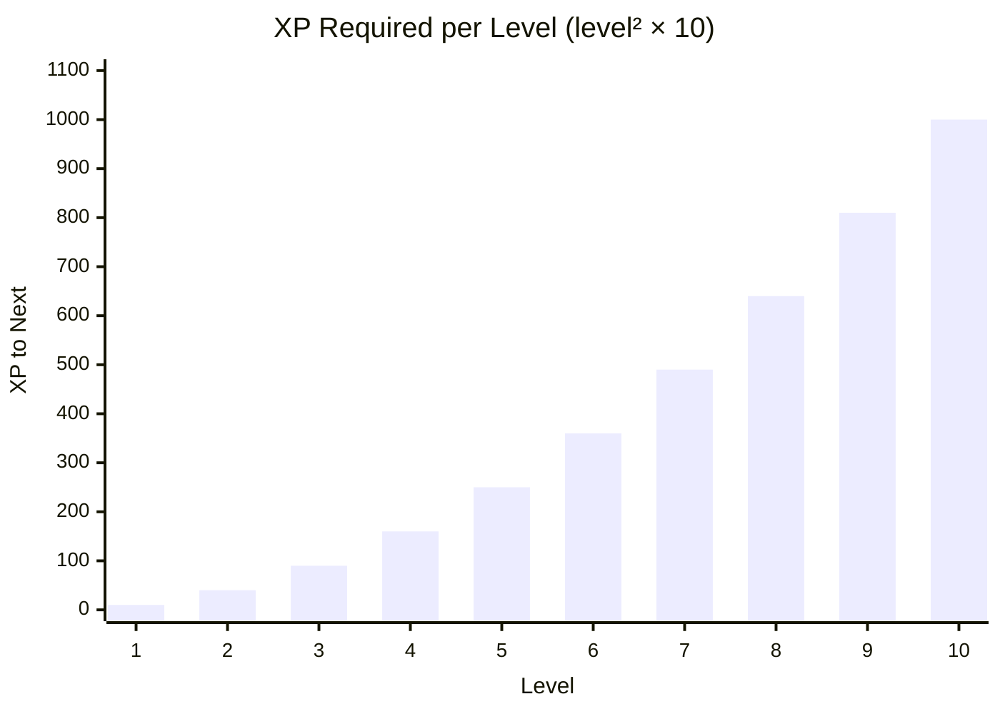

# Module 18: Victory, Rewards, and Leveling

## What We Have So Far

Interactive combat with enemies, AI, random encounters, and a boss fight. But winning a battle does nothing: no rewards, no progression.

## What We're Building This Module

Post-battle rewards (XP, gold, item drops), a leveling system with stat growth curves, the victory fanfare screen, and the game-over/defeat flow.

## Preparing the Data Layer

Before building the victory and leveling flows, make sure `CharacterData` still has the runtime properties we introduced in Module 9. We are finally going to put them to work here.

### CharacterData Runtime State

If your `res://resources/character_data.gd` does not already include these plain variables, add them now:

```gdscript
# Add to character_data.gd, runtime state (below the @export vars)
var current_xp: int = 0
var current_hp: int = 0  # Tracks HP between battles
var current_mp: int = 0  # Tracks MP between battles
```

> **Why both CharacterData and BattlerData have HP/MP:** BattlerData holds HP/MP *during* a battle (it's temporary, created fresh each fight). CharacterData holds HP/MP *between* battles (persistent across scenes). At battle start, `BattlerData.initialize_from_character()` copies from CharacterData. At battle end, we sync back.

### The XP Curve

We need a formula for "how much XP to reach the next level." This is one of the most important tuning knobs in your RPG. The curve shape determines the pacing of the entire game.

#### Why Levels Matter (Beyond Numbers)

Levels serve four purposes in a JRPG:

1. **Reward feedback.** The number going up *is* the reward. It's Pavlovian: fight → XP → level up → dopamine. Fast early levels hook the player.
2. **Narrative pacing.** Level roughly tracks where the player is in the story. A level 5 party is in the early game; a level 30 party is near the end. Designers use this to gate content.
3. **Complexity drip-feed.** New abilities unlock at specific levels, introducing mechanics gradually instead of dumping everything on the player at once.
4. **Content gating.** An area with level 15 enemies is implicitly locked until the party reaches that range. No locked doors needed.

#### Real RPG XP Formulas

Different curves produce very different game feel. Here are formulas reverse-engineered from real games:

| Game | Formula | Feel |
|------|---------|------|
| D&D 3.5 | `500 * level^2 - 500 * level` | Very steep. High levels are rare achievements. |
| Pokemon (fast group) | `round(0.8 * level^3)` | Moderate curve. Grinding is possible but not required. |
| Disgaea | `round(0.04 * level^3 + 0.8 * level^2 + 2 * level)` | Shallow. Levels come fast because *everything* levels. |

The general formula is:

```
xp_for_level = base_xp * level ^ exponent
```

- `base_xp` controls the overall cost of leveling. Higher = slower progression.
- `exponent` controls how much harder each successive level gets. At 1.0, every level costs the same XP. At 2.0 (quadratic), costs increase rapidly. At 3.0 (cubic), later levels take dramatically longer.

#### Our Curve

A simple quadratic curve works well for Crystal Saga's scope. Add this static function to `res://resources/character_data.gd`:

```gdscript
# A static func belongs to the class itself, not an instance. Call it as
# CharacterData.xp_for_level(5) without needing a CharacterData object.
# Useful for utility calculations that don't depend on instance data.
static func xp_for_level(level: int) -> int:
    return level * level * 10
```

| Level | XP to Next Level | Total XP |
|-------|-----------------|----------|
| 1 → 2 | 10 | 10 |
| 2 → 3 | 40 | 50 |
| 3 → 4 | 90 | 140 |
| 4 → 5 | 160 | 300 |
| 5 → 6 | 250 | 550 |
| 10 → 11 | 1,000 | 3,850 |

This is `base_xp=10, exponent=2`. Early levels come fast (10 XP for level 2), later levels take real effort (1,000 XP for level 11). If playtesting reveals that leveling feels too slow or too fast, change the `10` multiplier first, then consider adjusting the exponent.

> **Tuning tip:** Print the XP table for your expected level range (1-15 for Crystal Saga) and compare it against enemy XP rewards. If a single battle gives enough XP to level up, your curve is too shallow. If the player needs 50+ fights to level, it's too steep. Aim for 4-8 fights per level in the mid-game.



### Stat Growth

When a character levels up, their stats increase based on **growth rates** defined in CharacterData.

> **Spiral:** These growth rate fields (`hp_growth`, `mp_growth`, `attack_growth`, `defense_growth`, `speed_growth`) were defined in Module 9's CharacterData class. Verify your `aiden.tres` has non-zero values for all growth fields (e.g., hp_growth: 12, attack_growth: 3). If they default to 0, Aiden won't gain stats on level-up.

#### The Importance of Variance

If every level-up gives exactly +3 Attack, the progression feels mechanical. Real JRPGs add randomness: sometimes you get +2, sometimes +4. This makes each level-up a micro-event. The player watches the numbers and thinks "nice, +4 Strength this time!"

Some RPGs use dice notation for this. A growth rate of "3d2" means "roll three 2-sided dice" (range 3-6, weighted toward the middle). Faster-growing stats use more dice with higher sides; slower stats use fewer dice. We'll keep it simpler with `randi_range`, but the principle is the same: **growth rate = base value + bounded randomness**.

Different characters should grow differently. A warrior gains more HP and Attack per level; a mage gains more MP and Magic. These growth rate differences, compounded over 15-20 levels, make characters feel distinct even if they start similar.

#### The Calculate-Before-Apply Pattern

Notice that `level_up()` returns a `gains` dictionary *and* applies the gains in the same call. This is a simplification. In a polished RPG, you'd split this into two steps:

1. **Calculate** the level-up (what stats *would* increase), returning a preview
2. **Apply** the level-up (actually modify the character), called after the UI finishes displaying

This separation lets you show an animated victory screen where stats tick up one by one, HP bars extend, and "Level Up!" flashes before the numbers are committed. For Crystal Saga, combining both steps is fine. But if you build a victory screen with animated stat bars later, refactor `level_up()` into `create_level_up() -> Dictionary` and `apply_level_up(gains: Dictionary)`.

#### Implementation

Add this method to `res://resources/character_data.gd`:

> **Note:** `level_up()` modifies the Resource's properties at runtime. These changes persist in memory (because Resources are shared by reference) but do NOT modify the `.tres` file on disk. This is the correct behavior; runtime progression should not overwrite base data.

```gdscript
func level_up() -> Dictionary:
    level += 1
    var gains: Dictionary = {
        hp = hp_growth + randi_range(0, 2),
        mp = mp_growth + randi_range(0, 1),
        attack = attack_growth + randi_range(0, 1),
        defense = defense_growth + randi_range(0, 1),
        speed = speed_growth,
    }
    var old_max_hp: int = max_hp
    var old_max_mp: int = max_mp
    max_hp += gains.hp
    max_mp += gains.mp
    current_hp = min(current_hp + (max_hp - old_max_hp), max_hp)
    current_mp = min(current_mp + (max_mp - old_max_mp), max_mp)
    attack += gains.attack
    defense += gains.defense
    speed += gains.speed
    return gains
```

The small random variance (`randi_range(0, 1)` or `(0, 2)`) makes each level-up feel slightly different. HP gets the widest variance because it's the largest number and small fluctuations are less noticeable.

Crystal Saga uses the **gain the delta** rule for HP and MP: if max HP increases by 10, current HP also increases by 10, without exceeding the new max. This feels better than "max increases but current HP stays the same" and is less generous than a full heal on every level-up.

### Centralizing XP Awards

Battles are awarding XP now, and quests will start awarding XP once PartyManager exists in Module 21. Rather than duplicate the level-up loop in multiple systems, give `CharacterData` one helper that owns the "gain XP, maybe level up several times" flow.

Add this below `level_up()` in `res://resources/character_data.gd`:

```gdscript
func grant_xp(xp: int) -> Array[Dictionary]:
    current_xp += xp

    var level_ups: Array[Dictionary] = []
    var required: int = CharacterData.xp_for_level(level)
    while current_xp >= required:
        current_xp -= required
        var gains: Dictionary = level_up()
        level_ups.append({
            level = level,
            gains = gains,
        })
        required = CharacterData.xp_for_level(level)

    return level_ups
```

This helper returns a small summary for each level-up so the caller can print messages or build UI around it without owning the math itself.

## The Victory Flow

Now that the data layer is ready, update the Victory battle state (`res://systems/battle/states/victory_state.gd`) to show rewards:

```gdscript
extends BattleState
## Battle won. Calculate and display rewards.


func enter(_context: Dictionary = {}) -> void:
    print("VICTORY")

    var total_xp: int = 0
    var total_gold: int = 0
    var dropped_items: Array[ItemData] = []

    # Calculate rewards from all enemies
    for enemy in battle_manager.enemies:
        if enemy.enemy_data:
            total_xp += enemy.enemy_data.xp_reward
            total_gold += enemy.enemy_data.gold_reward
            if enemy.enemy_data.drop_item and randf() < enemy.enemy_data.drop_chance:
                dropped_items.append(enemy.enemy_data.drop_item)

    # Distribute XP to party members
    var xp_per_member: int = total_xp / max(1, battle_manager.get_alive_party().size())
    for battler in battle_manager.get_alive_party():
        _apply_xp(battler, xp_per_member)

    # Sync battle HP/MP back to CharacterData for persistence
    battle_manager.sync_party_to_character_data()

    # Grant gold
    InventoryManager.add_gold(total_gold)
    print("Gained " + str(total_gold) + " gold!")

    # Grant dropped items
    for item in dropped_items:
        InventoryManager.add_item(item)
        print("Found: " + item.display_name + "!")

    battle_manager.battle_won.emit()

    # Wait for player to acknowledge
    await get_tree().create_timer(2.0).timeout
    # Return to overworld
    SceneManager.return_from_battle()


func _apply_xp(battler: BattlerData, xp: int) -> void:
    if not battler.character_data:
        return

    var char_data: CharacterData = battler.character_data
    print(char_data.display_name + " gained " + str(xp) + " XP!")
    for result in char_data.grant_xp(xp):
        var gains: Dictionary = result.gains
        print(char_data.display_name + " reached level " + str(result.level) + "!")
        print("  HP +" + str(gains.hp) + ", ATK +" + str(gains.attack) +
              ", DEF +" + str(gains.defense))
```

Item drops turn every battle into a small gamble. In Pokemon, rare wild encounters might hold rare items; in Final Fantasy, stealing from bosses yields unique equipment. The probability doesn't need to be high; even a 10% chance of a rare drop creates a "did I get it?" moment after every fight. Drops should complement shop inventory, not replace it: shops sell reliable basics, drops reward persistence with something special.

## The Defeat Flow

When the party is wiped:

```gdscript
extends BattleState
## Party wiped. Show game over screen.


func enter(_context: Dictionary = {}) -> void:
    print("DEFEAT")
    print("The party has fallen...")
    battle_manager.sync_party_to_character_data()
    battle_manager.battle_lost.emit()

    await get_tree().create_timer(2.0).timeout

    # Return to title screen (or last save point)
    # For now, just reload the main scene
    SceneManager.change_scene("res://scenes/willowbrook/willowbrook.tscn", "default")
```

Module 25 replaces this with a proper Game Over screen with options (load save, return to title).

## Post-Battle State Restoration

HP carry-over is the hidden engine of dungeon tension. In every classic Final Fantasy, the real challenge isn't any single battle. It's surviving the entire dungeon with limited healing. Each random encounter chips away at your HP and MP, and the question becomes: "Do I use my last Ether now, or save it for the boss?" This resource attrition is what makes save crystals feel like oases and inns feel like home.

After a victorious battle, the party returns to the overworld with their current HP/MP intact. This works because every battle exit path calls one helper before leaving the battle scene:

```gdscript
# In BattleManager. Module 17's flee path uses this too.
func sync_party_to_character_data() -> void:
    for battler in party:
        if battler.character_data:
            battler.character_data.current_hp = battler.current_hp
            battler.character_data.current_mp = battler.current_mp
```

Two things make that helper matter:

1. **HP/MP sync**: victory, defeat, flee, and scripted escapes all write `battler.current_hp` and `battler.current_mp` back to `battler.character_data`. Without this, fleeing after taking damage would become a hidden full-heal exploit.
2. **Resource sharing**: CharacterData resources are shared by reference. When the battle modifies stats via `level_up()`, that change persists across scenes automatically.

For now, since we don't have a formal PartyManager yet (Module 21), the CharacterData resource at `res://data/characters/aiden.tres` is loaded via `load()`, which caches it. All code that loads the same path gets the same object during the current run, which is what lets battle results persist across scenes. In Module 22 and Module 25, we'll start loading **fresh runtime copies** for save/load and New Game so a brand-new run always starts from pristine base data on disk.

> **JRPG Pattern:** After normal battles, HP/MP carry over (no free heals). Save points and inns restore them. This creates a resource management game: do you use that Potion now or save it for the boss?

> **See:** [Resource](https://docs.godotengine.org/en/stable/classes/class_resource.html). Resources loaded with `load()` are cached and shared by reference. Runtime changes to exported properties persist in memory but don't write back to the `.tres` file.

> **See:** [Tween](https://docs.godotengine.org/en/stable/classes/class_tween.html). For future enhancements, Tweens can animate the victory screen (stat bars filling, XP counters incrementing).

## Engineering Contract

- **Global state:** Victory writes rewards into PartyManager and InventoryManager through their public APIs.
- **Public surface:** XP gain, level-up, reward calculation, loot rolls, and post-battle HP/MP sync.
- **Invariant:** Level-up max HP/MP gains also increase current HP/MP by the same delta, capped at the new max.
- **Failure behavior:** Dead party members do not receive XP in the base tutorial flow.
- **Copy semantics:** Battle HP/MP lives on BattlerData until a battle exit syncs it back to CharacterData.

## Engine Gotcha

Resource mutation is now intentional: party CharacterData is runtime state. New Game and load flows must avoid reusing mutated cached Resources when they need pristine base data.

## What We've Learned

- **XP distribution** divides total XP among alive party members.
- **Levels serve four purposes:** reward feedback, narrative pacing, complexity drip-feed, and content gating. They're not just a number.
- **XP curve shape** (`base_xp * level ^ exponent`) determines game pacing. A quadratic curve (exponent 2) starts fast and ramps up. Compare your curve against enemy XP rewards to check pacing.
- **Stat growth** per level uses base growth rates plus bounded randomness. Variance makes each level-up feel like a micro-event. Different characters should grow differently to feel distinct.
- **Calculate before apply:** for a polished victory screen, separate `create_level_up()` (returns preview data) from `apply_level_up()` (commits changes). This enables animated stat displays.
- **Loot drops** use probability (`randf() < drop_chance`) on each defeated enemy.
- **Victory flow:** calculate rewards → distribute XP → check level ups → sync HP/MP → grant gold/items → return to overworld.
- **Defeat flow:** display game over → return to title or last save.
- Character progression is centralized through `CharacterData.grant_xp()`, so battles and later quest rewards can use the same level-up path.
- Runtime CharacterData changes persist during the current play session because systems share the same active character resources.

## What You Should See

After winning a battle:
- "VICTORY" appears in the output panel
- XP, gold, and item drops are listed (e.g., "Aiden gained 12 XP!", "Gained 6 gold!")
- Characters may level up: "Aiden reached level 2!" with stat increases
- After 2 seconds, the game returns to the overworld at the player's previous position
- HP/MP carry over from the battle (if you took damage, your HP stays reduced)

After losing a battle:
- "DEFEAT" appears in the output panel
- The game reloads Willowbrook (placeholder for proper Game Over screen in Module 25)

**Concrete example:** If Aiden (level 1, 0 XP) defeats 2 Crystal Slimes (12 XP each), he gains 24 XP total. Since level 1→2 requires only 10 XP, he levels up to level 2 with 14 XP remaining.

## Next Module

Next up, **Module 19** reviews everything from Part IV with cheat sheets and common mistakes. Then in **Module 20: The Quest System and Game Flags**, we'll add a game-wide flag system for tracking world state, quest data with objectives, a quest log UI, and make NPCs react differently based on what the player has accomplished.
