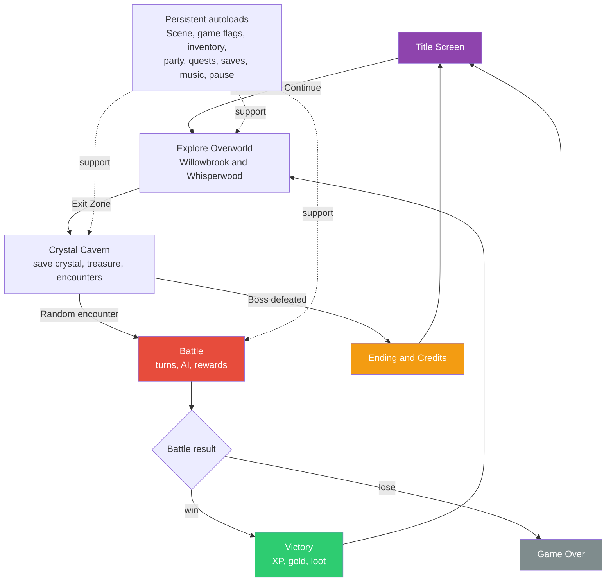

# Module 26: Finish Line (Polish, Export, and Next Steps)

## What We Have

A complete tutorial JRPG vertical slice. Let that sink in. Across the series, you've built:

- A tile-based overworld with three connected areas
- An animated player character with a state machine
- Scene transitions with fade effects
- NPCs with dialogue, a typewriter text effect, and branching choices
- A data-driven architecture using custom Resources
- An inventory system with consumable items
- A turn-based battle system with a node-based state machine
- Player actions: attack, defend, item use, and a disabled Magic slot reserved for a future ability system
- Enemy AI with three behavior types
- Random encounters with weighted probability
- A dungeon with treasure chests, a save crystal, and a boss fight
- XP, leveling, stat growth, and loot drops
- A quest system with game flags and reactive dialogue
- Party management with a recruitable companion
- Equipment that modifies combat stats
- Shops and an inn
- Save and load with JSON serialization
- Background music with crossfading
- Sound effects via audio buses
- A title screen, pause menu, ending, and credits
- A complete game loop

That's a real tutorial game: a playable JRPG vertical slice with every major system in place. It is not a content-complete commercial RPG yet, but the architecture can support more content and polish.



Intentional exclusions for this slice: Magic/AbilityData remains a future extension, status effects are limited to the Defend-style temporary buff pattern, and the starter quest log shows active quests only. Those are good next steps, not missing prerequisites for this tutorial's title-to-credits flow.

## Playtesting Walkthrough

Play through Crystal Saga from start to finish and verify each checkpoint:

### 1. Title Screen
- [ ] Title screen appears on launch
- [ ] "New Game" starts with correct initial state (3 Potions, 100 gold, Aiden only)
- [ ] "Continue" is disabled when no saves exist

### 2. Willowbrook
- [ ] Player spawns in town center
- [ ] Town music plays
- [ ] Walking into NPCs shows interaction prompt
- [ ] Shopkeeper opens the shop (buy Potions, equipment)
- [ ] Shopkeeper can buy from and sell to the player
- [ ] Innkeeper offers rest for 10 gold
- [ ] Elder Maren starts the Crystal Resonance quest
- [ ] Fynn mentions his lost pendant (starts quest)
- [ ] Lira can be recruited after two conversations

### 3. Whisperwood
- [ ] Music crossfades when entering the forest
- [ ] Scene transitions to and from Willowbrook still work
- [ ] The forest reads clearly as an exploration connector, not a battle arena
- [ ] The pendant can be found in Whisperwood (the PendantChest you placed in Module 20); returning it to Fynn completes the Lost Pendant quest

### 4. Crystal Cavern
- [ ] Dungeon music plays
- [ ] Treasure chests give items
- [ ] Save crystal saves the game
- [ ] Encounter zones have harder enemies
- [ ] Boss room door requires the Crystal Key (if you created this item; otherwise leave `required_item_id` empty)
- [ ] Crystal Guardian dialogue plays before the fight

### 5. Boss Battle
- [ ] Boss has higher stats, tougher fight
- [ ] Defeating the boss triggers the ending
- [ ] Game over on party wipe opens the Game Over screen, with load-or-title options

### 6. Ending and Credits
- [ ] Ending text displays after boss
- [ ] Credits scroll and return to title
- [ ] "Continue" opens the save slot dialog and loads the selected save (if the player saved before the boss)

### 7. Systems Integration
- [ ] Save/load preserves all state correctly
- [ ] Quest log shows correct objective states for active quests
- [ ] Equipment changes are reflected in battle
- [ ] Pause menu opens Inventory, Equipment, Quest Log, and Settings during gameplay
- [ ] Pause menu stays inactive on battle, title, game over, ending, and credits screens
- [ ] Audio volume controls persist across restarts via `user://settings.cfg`

## Common Bugs and Fixes

### "Player walks through walls"
- **Cause:** TileMap tiles don't have physics collision set.
- **Fix:** Select the tile in the TileSet editor, add collision on the Physics Layer.

### "Scene change crashes with null reference"
- **Cause:** Code runs on a node that was just freed during scene change.
- **Fix:** Check `is_instance_valid(node)` before accessing nodes during transitions.

### "Dialogue box doesn't advance"
- **Cause:** Input event consumed by another system.
- **Fix:** Ensure the dialogue box uses `_unhandled_input()` and calls `set_input_as_handled()`.

### "Enemy HP goes negative"
- **Cause:** `take_damage()` doesn't clamp to 0.
- **Fix:** `current_hp = max(0, current_hp - damage)`.

### "Save file loads wrong data"
- **Cause:** Resource paths changed since the save was written.
- **Fix:** Use stable paths. Add a version field to saves for migration.

### "Music plays over itself"
- **Cause:** MusicManager not checking if the same track is already playing.
- **Fix:** Check `track_path == _current_track_path` before starting.

### "Inventory shows stale data after using an item in battle"
- **Cause:** Battle creates a new Tween that outlives the inventory reference.
- **Fix:** Refresh inventory UI on `inventory_changed` signal.

## Performance Basics

2D JRPGs are not performance-intensive, but a few things to watch:

### Avoid `_process()` on everything
Nodes with empty `_process()` methods still cost a function call per frame. Remove the template `_process()` from scripts that don't need per-frame updates.

### Cache node references with `@onready`
```gdscript
# Good: cached once
@onready var sprite: Sprite2D = $Sprite

# Bad: looked up every frame
func _process(delta):
    get_node("Sprite").visible = true
```

### Object pool for damage numbers
If you're creating many floating damage numbers per battle, consider reusing label nodes instead of creating and freeing them each time.

### TileMap optimization
Large tilemaps with thousands of tiles are fine. Godot optimizes them into rendering quadrants. But avoid calling `set_cell()` in `_process()`.

> **See:** [Performance best practices](https://docs.godotengine.org/en/stable/tutorials/performance/general_optimization.html), the official performance guide.

## Exporting the Game

Until you export, your game only runs inside the Godot editor. Exporting creates a standalone application that anyone can play without installing Godot, the same way players download a game from Steam or itch.io. Cave Story was built by one person over five years, and the moment Daisuke Amaya exported it and uploaded it to his website, it went from a personal project to one of the most influential indie games ever made.

### Step 1: Install Export Templates

Go to **Editor → Manage Export Templates → Download and Install**. This downloads platform-specific build templates.

### Step 2: Create an Export Preset

1. Go to **Project → Export**.
2. Click **Add...** and choose your platform (Windows, macOS, or Linux).
3. Configure the preset name and output path.

### Step 3: Build

Click **Export Project** and choose where to save the build. Godot creates a standalone executable plus a `.pck` file containing all your game data.

Your game is now a real, distributable application.

> **See:** [Exporting projects](https://docs.godotengine.org/en/stable/tutorials/export/exporting_projects.html), the full export guide for all platforms.

## Balancing Your Game

You've built all the systems. Now comes the part that separates a frustrating game from a satisfying one: balance. No formula or system matters if the numbers don't feel right.

### Economy Balance

Your game has a gold economy: enemies drop gold, shops charge gold, inns cost gold. These form a loop:

```
Fight enemies → earn gold → buy equipment → fight harder enemies → earn more gold
```

Check this loop by doing the math on paper:

1. **How much gold does the player earn per dungeon run?** Average enemies per run * average gold per enemy. For Crystal Saga: ~8 fights * ~8 gold = ~64 gold per run.
2. **How much does the best available equipment cost?** Iron Sword = 100 gold, Leather Armor = 80 gold. Total to equip one character = ~180 gold.
3. **How many runs to afford a full equipment set?** 180 / 64 = ~2.8 dungeon runs. That feels about right; the player can gear up without excessive grinding.

If the answer to #3 is "10+ runs," your economy is too tight. If it's "they can buy everything after one fight," equipment upgrades don't feel meaningful. Aim for 1-3 dungeon runs to afford the next tier of gear.

The inn is a pressure valve. If it costs 10 gold and the player earns ~8 gold per fight, healing between runs costs roughly one fight's worth of gold. That's a fair tax.

### Combat Simulation

Here's a trick from professional RPG development: before playtesting manually, write a quick script that simulates hundreds of battles and prints the results. No UI needed, just pure math:

```gdscript
# Run this in a test script or the Output panel
func simulate_battle(attacker_atk: int, attacker_hp: int, defender_atk: int, defender_hp: int) -> Dictionary:
    var turns: int = 0
    var a_hp := attacker_hp
    var d_hp := defender_hp
    while a_hp > 0 and d_hp > 0:
        d_hp -= max(1, attacker_atk - 3 + randi_range(-2, 2))  # player hits enemy
        if d_hp <= 0:
            break
        a_hp -= max(1, defender_atk - 3 + randi_range(-2, 2))   # enemy hits player
        turns += 1
    return {player_won = a_hp > 0, turns = turns, remaining_hp = a_hp}
```

Run it 1,000 times with your actual stat values and check:
- **Win rate against regular enemies** should be 85-95%. Below 80% means the player will wipe too often. Above 98% means fights have no tension.
- **Average turns to win** should be 2-4 for trash mobs. Longer and fights feel like a slog. Shorter and enemies are just XP piñatas with no threat.
- **Remaining HP** after a fight tells you how many consecutive fights the player can handle before needing to heal. If they exit every fight at 95% HP, encounters have no strategic weight.

This approach lets you tune your damage formula, stat growth, and enemy stats without playing through the game dozens of times.

## Where to Go from Here

Crystal Saga is a foundation. Here's what you could add next, in rough order of complexity:

### More Content (Easy)
- New areas, NPCs, and quests using the existing systems
- More enemy types and encounter groups
- Additional items and equipment
- Extended dialogue for existing NPCs

### Status Effects System (Medium)
Generalize the Defend buff from Module 15 into a full system. The modifier pattern from Module 21 is the natural foundation: each status effect is a modifier with a duration.
- **Poison:** Lose HP each turn (3 turns). Implement as a tick effect that fires in CHECK_RESULT.
- **Sleep:** Skip turn, wakes on damage. Implement by intercepting the turn in TURN_START.
- **Stun:** Skip one turn. Same interception, but auto-clears after one skip.
- **Regen:** Heal HP each turn. Tick effect, opposite of Poison.
- **Buff/Debuff:** Temporary stat modifiers (the `add`/`mult` pattern from Module 21). Bravery adds +25% Attack for 3 turns; Slow reduces Speed by 50% for 2 turns.
- Each effect needs: type, duration (turns remaining), magnitude, a `tick()` method (for per-turn effects), and a modifier (for stat changes). Use unique IDs to prevent stacking the same buff; casting Bravery twice refreshes the duration instead of doubling the bonus.

### Elemental Weakness/Resistance (Medium)
Add elements to abilities and enemies:
- Fire, Ice, Lightning, Earth, Light, Dark
- Weakness = 2x damage, Resistance = 0.5x damage
- Adds strategic depth to magic and enemy design

### Limit Breaks (Medium)
Special abilities that charge as a character takes damage:
- A "limit gauge" that fills from 0 to 100
- At 100, a powerful unique ability becomes available
- Each character has a different limit break

### Advanced Dialogue (Medium-Hard)
- Speaker portraits that animate during dialogue
- Animated text effects (shake, wave, color change) via BBCode
- Cutscene system with camera movement and character positioning

### More Party Members (Medium)
Each new character needs: CharacterData, abilities, recruitment event, and unique battle behavior. The systems already support it; just add content.

### Procedural Dungeons (Hard)
Generate cave layouts from room templates:
- Define room shapes as small TileMapLayer sections
- Connect them with corridors via a generation algorithm
- Place enemies, chests, and the boss procedurally

### Controller Support Polish (Easy-Medium)
- Detect connected controller type (Xbox, PlayStation, Switch)
- Show matching button prompts in UI
- Analog stick deadzone tuning
- Vibration/rumble on hits

### Mobile Export (Medium)
- Touch controls (virtual D-pad, action buttons)
- Screen scaling for different aspect ratios
- Touch-friendly UI with larger buttons

## Recommended Resources

### Learning
- **[GDQuest](https://www.gdquest.com/):** High-quality Godot tutorials and courses
- **[KidsCanCode](https://kidscancode.org/godot_recipes/):** Godot recipes and patterns
- **[Official Godot docs](https://docs.godotengine.org/):** The reference we've cited throughout
- **[Godot community forums](https://forum.godotengine.org/):** Help and discussion

### Assets
- **[Kenney](https://kenney.nl/):** Free, high-quality 2D/3D game assets
- **[OpenGameArt](https://opengameart.org/):** Community-contributed free art
- **[itch.io asset packs](https://itch.io/game-assets):** Free and paid 2D art, including JRPG-specific packs
- **[Time Fantasy](https://finalbossblues.com/timefantasy/):** Professional JRPG tile and sprite packs

### Tools
- **[Aseprite](https://www.aseprite.org/):** Pixel art editor (paid, open source)
- **[Tiled](https://www.mapeditor.org/):** External tilemap editor (free)
- **[Audacity](https://www.audacityteam.org/):** Audio editing (free)

## Engineering Contract

- **Global state:** This module audits all existing autoload state rather than adding new systems.
- **Public surface:** Playtest checklist, troubleshooting guide, export steps, and extension roadmap.
- **Invariant:** The tutorial ships a vertical slice whose implemented systems agree with review modules and save/load contracts.
- **Failure behavior:** Any broken checkpoint becomes a concrete bug to fix before export.
- **Copy semantics:** Export packages project resources into a build; runtime user data remains under `user://`.

## Engine Gotcha

Exported builds do not write to `res://`. Save files and settings must use `user://`, and exported behavior should be tested separately from the editor.

## What We've Learned

- A finished tutorial vertical slice is more than isolated features; the title, save/load, audio, ending, and failure flows must all connect.
- Playtesting should follow the player's actual route through the game, not the order the systems were implemented.
- Save/load testing includes world-object flags, quest state, inventory, party stats, scene path, player position, and settings that live outside save slots.
- Performance work starts with simple habits: remove unused `_process()` methods, cache node references, and avoid per-frame tile edits.
- Exporting turns an editor project into a distributable application, but the build still needs the same gameplay verification as the editor version.

## What You Should See

After working through this module, your game should pass the full playtesting walkthrough above. Specifically:

- The title screen loads with New Game, Continue, and Settings buttons
- New Game starts in Willowbrook with Aiden, 3 Potions, and 100 gold
- You can walk through all three areas, talk to NPCs, buy items, and save at the crystal
- Random encounters trigger in Crystal Cavern, leading to turn-based battles
- The boss fight in the Crystal Cavern leads to the ending and credits
- Continue opens the save slot dialog and loads a saved game with all progress intact
- The game exports to a standalone executable that runs without the Godot editor

If any of these fail, check the Common Bugs section above and the troubleshooting tables in the review modules (08, 13, 19, 23, 27).

## What You've Accomplished

You started with an empty Godot project and a blinking cursor. Twenty-six modules later, you have:

- **Thousands of lines of GDScript** across dozens of scripts
- **8 autoloads** managing global game state and global UI (SceneManager, InventoryManager, GameManager, QuestManager, PartyManager, SaveManager, MusicManager, PauseMenu)
- **3 game areas** with hand-crafted tilemaps
- **A complete battle system** with state machines, AI, and animations
- **5 interlocking systems** (inventory, quests, party, save/load, audio)
- **A complete tutorial JRPG vertical slice** with a beginning, middle, and end

More importantly, you've learned the **patterns** that scale. The state machine pattern works for player movement, battle flow, quest tracking, and dialogue flow. The Resource pattern works for items, characters, enemies, quests, and encounters. The autoload pattern works for scene management, inventory, quests, party, save/load, audio, and pause UI. These patterns repeat everywhere in game development, not just in JRPGs.

## Closing Thoughts

JRPGs are a labor of love. They require patience: building systems, crafting worlds, writing dialogue, balancing combat, and testing everything together. But they're also one of the most rewarding genres to build, because every system connects to every other system, and when they all work together, the result is a game that feels whole.

Crystal Saga is small by commercial standards, but its tutorial architecture is complete enough to expand: more story, more areas, more characters, more mechanics. The foundation supports it.

## Next Module

In **Module 27: Part VI Review and Cheat Sheet**, we'll consolidate the audio, game-flow, polish, export, and final architecture into one reference you can use before extending the project.

The most important thing you can do now is **keep building**. Pick one of the "where to go from here" suggestions that excites you, and implement it. Then another. Each addition teaches you something new, and each one makes the game more yours.

Good luck. The world needs more JRPGs.
