# Tutorial Mermaid Diagrams

Generated snapshot of the Mermaid diagrams embedded in the numbered tutorial modules. The module files are the source of truth.

## Module 1: The Journey Begins

### Nodes: The Building Blocks

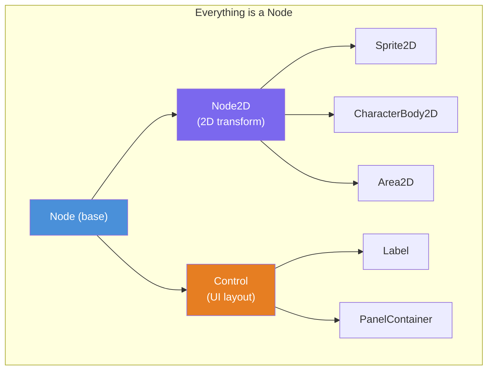
```mermaid
graph TD
    subgraph "Everything is a Node"
        Node["Node (base)"]
        Node2D["Node2D\n(2D transform)"]
        Control["Control\n(UI layout)"]
        Sprite["Sprite2D"]
        CB2D["CharacterBody2D"]
        Area["Area2D"]
        Label["Label"]
        Panel["PanelContainer"]

        Node --> Node2D
        Node --> Control
        Node2D --> Sprite
        Node2D --> CB2D
        Node2D --> Area
        Control --> Label
        Control --> Panel
    end

    style Node fill:#4a90d9,color:#fff
    style Node2D fill:#7b68ee,color:#fff
    style Control fill:#e67e22,color:#fff
```

## Module 2: GDScript for Programmers

### `_process(delta)`

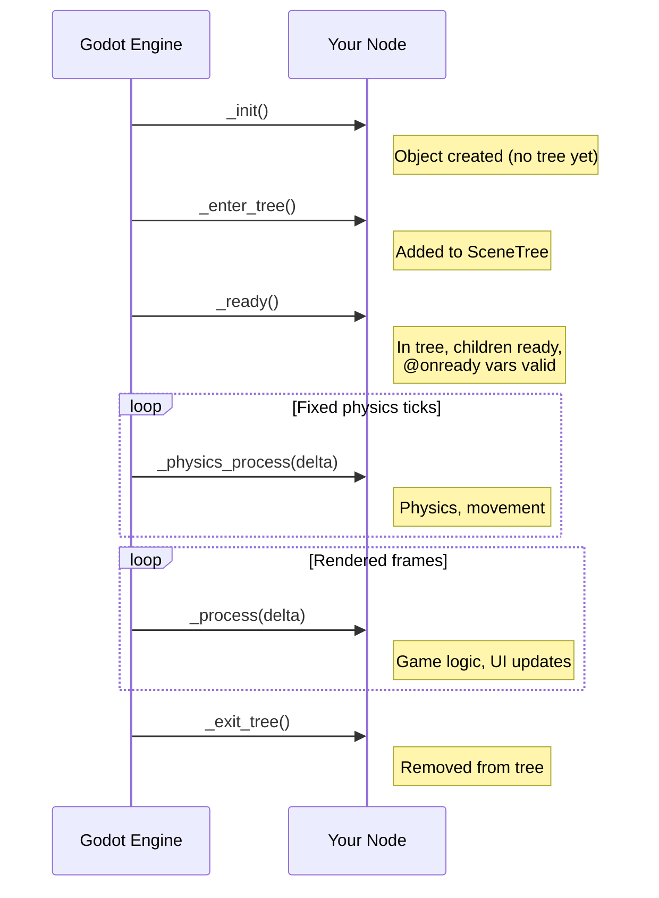
```mermaid
sequenceDiagram
    participant Engine as Godot Engine
    participant Node as Your Node

    Engine->>Node: _init()
    Note right of Node: Object created (no tree yet)
    Engine->>Node: _enter_tree()
    Note right of Node: Added to SceneTree
    Engine->>Node: _ready()
    Note right of Node: In tree, children ready,<br/>@onready vars valid
    loop Fixed physics ticks
        Engine->>Node: _physics_process(delta)
        Note right of Node: Physics, movement
    end
    loop Rendered frames
        Engine->>Node: _process(delta)
        Note right of Node: Game logic, UI updates
    end
    Engine->>Node: _exit_tree()
    Note right of Node: Removed from tree
```

### `@onready`: Cache Node References

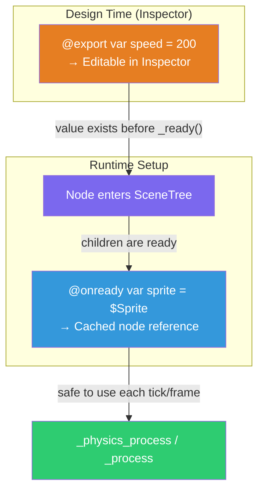
```mermaid
graph TD
    subgraph "Design Time (Inspector)"
        Export["@export var speed = 200\n→ Editable in Inspector"]
    end
    subgraph "Runtime Setup"
        Enter["Node enters SceneTree"]
        Onready["@onready var sprite = $Sprite\n→ Cached node reference"]
    end

    Export --> |"value exists before _ready()"| Enter
    Enter --> |"children are ready"| Onready
    Onready --> |"safe to use each tick/frame"| GameLoop["_physics_process / _process"]

    style Export fill:#e67e22,color:#fff
    style Onready fill:#3498db,color:#fff
    style Enter fill:#7b68ee,color:#fff
    style GameLoop fill:#2ecc71,color:#fff
```

## Module 3: Thinking in Scenes

### Area2D

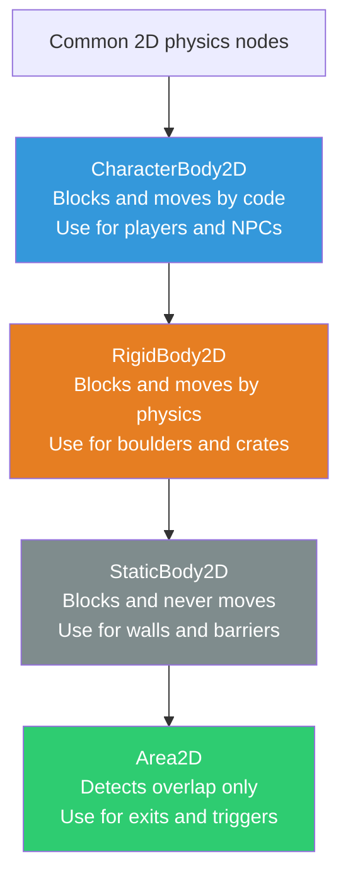
```mermaid
graph TD
    Start["Common 2D physics nodes"]
    CB["CharacterBody2D\nBlocks and moves by code\nUse for players and NPCs"]
    RB["RigidBody2D\nBlocks and moves by physics\nUse for boulders and crates"]
    SB["StaticBody2D\nBlocks and never moves\nUse for walls and barriers"]
    A2["Area2D\nDetects overlap only\nUse for exits and triggers"]

    Start --> CB
    CB --> RB
    RB --> SB
    SB --> A2

    style CB fill:#3498db,color:#fff
    style RB fill:#e67e22,color:#fff
    style SB fill:#7f8c8d,color:#fff
    style A2 fill:#2ecc71,color:#fff
```

### Signal Auto-Disconnection

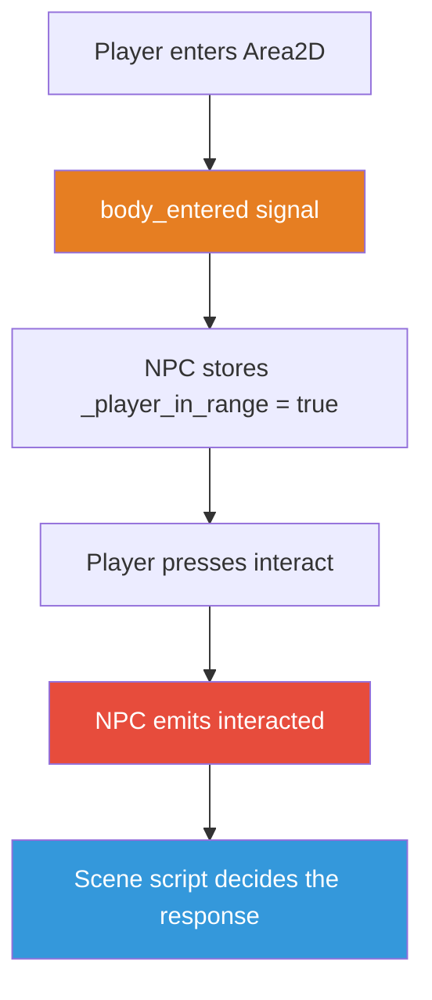
```mermaid
graph TD
    Enter["Player enters Area2D"]
    BodySignal["body_entered signal"]
    Cache["NPC stores _player_in_range = true"]
    Press["Player presses interact"]
    CustomSignal["NPC emits interacted"]
    SceneHandles["Scene script decides the response"]

    Enter --> BodySignal
    BodySignal --> Cache
    Cache --> Press
    Press --> CustomSignal
    CustomSignal --> SceneHandles

    style BodySignal fill:#e67e22,color:#fff
    style CustomSignal fill:#e74c3c,color:#fff
    style SceneHandles fill:#3498db,color:#fff
```

## Module 4: Part I Review and Cheat Sheet

### Key Concepts

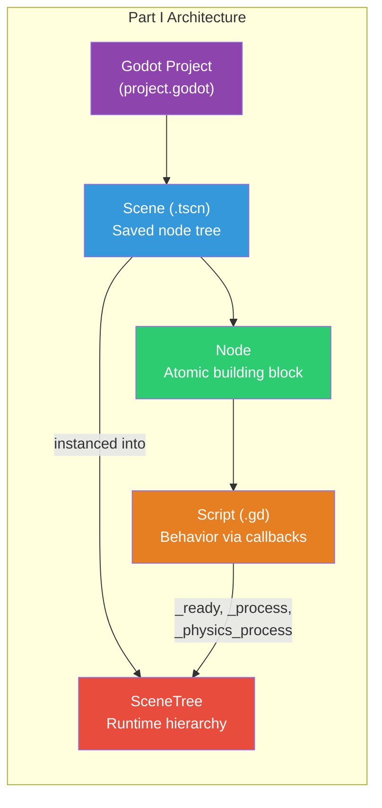
```mermaid
graph TD
    subgraph "Part I Architecture"
        direction TD
        Project["Godot Project\n(project.godot)"]
        Scene["Scene (.tscn)\nSaved node tree"]
        Node["Node\nAtomic building block"]
        Script["Script (.gd)\nBehavior via callbacks"]
        Tree["SceneTree\nRuntime hierarchy"]

        Project --> Scene
        Scene --> Node
        Node --> Script
        Scene --> |"instanced into"| Tree
        Script --> |"_ready, _process,\n_physics_process"| Tree
    end

    style Project fill:#8e44ad,color:#fff
    style Scene fill:#3498db,color:#fff
    style Node fill:#2ecc71,color:#fff
    style Script fill:#e67e22,color:#fff
    style Tree fill:#e74c3c,color:#fff
```

### Key Concepts

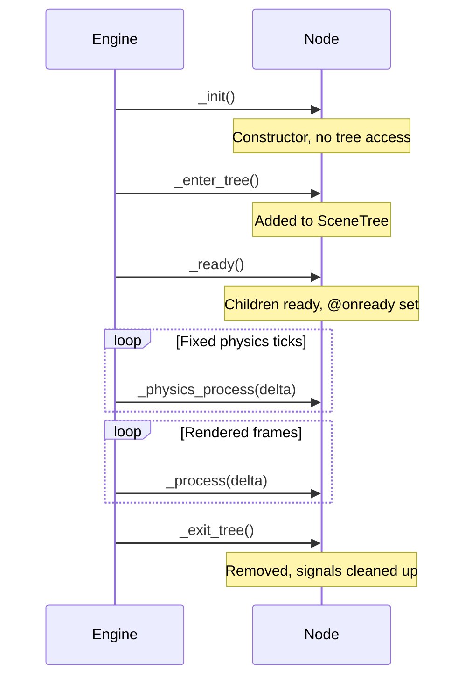
```mermaid
sequenceDiagram
    participant E as Engine
    participant N as Node

    E->>N: _init()
    Note over N: Constructor, no tree access
    E->>N: _enter_tree()
    Note over N: Added to SceneTree
    E->>N: _ready()
    Note over N: Children ready, @onready set
    loop Fixed physics ticks
        E->>N: _physics_process(delta)
    end
    loop Rendered frames
        E->>N: _process(delta)
    end
    E->>N: _exit_tree()
    Note over N: Removed, signals cleaned up
```

## Module 5: The Overworld: TileMaps and Terrain

### How TileMaps Work: A Conceptual Model

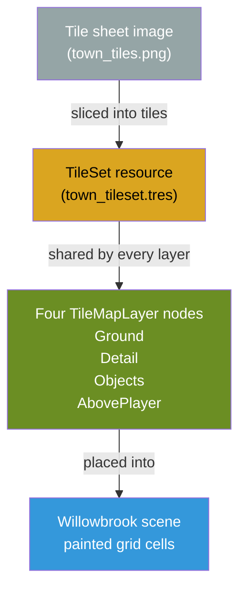
```mermaid
graph TD
    Sheet["Tile sheet image\n(town_tiles.png)"]
    TileSet["TileSet resource\n(town_tileset.tres)"]
    Layers["Four TileMapLayer nodes\nGround\nDetail\nObjects\nAbovePlayer"]
    Map["Willowbrook scene\npainted grid cells"]

    Sheet --> |"sliced into tiles"| TileSet
    TileSet --> |"shared by every layer"| Layers
    Layers --> |"placed into"| Map

    style Sheet fill:#95a5a6,color:#fff
    style TileSet fill:#DAA520,color:#000
    style Layers fill:#6B8E23,color:#fff
    style Map fill:#3498db,color:#fff
```

### Why Four Layers?

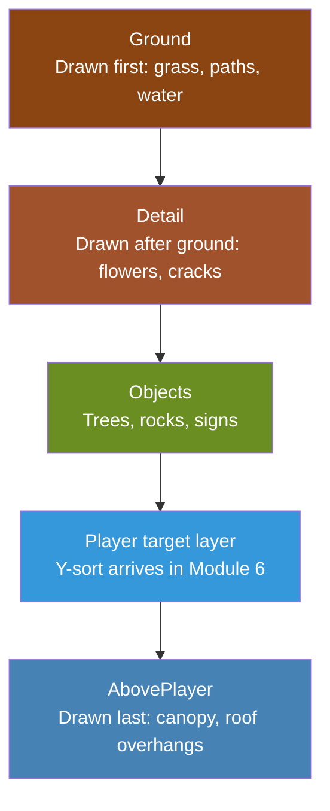
```mermaid
graph TD
    G["Ground\nDrawn first: grass, paths, water"]
    D["Detail\nDrawn after ground: flowers, cracks"]
    O["Objects\nTrees, rocks, signs"]
    P["Player target layer\nY-sort arrives in Module 6"]
    AP["AbovePlayer\nDrawn last: canopy, roof overhangs"]

    G --> D
    D --> O
    O --> P
    P --> AP

    style G fill:#8B4513,color:#fff
    style D fill:#A0522D,color:#fff
    style O fill:#6B8E23,color:#fff
    style P fill:#3498db,color:#fff
    style AP fill:#4682B4,color:#fff
```

## Module 6: Bringing the Player to Life

### The Rules

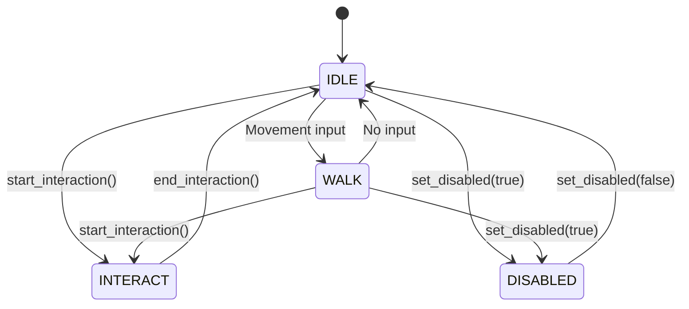
```mermaid
stateDiagram-v2
    [*] --> IDLE

    IDLE --> WALK : Movement input
    WALK --> IDLE : No input
    IDLE --> INTERACT : start_interaction()
    WALK --> INTERACT : start_interaction()
    INTERACT --> IDLE : end_interaction()
    IDLE --> DISABLED : set_disabled(true)
    WALK --> DISABLED : set_disabled(true)
    DISABLED --> IDLE : set_disabled(false)
```

### Y-Sorting: Correct Depth Ordering

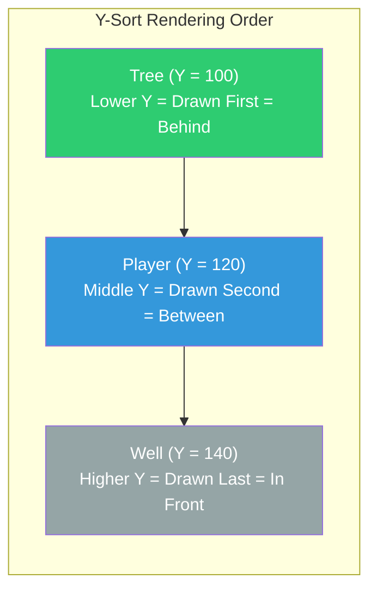
```mermaid
graph TD
    subgraph "Y-Sort Rendering Order"
        direction TB
        Top["Tree (Y = 100)\nLower Y = Drawn First = Behind"]
        Mid["Player (Y = 120)\nMiddle Y = Drawn Second = Between"]
        Bot["Well (Y = 140)\nHigher Y = Drawn Last = In Front"]

        Top --> Mid
        Mid --> Bot
    end

    style Top fill:#2ecc71,color:#fff
    style Mid fill:#3498db,color:#fff
    style Bot fill:#95a5a6,color:#fff
```

## Module 7: Connecting Worlds: Scene Transitions

### Step 1: Create the Script

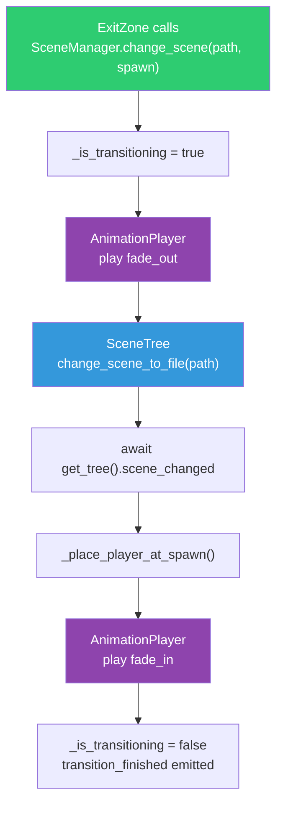
```mermaid
graph TD
    Exit["ExitZone calls\nSceneManager.change_scene(path, spawn)"]
    Lock["_is_transitioning = true"]
    FadeOut["AnimationPlayer\nplay fade_out"]
    Swap["SceneTree\nchange_scene_to_file(path)"]
    Wait["await get_tree().scene_changed"]
    Spawn["_place_player_at_spawn()"]
    FadeIn["AnimationPlayer\nplay fade_in"]
    Unlock["_is_transitioning = false\ntransition_finished emitted"]

    Exit --> Lock
    Lock --> FadeOut
    FadeOut --> Swap
    Swap --> Wait
    Wait --> Spawn
    Spawn --> FadeIn
    FadeIn --> Unlock

    style Exit fill:#2ecc71,color:#fff
    style FadeOut fill:#8e44ad,color:#fff
    style Swap fill:#3498db,color:#fff
    style FadeIn fill:#8e44ad,color:#fff
```

### Understanding `await`

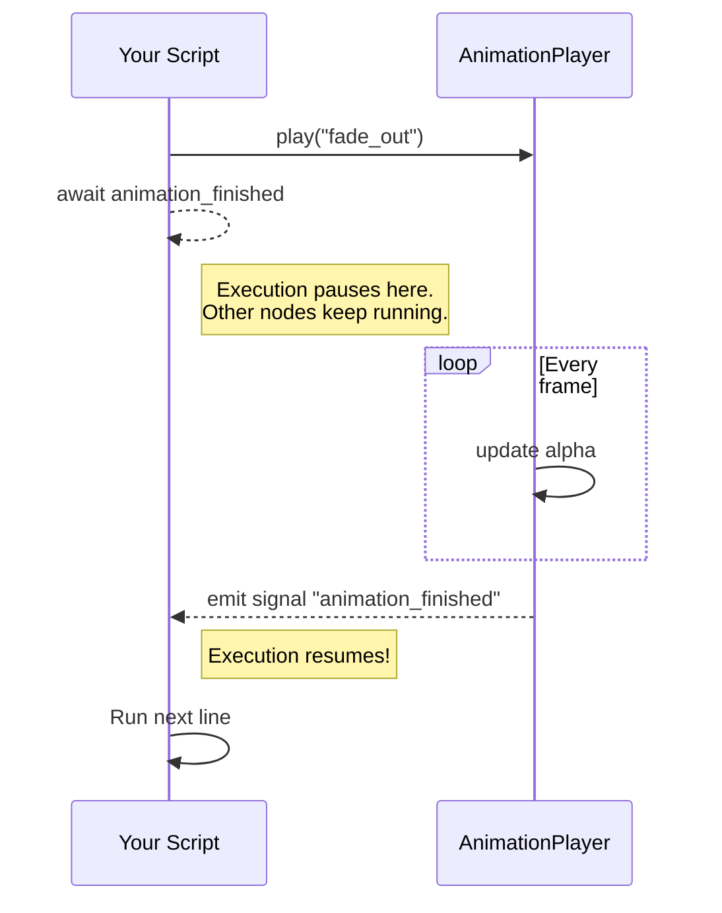
```mermaid
sequenceDiagram
    participant Code as Your Script
    participant Anim as AnimationPlayer

    Code->>Anim: play("fade_out")
    Code-->>Code: await animation_finished
    Note right of Code: Execution pauses here.<br/>Other nodes keep running.

    loop Every frame
        Anim->>Anim: update alpha
    end

    Anim-->>Code: emit signal "animation_finished"
    Note right of Code: Execution resumes!
    Code->>Code: Run next line
```

## Module 8: Part II Review and Cheat Sheet

### Key Concepts

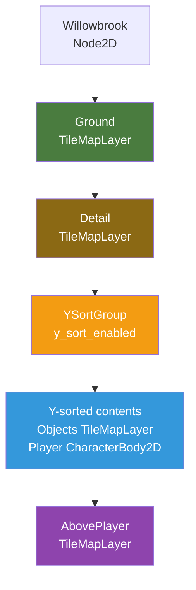
```mermaid
graph TD
    WB["Willowbrook\nNode2D"]
    G["Ground\nTileMapLayer"]
    D["Detail\nTileMapLayer"]
    YS["YSortGroup\ny_sort_enabled"]
    Contents["Y-sorted contents\nObjects TileMapLayer\nPlayer CharacterBody2D"]
    AP["AbovePlayer\nTileMapLayer"]

    WB --> G
    G --> D
    D --> YS
    YS --> Contents
    Contents --> AP

    style G fill:#4a7c3f,color:#fff
    style D fill:#8b6914,color:#fff
    style Contents fill:#3498db,color:#fff
    style AP fill:#8e44ad,color:#fff
    style YS fill:#f39c12,color:#fff
```

### Key Concepts

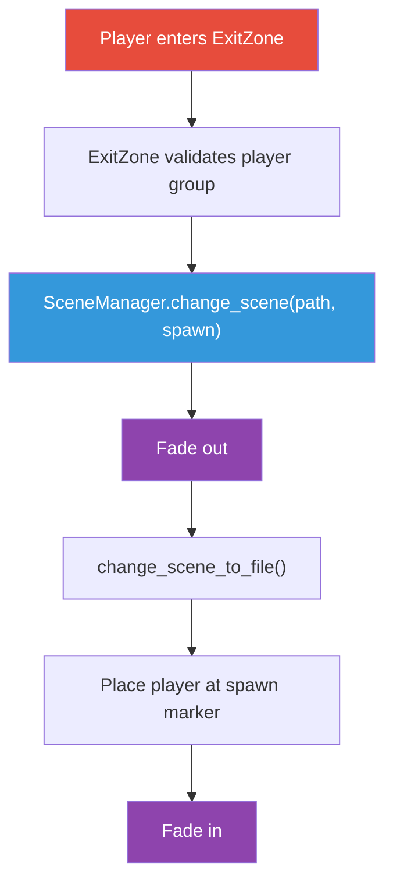
```mermaid
graph TD
    Player["Player enters ExitZone"]
    ExitZone["ExitZone validates player group"]
    Manager["SceneManager.change_scene(path, spawn)"]
    FadeOut["Fade out"]
    Swap["change_scene_to_file()"]
    Spawn["Place player at spawn marker"]
    FadeIn["Fade in"]

    Player --> ExitZone
    ExitZone --> Manager
    Manager --> FadeOut
    FadeOut --> Swap
    Swap --> Spawn
    Spawn --> FadeIn

    style Player fill:#e74c3c,color:#fff
    style Manager fill:#3498db,color:#fff
    style FadeOut fill:#8e44ad,color:#fff
    style FadeIn fill:#8e44ad,color:#fff
```

## Module 9: Resources, the Data Layer

### What is a Resource?

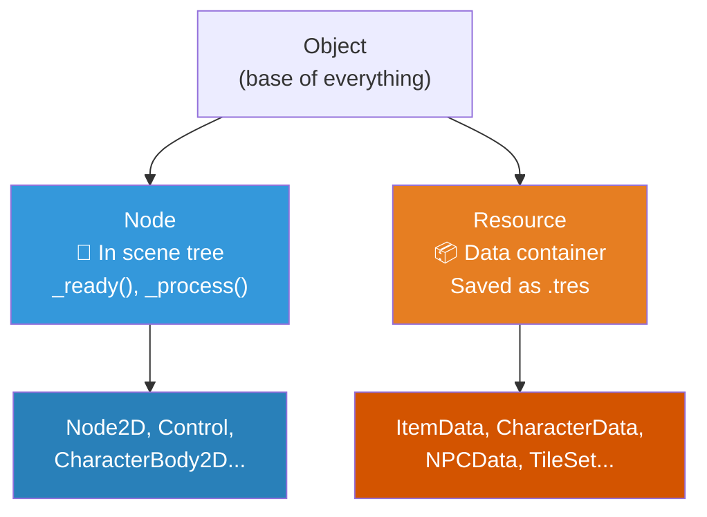
```mermaid
graph TD
    Obj["Object\n(base of everything)"]
    Node["Node\n🌳 In scene tree\n_ready(), _process()"]
    Res["Resource\n📦 Data container\nSaved as .tres"]

    Obj --> Node
    Obj --> Res

    Node --> N2D["Node2D, Control,\nCharacterBody2D..."]
    Res --> Custom["ItemData, CharacterData,\nNPCData, TileSet..."]

    style Node fill:#3498db,color:#fff
    style Res fill:#e67e22,color:#fff
    style N2D fill:#2980b9,color:#fff
    style Custom fill:#d35400,color:#fff
```

### The Three-File Pattern

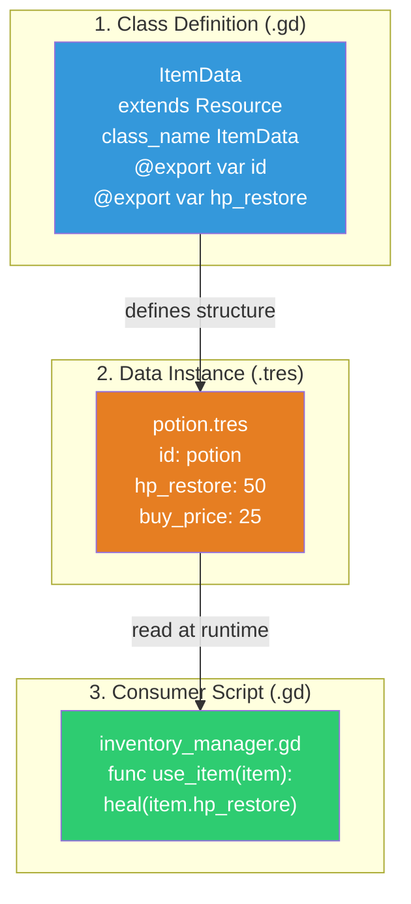
```mermaid
graph TD
    subgraph "1. Class Definition (.gd)"
        RC["ItemData\nextends Resource\nclass_name ItemData\n@export var id\n@export var hp_restore"]
    end
    subgraph "2. Data Instance (.tres)"
        DI["potion.tres\nid: potion\nhp_restore: 50\nbuy_price: 25"]
    end
    subgraph "3. Consumer Script (.gd)"
        CS["inventory_manager.gd\nfunc use_item(item):\n  heal(item.hp_restore)"]
    end

    RC --> |"defines structure"| DI
    DI --> |"read at runtime"| CS

    style RC fill:#3498db,color:#fff
    style DI fill:#e67e22,color:#fff
    style CS fill:#2ecc71,color:#fff
```

## Module 10: NPCs and Interaction

### The `interacted` Signal

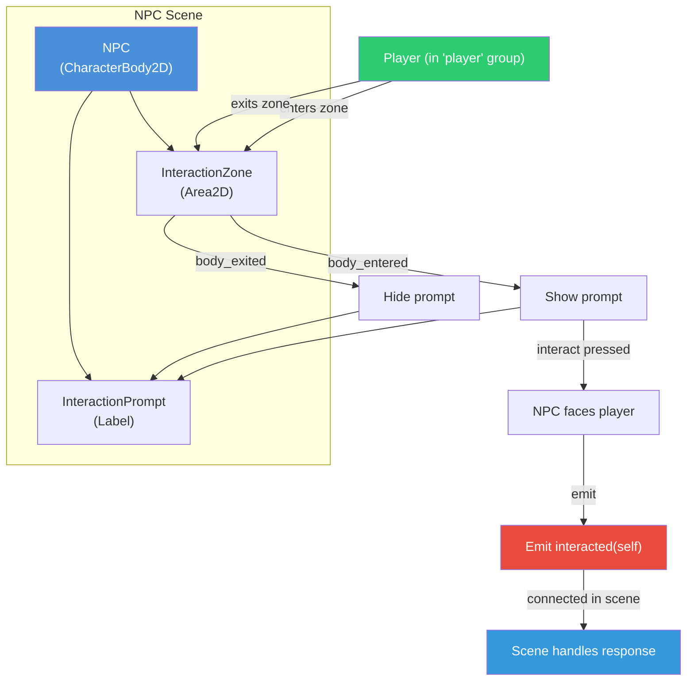
```mermaid
graph TD
    subgraph "NPC Scene"
        NPC["NPC\n(CharacterBody2D)"]
        IZ["InteractionZone\n(Area2D)"]
        Prompt["InteractionPrompt\n(Label)"]
        NPC --> IZ
        NPC --> Prompt
    end

    Player["Player (in 'player' group)"]
    Show["Show prompt"]
    Hide["Hide prompt"]
    Face["NPC faces player"]
    Signal["Emit interacted(self)"]
    Handler["Scene handles response"]

    Player -->|enters zone| IZ
    IZ -->|body_entered| Show
    Show --> Prompt
    Player -->|exits zone| IZ
    IZ -->|body_exited| Hide
    Hide --> Prompt
    Show -->|interact pressed| Face
    Face -->|emit| Signal
    Signal -->|connected in scene| Handler

    style NPC fill:#4a90d9,color:#fff
    style Player fill:#2ecc71,color:#fff
    style Signal fill:#e74c3c,color:#fff
    style Handler fill:#3498db,color:#fff
```

## Module 11: The Dialogue System

### Scene Tree

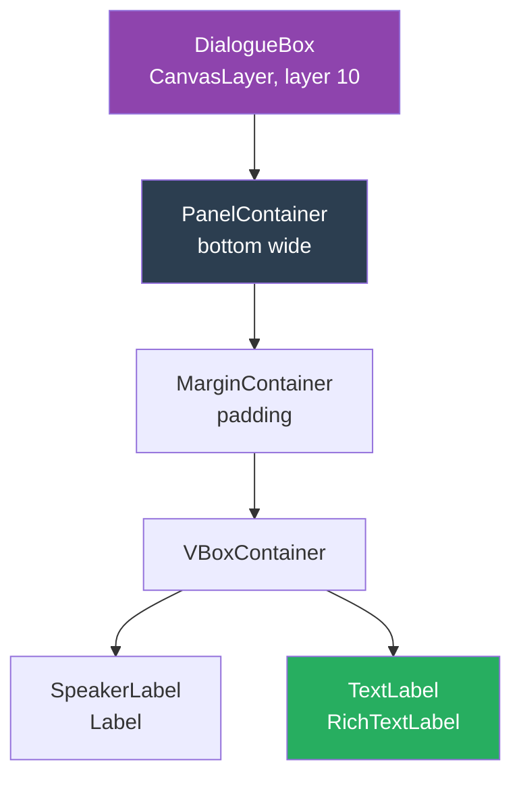
```mermaid
graph TD
    DBox["DialogueBox\nCanvasLayer, layer 10"]
    Panel["PanelContainer\nbottom wide"]
    Margin["MarginContainer\npadding"]
    VBox["VBoxContainer"]
    Speaker["SpeakerLabel\nLabel"]
    Text["TextLabel\nRichTextLabel"]

    DBox --> Panel
    Panel --> Margin
    Margin --> VBox
    VBox --> Speaker
    VBox --> Text

    style DBox fill:#8e44ad,color:#fff
    style Panel fill:#2c3e50,color:#fff
    style Text fill:#27ae60,color:#fff
```

### The Dialogue Box Script

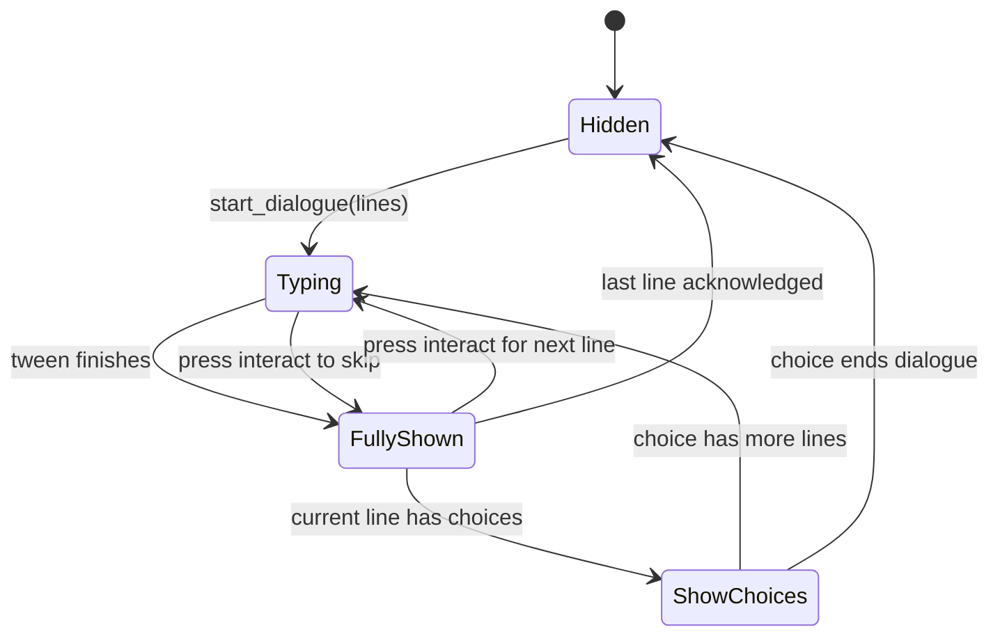
```mermaid
stateDiagram-v2
    [*] --> Hidden

    Hidden --> Typing : start_dialogue(lines)
    Typing --> FullyShown : tween finishes
    Typing --> FullyShown : press interact to skip
    FullyShown --> Typing : press interact for next line
    FullyShown --> ShowChoices : current line has choices
    ShowChoices --> Typing : choice has more lines
    ShowChoices --> Hidden : choice ends dialogue
    FullyShown --> Hidden : last line acknowledged
```

## Module 12: The Inventory System

### Design Notes

```mermaid
graph TD
    IM["InventoryManager\n(Autoload)"]
    UI["InventoryScreen\n(UI)"]
    Slot["ItemSlot"]

    IM -->|"inventory_changed"| UI
    IM -->|"gold_changed"| UI
    UI -->|"_refresh()"| Slot
    Slot -->|"slot_selected"| UI
    UI -->|"use_item()"| IM

    style IM fill:#e74c3c,color:#fff
    style UI fill:#3498db,color:#fff
    style Slot fill:#2ecc71,color:#fff
```

### Pausing the Game

```mermaid
graph TD
    Pause["get_tree().paused = true"]
    World["Pausable world nodes\nPlayer, NPCs, encounter timers"]
    UI["PROCESS_MODE_ALWAYS\nInventoryScreen"]
    SceneManager["PROCESS_MODE_ALWAYS\nSceneManager"]
    Resume["Inventory closes\nget_tree().paused = false"]

    Pause --> World
    Pause --> UI
    Pause --> SceneManager
    UI --> Resume

    style World fill:#3498db,color:#fff
    style UI fill:#e74c3c,color:#fff
    style SceneManager fill:#8e44ad,color:#fff
    style Resume fill:#2ecc71,color:#fff
```

## Module 13: Part III Review and Cheat Sheet

### Key Concepts

```mermaid
graph TD
    subgraph "Three-File Pattern"
        Class["Resource Class (.gd)\nDefines shape"]
        Data["Data Instance (.tres)\nHolds values"]
        Consumer["Consumer Script (.gd)\nUses data"]
    end

    Class --> |"instantiated as"| Data
    Data --> |"loaded by"| Consumer

    style Class fill:#8e44ad,color:#fff
    style Data fill:#3498db,color:#fff
    style Consumer fill:#2ecc71,color:#fff
```

### Key Concepts

```mermaid
graph TD
    subgraph "NPC Dialogue Flow"
        Enter["Player enters InteractionZone"]
        Press["Player presses interact"]
        Emit["NPC emits interacted"]
        Freeze["Scene calls Player.start_interaction()"]
        Dialogue["DialogueBox.start_dialogue(lines)"]
        Finish["dialogue_finished"]
        Unfreeze["Player.end_interaction()"]
    end

    subgraph "Inventory Signal Loop"
        Change["InventoryManager changes item/gold"]
        Signal["inventory_changed / gold_changed"]
        Refresh["Inventory UI refreshes slots"]
    end

    Enter --> Press
    Press --> Emit
    Emit --> Freeze
    Freeze --> Dialogue
    Dialogue --> Finish
    Finish --> Unfreeze

    Unfreeze -. "separate system" .-> Change
    Change --> Signal
    Signal --> Refresh

    style Emit fill:#e74c3c,color:#fff
    style Dialogue fill:#8e44ad,color:#fff
    style Signal fill:#f39c12,color:#fff
```

## Module 14: Battle Foundations: State Machines and Turn Order

### The Node-Based Pattern

```mermaid
graph TD
    Intro["Intro\nbrief pause"]
    Queue["TurnStart\nbuild speed-sorted queue"]
    Next["Pop next alive battler"]
    Player{"Player controlled?"}
    Choice["PlayerChoice\nwait for command"]
    Enemy["ActionExecute\nenemy_turn"]
    Execute["ActionExecute\nresolve command"]
    Result{"Battle over?"}
    More{"Queue empty?"}
    Victory["Victory"]
    Defeat["Defeat"]

    Intro --> Queue
    Queue --> Next
    Next --> Player
    Player -->|yes| Choice
    Player -->|no| Enemy
    Choice --> Execute
    Enemy --> Execute
    Execute --> Result
    Result -->|all enemies dead| Victory
    Result -->|all party dead| Defeat
    Result -->|no| More
    More -->|no| Next
    More -->|yes| Queue

    style Queue fill:#3498db,color:#fff
    style Choice fill:#2ecc71,color:#fff
    style Enemy fill:#e67e22,color:#fff
    style Victory fill:#2ecc71,color:#fff
    style Defeat fill:#e74c3c,color:#fff
```

### BattlerData: Who's Fighting

```mermaid
graph TD
    subgraph "BattlerData (runtime, per-battle)"
        BD["current_hp, current_mp\ncurrent_attack, current_defense\ndefense_boost\nis_player_controlled"]
    end

    subgraph "CharacterData (persistent, saved)"
        CD["display_name, level, XP\nmax_hp, max_mp\nattack, defense, speed\nequipped_weapon"]
    end

    subgraph "EnemyData (data definition)"
        ED["display_name, ai_type\nmax_hp, attack, defense\nxp_reward, gold_reward"]
    end

    CD --> |"initialize_from_character()"| BD
    ED --> |"BattlerData.from_enemy()"| BD
    BD --> |"sync back on victory"| CD

    style BD fill:#e74c3c,color:#fff
    style CD fill:#3498db,color:#fff
    style ED fill:#e67e22,color:#fff
```

## Module 15: Player Actions: Attack, Defend, Magic, Items

### The Command Pattern

```mermaid
graph TD
    Turn["PlayerChoice state starts"]
    Menu["BattleMenu.show_menu()"]
    Action["Player chooses action"]
    NeedsTarget{"Needs a target?"}
    Targets["TargetSelect.show_targets()"]
    Command["Build command dictionary\n{action, battler, target, item}"]
    Execute["Transition to ActionExecute"]
    Animate["Resolve action and animate"]

    Turn --> Menu
    Menu --> Action
    Action --> NeedsTarget
    NeedsTarget -->|yes| Targets
    NeedsTarget -->|no| Command
    Targets --> Command
    Command --> Execute
    Execute --> Animate

    style Menu fill:#3498db,color:#fff
    style Command fill:#f39c12,color:#fff
    style Execute fill:#e74c3c,color:#fff
```

### Our Damage Formula

```mermaid
graph TD
    Attack["attacker.current_attack"]
    Defense["target.get_effective_defense()\nbase defense + defense_boost"]
    Raw["raw = attack - defense"]
    Variance["add randi_range(-2, 2)"]
    Floor["max(1, raw + variance)"]
    Damage["Final damage"]

    Attack --> Raw
    Defense --> Raw
    Raw --> Variance
    Variance --> Floor
    Floor --> Damage

    style Attack fill:#e74c3c,color:#fff
    style Defense fill:#3498db,color:#fff
    style Damage fill:#f39c12,color:#fff
```

## Module 16: The Crystal Cavern, Dungeon Design

### Room-Based Layout

```mermaid
graph TD
    E["🚪 Entrance"]
    MC["Main Corridor\n⚔️ Random encounters"]
    F{"Fork\n(Decision point)"}
    DE["Dead End\n💎 Treasure chest"]
    SC["Save Crystal\n💾 Save point"]
    DC["Deep Cavern\n⚔️ Harder encounters"]
    BR["🐉 Boss Room"]

    E --> MC --> F
    F --> |"explore"| DE
    F --> |"advance"| DC
    DC --> BR
    SC -.-> |"adjacent"| DC

    style E fill:#4a7c3f,color:#fff
    style BR fill:#e74c3c,color:#fff
    style SC fill:#3498db,color:#fff
    style DE fill:#f39c12,color:#fff
    style F fill:#8e44ad,color:#fff
```

## Module 17: Enemies and AI

### Enemy AI

```mermaid
graph TD
    Start["Enemy AI type patterns"]
    Agg["Aggressive\nFind the lowest-HP target\nAttack that target"]
    Caut["Cautious\nIf HP < 30%: defend\nOtherwise: attack random"]
    Bal["Balanced\n30% chance: defend\n70% chance: attack random"]

    Start --> Agg
    Agg --> Caut
    Caut --> Bal

    style Start fill:#2c3e50,color:#fff
    style Agg fill:#e74c3c,color:#fff
    style Caut fill:#f39c12,color:#fff
    style Bal fill:#3498db,color:#fff
```

### The Oddment Table Pattern

```mermaid
graph TD
    Walk["Player walks"] --> Dist{"Moved 16px?"}
    Dist -->|no| Walk
    Dist -->|yes| Inc["step_count += 1"]
    Inc --> Thresh{"step_count >= threshold?"}
    Thresh -->|no| Walk
    Thresh -->|yes| Reset["Reset counter\nNew threshold: 8-20"]
    Reset --> Rate{"randf() < encounter_rate?"}
    Rate -->|no| Walk
    Rate -->|yes| Pick["Pick weighted encounter"]
    Pick --> Battle["Start battle!"]

    style Battle fill:#e74c3c,color:#fff
    style Pick fill:#f39c12,color:#fff
```

## Module 18: Victory, Rewards, and Leveling

### Our Curve

```mermaid
xychart-beta
    title "XP Required per Level (level² × 10)"
    x-axis "Level" [1, 2, 3, 4, 5, 6, 7, 8, 9, 10]
    y-axis "XP to Next" 0 --> 1100
    bar [10, 40, 90, 160, 250, 360, 490, 640, 810, 1000]
```

### The Victory Flow

```mermaid
graph TD
    Start["Victory state enters"]
    Sum["Sum enemy XP, gold, and drops"]
    Split["Split XP across alive party members"]
    Grant["CharacterData.grant_xp()"]
    Level{"Enough XP to level up?"}
    Grow["Apply stat growth\nand report gains"]
    Sync["Sync battle HP/MP back to CharacterData"]
    Loot["InventoryManager adds gold and drops"]
    Return["SceneManager.return_from_battle()"]

    Start --> Sum
    Sum --> Split
    Split --> Grant
    Grant --> Level
    Level -->|yes| Grow
    Grow --> Level
    Level -->|no| Sync
    Sync --> Loot
    Loot --> Return

    style Grant fill:#3498db,color:#fff
    style Grow fill:#2ecc71,color:#fff
    style Loot fill:#f39c12,color:#fff
```

## Module 19: Part IV Review and Cheat Sheet

### Key Concepts

```mermaid
stateDiagram-v2
    [*] --> Intro
    Intro --> TurnStart
    TurnStart --> PlayerChoice : Player's turn
    TurnStart --> ActionExecute : Enemy's turn (AI decides)
    PlayerChoice --> ActionExecute : Command chosen
    ActionExecute --> CheckResult
    CheckResult --> Victory : All enemies dead
    CheckResult --> Defeat : All party dead
    CheckResult --> TurnStart : Next battler / next round
    Victory --> [*]
    Defeat --> [*]
```

### Key Concepts

```mermaid
graph TD
    subgraph "Combat Round Cycle"
        BQ["Build Turn Queue\n(sort by speed)"]
        Pop["Pop next alive battler"]
        IsP{Player?}
        Menu["Show Battle Menu\n(Attack/Defend/Item)"]
        AI["AI chooses action\n(Aggressive/Cautious/Balanced)"]
        Exec["Execute Command\n{action, battler, target}"]
        Check{"All enemies\nor party dead?"}
        More{"Queue empty?"}
    end

    BQ --> Pop
    Pop --> IsP
    IsP --> |Yes| Menu
    IsP --> |No| AI
    Menu --> Exec
    AI --> Exec
    Exec --> Check
    Check --> |No| More
    More --> |No| Pop
    More --> |Yes| BQ
    Check --> |Victory| V["Distribute XP, gold, drops"]
    Check --> |Defeat| D["Game Over"]

    style BQ fill:#3498db,color:#fff
    style Menu fill:#2ecc71,color:#fff
    style AI fill:#e74c3c,color:#fff
    style Exec fill:#f39c12,color:#fff
```

## Module 20: The Quest System and Game Flags

### QuestManager Autoload

```mermaid
stateDiagram-v2
    [*] --> NOT_STARTED

    NOT_STARTED --> ACTIVE : start_quest()
    ACTIVE --> COMPLETE : all objective_flags set
    COMPLETE --> TURNED_IN : turn_in_quest()
    TURNED_IN --> [*]
```

### Reactive Dialogue

```mermaid
graph TD
    Talk["Player talks to Fynn"]
    Returned{"pendant_returned?"}
    Found{"pendant_found?"}
    Met{"talked_to_fynn?"}
    Thanks["Thanks again dialogue"]
    TurnIn["Turn-in dialogue\nconnect dialogue_finished once"]
    Waiting["Any luck finding it?"]
    First["First meeting dialogue\nset talked_to_fynn\nstart lost_pendant quest"]

    Talk --> Returned
    Returned -->|yes| Thanks
    Returned -->|no| Found
    Found -->|yes| TurnIn
    Found -->|no| Met
    Met -->|yes| Waiting
    Met -->|no| First

    style TurnIn fill:#2ecc71,color:#fff
    style First fill:#3498db,color:#fff
```

## Module 21: Party Management, Equipment, and Shops

### The Modifier Pattern (Looking Ahead)

```mermaid
graph TD
    Base["Base Stats\n(CharacterData .tres)"] --> Eff["Effective Stats"]
    Equip["Equipment Bonuses\n(weapon.attack_bonus)"] --> Eff
    Eff --> Battle["BattlerData\ninitialize_from_character()"]
    Buff["Temp Buffs\n(defense_boost)"] --> Combat["Combat Calculation"]
    Battle --> Combat

    style Base fill:#3498db,color:#fff
    style Equip fill:#f39c12,color:#fff
    style Buff fill:#e74c3c,color:#fff
    style Combat fill:#2ecc71,color:#fff
```

### Autoload Reference Card (Updated)

```mermaid
graph TD
    subgraph Root["Persistent autoloads under /root"]
        direction TB
        SM["SceneManager\nModule 7"]
        IM["InventoryManager\nModule 12"]
        GM["GameManager\nModule 20"]
        QM["QuestManager\nModule 20"]
        PM["PartyManager\nModule 21"]
    end

    Scene["Current gameplay scene\nswapped at runtime"]

    GM -->|"flag_changed"| QM
    PM -->|"provides roster to"| Scene
    SM -->|"transitions"| Scene

    style SM fill:#e74c3c,color:#fff
    style IM fill:#e67e22,color:#fff
    style GM fill:#2ecc71,color:#fff
    style QM fill:#27ae60,color:#fff
    style PM fill:#3498db,color:#fff
```

## Module 22: Save and Load

### The `to_save_data()` / `from_save_data()` Pattern

```mermaid
graph TD
    AutoS["Autoload State\nvariables and arrays"]
    DictS["Dictionary"]
    File["JSON File\nuser://save1.json"]
    DictL["Dictionary"]
    AutoL["Autoload State\nrestored variables and arrays"]

    AutoS -->|to_save_data| DictS
    DictS -->|JSON.stringify| File
    File -->|JSON.parse| DictL
    DictL -->|from_save_data| AutoL

    style AutoS fill:#3498db,color:#fff
    style AutoL fill:#3498db,color:#fff
    style File fill:#e67e22,color:#fff
```

### The SaveManager

```mermaid
graph TD
    Crystal["Save Crystal opens save slot UI"]
    Save["SaveManager.save_game(slot)"]
    Gather["Call to_save_data() on\nGameManager, InventoryManager,\nPartyManager, QuestManager"]
    Write["JSON.stringify()\nwrite to user://saves/"]
    Load["SaveManager.load_game(slot)"]
    Read["Read file\nJSON.parse()"]
    Restore["Call from_save_data() on each manager"]
    Scene["change_scene_to_file()\nawait scene_changed"]
    Position["Restore player position"]

    Crystal --> Save
    Save --> Gather
    Gather --> Write
    Write -->|"later"| Load
    Load --> Read
    Read --> Restore
    Restore --> Scene
    Scene --> Position

    style Save fill:#3498db,color:#fff
    style Load fill:#8e44ad,color:#fff
    style Write fill:#e67e22,color:#fff
    style Position fill:#2ecc71,color:#fff
```

## Module 23: Part V Review and Cheat Sheet

### Key Concepts

```mermaid
graph TD
    SVM["SaveManager\npersistence coordinator"]
    Managers["Saved managers\nGameManager flags\nQuestManager quests\nPartyManager roster\nInventoryManager items + gold"]
    Flags["GameManager emits flag_changed"]
    Quests["QuestManager updates quests"]
    Rewards["Rewards route to\nInventoryManager and PartyManager"]
    Scenes["SceneManager uses party/world state\nwhile changing scenes"]

    SVM -->|"to/from_save_data()"| Managers
    Managers --> Flags
    Flags --> Quests
    Quests --> Rewards
    Rewards --> Scenes

    style Managers fill:#3498db,color:#fff
    style Flags fill:#e74c3c,color:#fff
    style Quests fill:#9b59b6,color:#fff
    style Rewards fill:#f39c12,color:#000
    style Scenes fill:#2ecc71,color:#fff
    style SVM fill:#1abc9c,color:#fff
```

### Key Concepts

```mermaid
stateDiagram-v2
    [*] --> NOT_STARTED
    NOT_STARTED --> ACTIVE : start_quest()
    ACTIVE --> COMPLETE : All objective flags set
    COMPLETE --> TURNED_IN : turn_in_quest()
    TURNED_IN --> [*]
```

### Key Concepts

```mermaid
graph TD
    Crystal["Save Crystal"]
    Save["SaveManager.save_game(slot)"]
    Pack["Managers export dictionaries"]
    File["FileAccess writes JSON\nuser://saves/"]
    Load["SaveManager.load_game(slot)"]
    Parse["FileAccess reads JSON"]
    Restore["Managers restore dictionaries"]

    Crystal --> Save
    Save --> Pack
    Pack --> File
    File -->|"later"| Load
    Load --> Parse
    Parse --> Restore

    style Save fill:#3498db,color:#fff
    style Load fill:#8e44ad,color:#fff
    style File fill:#e67e22,color:#fff
```

## Module 24: Audio (Music and Sound Effects)

### MusicManager Autoload

```mermaid
graph TD
    Current["PlayerA\ncurrent town_theme at 0 dB"]
    Request["MusicManager.play_music(forest_theme)"]
    Prepare["PlayerB gets new stream\nstarts at -40 dB"]
    Crossfade["Tween both volumes\nPlayerA to -40 dB\nPlayerB to 0 dB"]
    Stop["Stop PlayerA"]
    Swap["PlayerB becomes active player"]

    Current --> Request
    Request --> Prepare
    Prepare --> Crossfade
    Crossfade --> Stop
    Stop --> Swap

    style Current fill:#3498db,color:#fff
    style Prepare fill:#8e44ad,color:#fff
    style Crossfade fill:#f39c12,color:#000
```

### Setting Up Buses

```mermaid
graph TD
    MusicPlayer["MusicManager\nPlayerA / PlayerB"]
    SFXPlayer["One-shot\nAudioStreamPlayer"]
    MusicBus["Music bus\nBGM volume"]
    SFXBus["SFX bus\nsound effect volume"]
    Master["Master bus"]

    MusicPlayer --> MusicBus
    SFXPlayer --> SFXBus
    MusicBus --> Master
    SFXBus --> Master

    style MusicBus fill:#3498db,color:#fff
    style SFXBus fill:#2ecc71,color:#fff
    style Master fill:#e74c3c,color:#fff
```

## Module 25: Title Screen and Game Flow

### The Complete Game Loop

```mermaid
graph TD
    Title["Title Screen"]
    Choice{"Player chooses"}
    Fresh["New Game\ninitialize fresh state"]
    Continue["Continue\nload save slot"]
    Explore["Gameplay scenes\nWillowbrook → Whisperwood → Crystal Cavern"]
    Pause["Pause Menu\nResume / Inventory / Equipment / Quest Log / Settings"]
    Save["Save Crystal\nSave Game"]
    Boss["Boss Fight"]
    Outcome{"Boss outcome"}
    Ending["Ending"]
    Credits["Credits"]
    GameOver["Game Over"]
    Recovery{"Recover?"}

    Title --> Choice
    Choice -->|New Game| Fresh
    Choice -->|Continue| Continue
    Fresh --> Explore
    Continue --> Explore
    Explore --> Pause
    Pause --> Explore
    Explore --> Save
    Save --> Explore
    Explore --> Boss
    Boss --> Outcome
    Outcome -->|win| Ending
    Ending --> Credits
    Credits --> Title
    Outcome -->|lose| GameOver
    GameOver --> Recovery
    Recovery -->|Load Save| Continue
    Recovery -->|Return to Title| Title

    style Title fill:#8e44ad,color:#fff
    style Boss fill:#e74c3c,color:#fff
    style Ending fill:#f39c12,color:#fff
    style GameOver fill:#c0392b,color:#fff
    style Credits fill:#3498db,color:#fff
```

## Module 26: Finish Line (Polish, Export, and Next Steps)

### What We Have

```mermaid
graph TD
    Title["Title Screen"]
    Explore["Explore Overworld\nWillowbrook and Whisperwood"]
    Dungeon["Crystal Cavern\nsave crystal, treasure, encounters"]
    Battle["Battle\nturns, AI, rewards"]
    Result{"Battle result"}
    Victory["Victory\nXP, gold, loot"]
    Defeat["Game Over"]
    Ending["Ending and Credits"]
    Systems["Persistent autoloads\nScene, game flags, inventory,\nparty, quests, saves, music, pause"]

    Title -->|"New Game / Continue"| Explore
    Explore -->|"Exit Zone"| Dungeon
    Dungeon -->|"Random encounter"| Battle
    Battle --> Result
    Result -->|win| Victory
    Victory --> Explore
    Result -->|lose| Defeat
    Defeat --> Title
    Dungeon -->|"Boss defeated"| Ending
    Ending --> Title
    Systems -. support .-> Explore
    Systems -. support .-> Dungeon
    Systems -. support .-> Battle

    style Title fill:#8e44ad,color:#fff
    style Battle fill:#e74c3c,color:#fff
    style Victory fill:#2ecc71,color:#fff
    style Defeat fill:#7f8c8d,color:#fff
    style Ending fill:#f39c12,color:#fff
```

## Module 27: Part VI Review and Cheat Sheet

### Key Concepts

```mermaid
graph TD
    MusicPlayers["MusicManager\nPlayerA + PlayerB"]
    Music["Music Bus\nBGM and crossfade"]
    OneShot["One-shot AudioStreamPlayer"]
    SFX["SFX Bus\nmenu and battle effects"]
    Master["Master Bus"]

    MusicPlayers --> Music
    Music --> Master
    OneShot --> SFX
    SFX --> Master

    style Master fill:#e74c3c,color:#fff
    style Music fill:#3498db,color:#fff
    style SFX fill:#2ecc71,color:#fff
```

### Key Concepts

```mermaid
graph TD
    Title["Title Screen"]
    Start{"Start option"}
    Gameplay["Gameplay\nOverworld and Dungeon"]
    Pause["Pause Menu\nResume, inventory, equipment,\nquest log, settings"]
    Encounter["Battle Encounter"]
    BattleResult{"Battle result"}
    Boss["Boss Fight"]
    BossResult{"Boss result"}
    Ending["Ending"]
    Credits["Credits"]
    GameOver["Game Over"]
    Recover{"Recover?"}

    Title --> Start
    Start -->|New Game| Gameplay
    Start -->|Continue| Gameplay
    Start -->|Settings| Title
    Gameplay -->|Escape| Pause
    Pause -->|Resume| Gameplay
    Gameplay -->|random encounter| Encounter
    Encounter --> BattleResult
    BattleResult -->|Victory| Gameplay
    BattleResult -->|Defeat| GameOver
    Gameplay -->|Boss Room| Boss
    Boss --> BossResult
    BossResult -->|Boss defeated| Ending
    BossResult -->|Defeat| GameOver
    Ending --> Credits
    Credits --> Title
    GameOver --> Recover
    Recover -->|Load Save| Gameplay
    Recover -->|Quit| Title

    style Title fill:#8e44ad,color:#fff
    style Encounter fill:#e74c3c,color:#fff
    style Boss fill:#c0392b,color:#fff
    style Ending fill:#f39c12,color:#000
```
