# Tutorial Mermaid Diagrams

Supplementary visual aids for each tutorial module. Use alongside the module text.

---

## Module 01 — The Journey Begins

### Godot's Node Composition Model

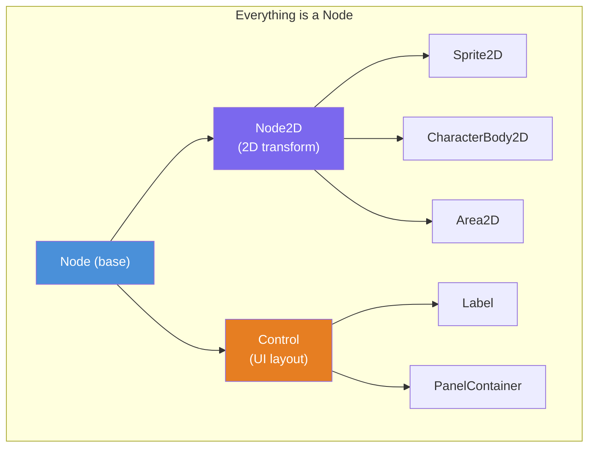
```mermaid
graph TD
    subgraph "Everything is a Node"
        Node["Node (base)"]
        Node2D["Node2D\n(2D transform)"]
        Control["Control\n(UI layout)"]
        Sprite["Sprite2D"]
        CB2D["CharacterBody2D"]
        Area["Area2D"]
        Label["Label"]
        Panel["PanelContainer"]

        Node --> Node2D
        Node --> Control
        Node2D --> Sprite
        Node2D --> CB2D
        Node2D --> Area
        Control --> Label
        Control --> Panel
    end

    style Node fill:#4a90d9,color:#fff
    style Node2D fill:#7b68ee,color:#fff
    style Control fill:#e67e22,color:#fff
```

### Scene = Reusable Node Tree

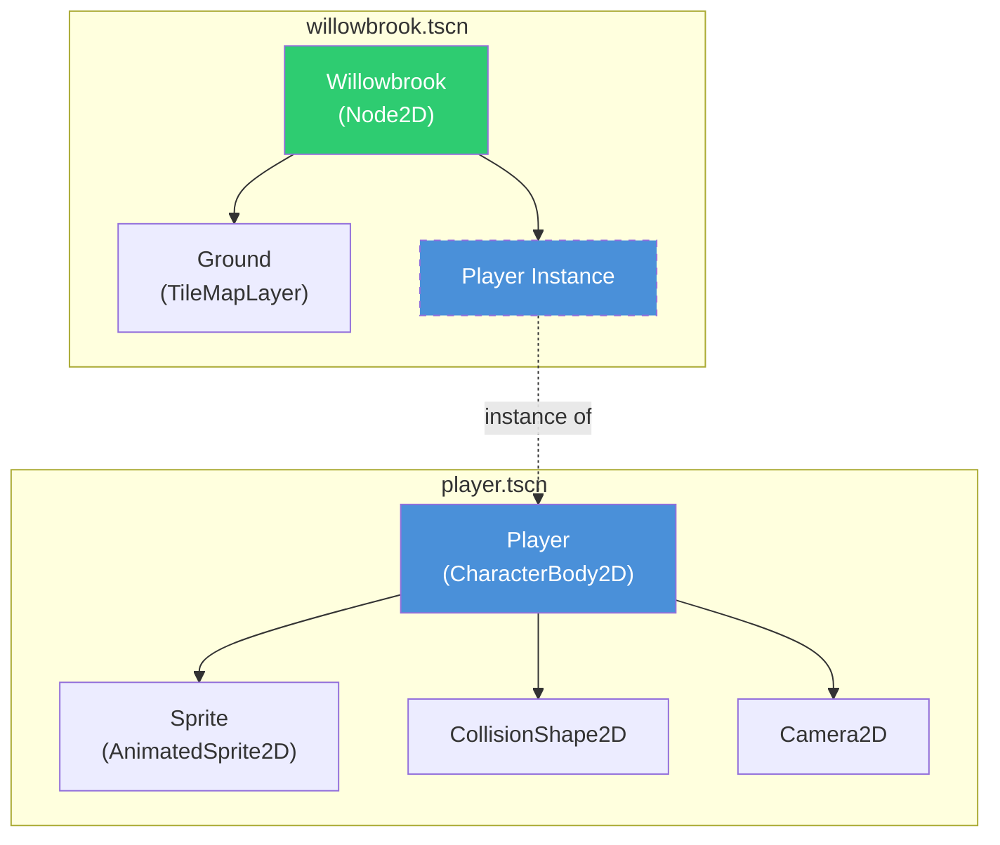
```mermaid
graph TD
    subgraph "player.tscn"
        P["Player\n(CharacterBody2D)"]
        S["Sprite\n(AnimatedSprite2D)"]
        C["CollisionShape2D"]
        Cam["Camera2D"]
        P --> S
        P --> C
        P --> Cam
    end

    subgraph "willowbrook.tscn"
        W["Willowbrook\n(Node2D)"]
        G["Ground\n(TileMapLayer)"]
        PI["Player Instance"]
        W --> G
        W --> PI
    end

    PI -. "instance of" .-> P

    style P fill:#4a90d9,color:#fff
    style W fill:#2ecc71,color:#fff
    style PI fill:#4a90d9,color:#fff,stroke-dasharray: 5 5
```

---

## Module 02 — GDScript for Programmers

### Node Lifecycle Callbacks

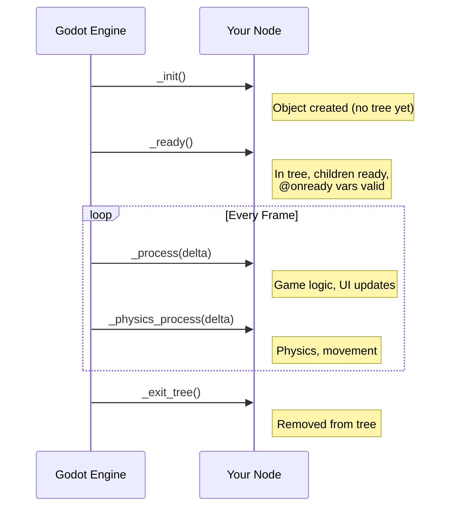
```mermaid
sequenceDiagram
    participant Engine as Godot Engine
    participant Node as Your Node

    Engine->>Node: _init()
    Note right of Node: Object created (no tree yet)
    Engine->>Node: _ready()
    Note right of Node: In tree, children ready,<br/>@onready vars valid
    loop Every Frame
        Engine->>Node: _process(delta)
        Note right of Node: Game logic, UI updates
        Engine->>Node: _physics_process(delta)
        Note right of Node: Physics, movement
    end
    Engine->>Node: _exit_tree()
    Note right of Node: Removed from tree
```

### @export and @onready Flow

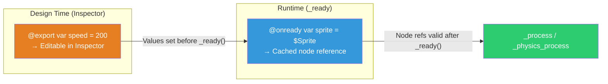
```mermaid
graph LR
    subgraph "Design Time (Inspector)"
        Export["@export var speed = 200\n→ Editable in Inspector"]
    end
    subgraph "Runtime (_ready)"
        Onready["@onready var sprite = $Sprite\n→ Cached node reference"]
    end

    Export --> |"Values set before _ready()"| Onready
    Onready --> |"Node refs valid after _ready()"| GameLoop["_process / _physics_process"]

    style Export fill:#e67e22,color:#fff
    style Onready fill:#3498db,color:#fff
    style GameLoop fill:#2ecc71,color:#fff
```

---

## Module 03 — Thinking in Scenes

### Composition over Inheritance

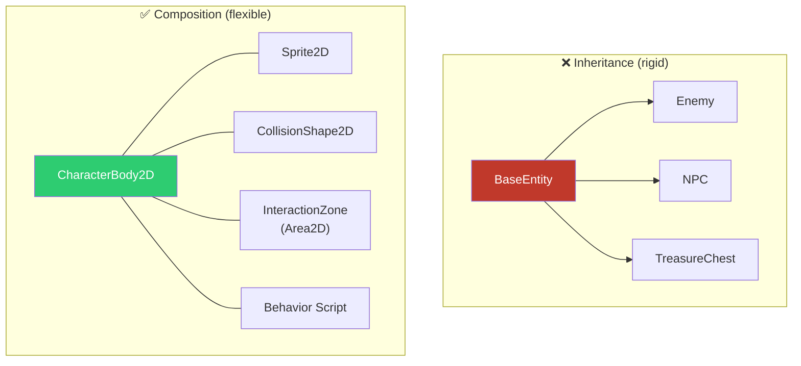
```mermaid
graph TD
    subgraph "❌ Inheritance (rigid)"
        Base["BaseEntity"] --> Enemy
        Base --> NPC
        Base --> Chest["TreasureChest"]
    end

    subgraph "✅ Composition (flexible)"
        CB["CharacterBody2D"]
        CB --- Sp["Sprite2D"]
        CB --- Col["CollisionShape2D"]
        CB --- IZ["InteractionZone\n(Area2D)"]
        CB --- Script["Behavior Script"]
    end

    style Base fill:#c0392b,color:#fff
    style CB fill:#2ecc71,color:#fff
```

### Signal Communication Pattern

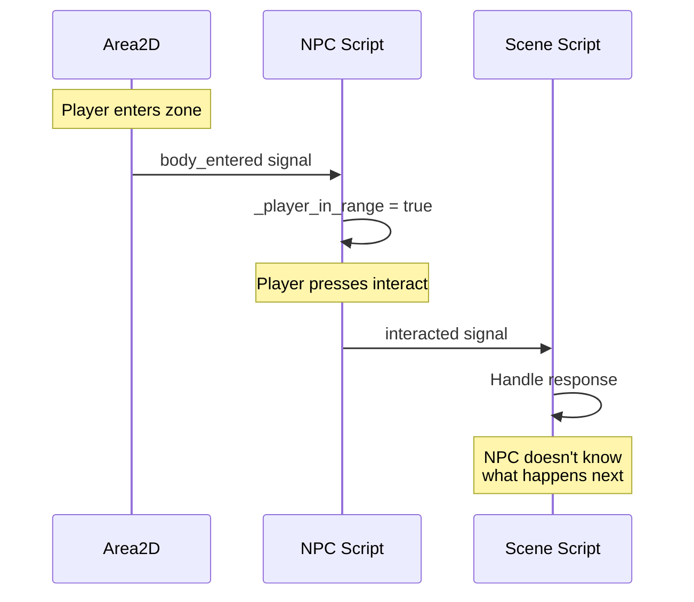
```mermaid
sequenceDiagram
    participant Area as Area2D
    participant NPC as NPC Script
    participant Scene as Scene Script

    Note over Area: Player enters zone
    Area->>NPC: body_entered signal
    NPC->>NPC: _player_in_range = true
    Note over NPC: Player presses interact
    NPC->>Scene: interacted signal
    Scene->>Scene: Handle response
    Note over Scene: NPC doesn't know<br/>what happens next
```

---

## Module 05 — TileMaps and Terrain

### TileMapLayer Architecture

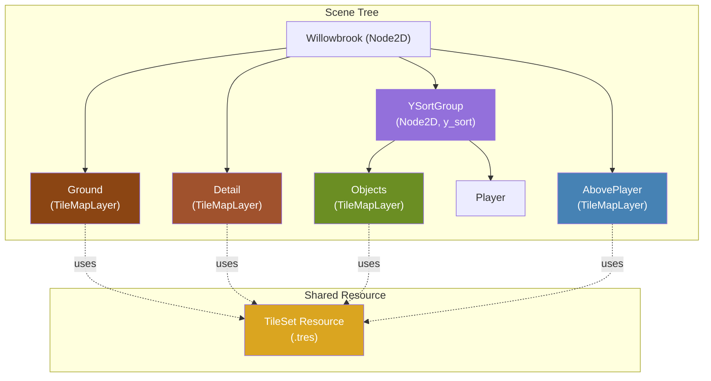
```mermaid
graph TD
    subgraph "Scene Tree"
        Root["Willowbrook (Node2D)"]
        G["Ground\n(TileMapLayer)"]
        D["Detail\n(TileMapLayer)"]
        YS["YSortGroup\n(Node2D, y_sort)"]
        O["Objects\n(TileMapLayer)"]
        Player["Player"]
        AP["AbovePlayer\n(TileMapLayer)"]

        Root --> G
        Root --> D
        Root --> YS
        YS --> O
        YS --> Player
        Root --> AP
    end

    subgraph "Shared Resource"
        TS["TileSet Resource\n(.tres)"]
    end

    G -. "uses" .-> TS
    D -. "uses" .-> TS
    O -. "uses" .-> TS
    AP -. "uses" .-> TS

    style G fill:#8B4513,color:#fff
    style D fill:#A0522D,color:#fff
    style O fill:#6B8E23,color:#fff
    style AP fill:#4682B4,color:#fff
    style TS fill:#DAA520,color:#fff
    style YS fill:#9370DB,color:#fff
```

### Rendering Order (Bottom to Top)

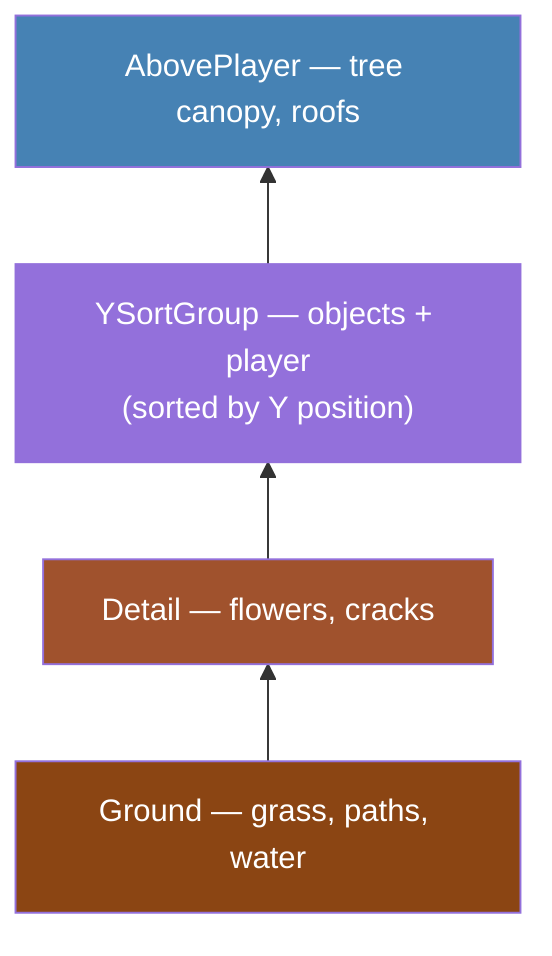
```mermaid
graph BT
    G["Ground — grass, paths, water"] --> D["Detail — flowers, cracks"]
    D --> YS["YSortGroup — objects + player\n(sorted by Y position)"]
    YS --> AP["AbovePlayer — tree canopy, roofs"]

    style G fill:#8B4513,color:#fff
    style D fill:#A0522D,color:#fff
    style YS fill:#9370DB,color:#fff
    style AP fill:#4682B4,color:#fff
```

---

## Module 06 — Player Character

### Player State Machine

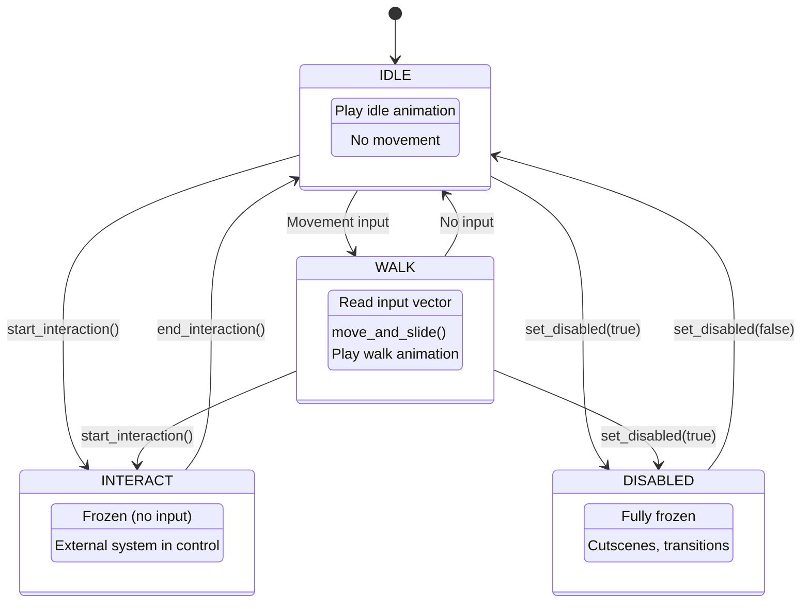
```mermaid
stateDiagram-v2
    [*] --> IDLE

    IDLE --> WALK : Movement input
    WALK --> IDLE : No input
    IDLE --> INTERACT : start_interaction()
    WALK --> INTERACT : start_interaction()
    INTERACT --> IDLE : end_interaction()
    IDLE --> DISABLED : set_disabled(true)
    WALK --> DISABLED : set_disabled(true)
    DISABLED --> IDLE : set_disabled(false)

    state IDLE {
        [*] : Play idle animation
        [*] : No movement
    }
    state WALK {
        [*] : Read input vector
        [*] : move_and_slide()
        [*] : Play walk animation
    }
    state INTERACT {
        [*] : Frozen (no input)
        [*] : External system in control
    }
    state DISABLED {
        [*] : Fully frozen
        [*] : Cutscenes, transitions
    }
```

---

## Module 07 — Scene Transitions

### SceneManager Transition Flow

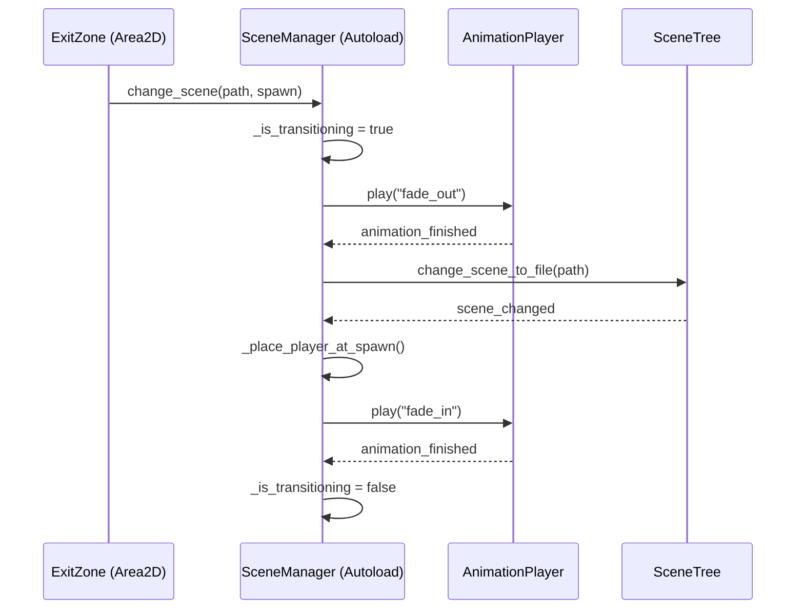
```mermaid
sequenceDiagram
    participant EZ as ExitZone (Area2D)
    participant SM as SceneManager (Autoload)
    participant Anim as AnimationPlayer
    participant Tree as SceneTree

    EZ->>SM: change_scene(path, spawn)
    SM->>SM: _is_transitioning = true
    SM->>Anim: play("fade_out")
    Anim-->>SM: animation_finished
    SM->>Tree: change_scene_to_file(path)
    Tree-->>SM: scene_changed
    SM->>SM: _place_player_at_spawn()
    SM->>Anim: play("fade_in")
    Anim-->>SM: animation_finished
    SM->>SM: _is_transitioning = false
```

### Autoload Persistence

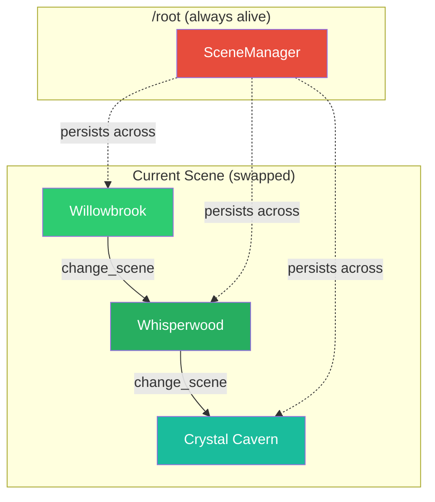
```mermaid
graph TD
    subgraph "/root (always alive)"
        SM["SceneManager"]
    end

    subgraph "Current Scene (swapped)"
        W["Willowbrook"] -->|change_scene| WW["Whisperwood"]
        WW -->|change_scene| CC["Crystal Cavern"]
    end

    SM -. "persists across" .-> W
    SM -. "persists across" .-> WW
    SM -. "persists across" .-> CC

    style SM fill:#e74c3c,color:#fff
    style W fill:#2ecc71,color:#fff
    style WW fill:#27ae60,color:#fff
    style CC fill:#1abc9c,color:#fff
```

---

## Module 09 — Resources, the Data Layer

### The Three-File Pattern

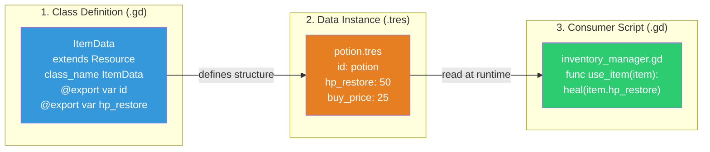
```mermaid
graph LR
    subgraph "1. Class Definition (.gd)"
        RC["ItemData\nextends Resource\nclass_name ItemData\n@export var id\n@export var hp_restore"]
    end
    subgraph "2. Data Instance (.tres)"
        DI["potion.tres\nid: potion\nhp_restore: 50\nbuy_price: 25"]
    end
    subgraph "3. Consumer Script (.gd)"
        CS["inventory_manager.gd\nfunc use_item(item):\n  heal(item.hp_restore)"]
    end

    RC --> |"defines structure"| DI
    DI --> |"read at runtime"| CS

    style RC fill:#3498db,color:#fff
    style DI fill:#e67e22,color:#fff
    style CS fill:#2ecc71,color:#fff
```

### Resource Sharing and References

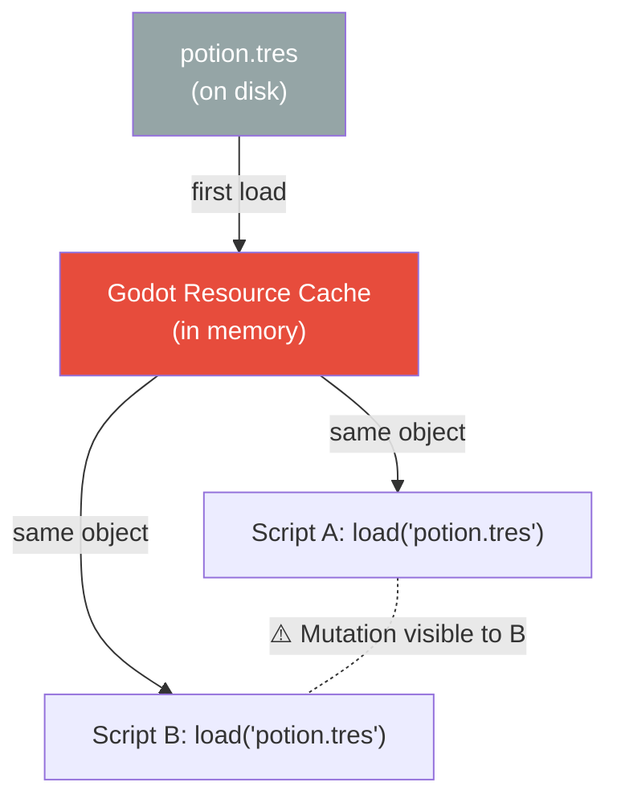
```mermaid
graph TD
    File["potion.tres\n(on disk)"]
    Cache["Godot Resource Cache\n(in memory)"]
    A["Script A: load('potion.tres')"]
    B["Script B: load('potion.tres')"]

    File --> |"first load"| Cache
    Cache --> |"same object"| A
    Cache --> |"same object"| B

    A -.- |"⚠️ Mutation visible to B"| B

    style File fill:#95a5a6,color:#fff
    style Cache fill:#e74c3c,color:#fff
```

---

## Module 10 — NPCs and Interaction

### Interaction Detection Flow

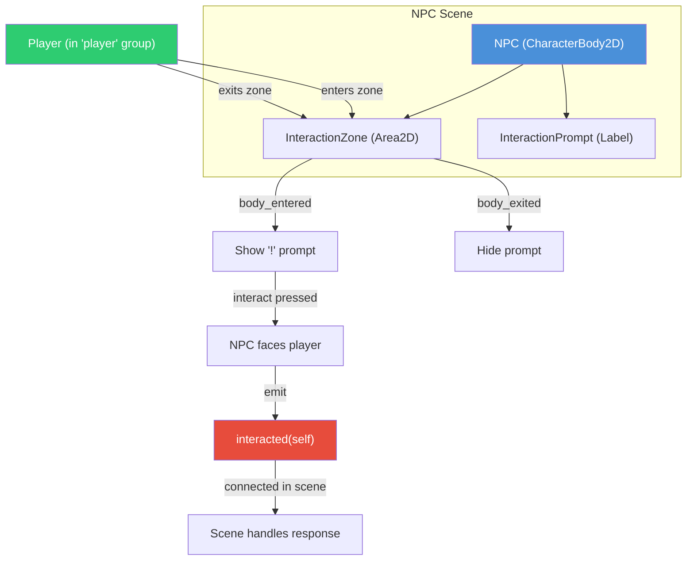
```mermaid
graph TD
    subgraph "NPC Scene"
        NPC["NPC (CharacterBody2D)"]
        IZ["InteractionZone (Area2D)"]
        Prompt["InteractionPrompt (Label)"]
        NPC --> IZ
        NPC --> Prompt
    end

    Player["Player (in 'player' group)"]

    Player -->|enters zone| IZ
    IZ -->|body_entered| Show["Show '!' prompt"]
    Show -->|interact pressed| Face["NPC faces player"]
    Face -->|emit| Signal["interacted(self)"]
    Signal -->|connected in scene| Handler["Scene handles response"]

    Player -->|exits zone| IZ
    IZ -->|body_exited| Hide["Hide prompt"]

    style NPC fill:#4a90d9,color:#fff
    style Player fill:#2ecc71,color:#fff
    style Signal fill:#e74c3c,color:#fff
```

---

## Module 11 — The Dialogue System

### Dialogue Box State Flow

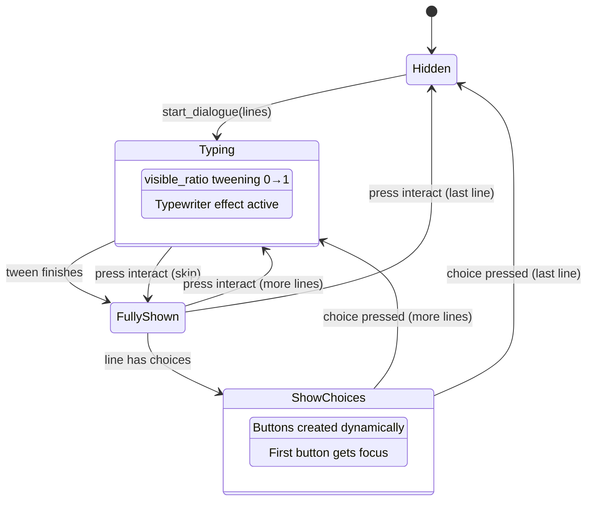
```mermaid
stateDiagram-v2
    [*] --> Hidden

    Hidden --> Typing : start_dialogue(lines)
    Typing --> FullyShown : tween finishes
    Typing --> FullyShown : press interact (skip)
    FullyShown --> Typing : press interact (more lines)
    FullyShown --> ShowChoices : line has choices
    ShowChoices --> Typing : choice pressed (more lines)
    ShowChoices --> Hidden : choice pressed (last line)
    FullyShown --> Hidden : press interact (last line)

    state Typing {
        [*] : visible_ratio tweening 0→1
        [*] : Typewriter effect active
    }
    state ShowChoices {
        [*] : Buttons created dynamically
        [*] : First button gets focus
    }
```

### Dialogue UI Node Hierarchy

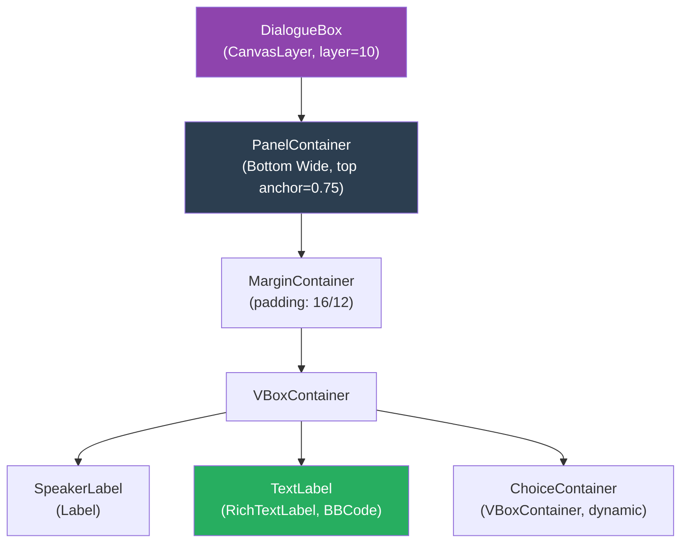
```mermaid
graph TD
    DBox["DialogueBox\n(CanvasLayer, layer=10)"]
    PC["PanelContainer\n(Bottom Wide, top anchor=0.75)"]
    MC["MarginContainer\n(padding: 16/12)"]
    VB["VBoxContainer"]
    SL["SpeakerLabel\n(Label)"]
    TL["TextLabel\n(RichTextLabel, BBCode)"]
    CC["ChoiceContainer\n(VBoxContainer, dynamic)"]

    DBox --> PC --> MC --> VB
    VB --> SL
    VB --> TL
    VB --> CC

    style DBox fill:#8e44ad,color:#fff
    style PC fill:#2c3e50,color:#fff
    style TL fill:#27ae60,color:#fff
```

---

## Module 12 — Inventory System

### Inventory Signal Architecture

```mermaid
graph LR
    IM["InventoryManager\n(Autoload)"]
    UI["InventoryScreen\n(UI)"]
    Slot["ItemSlot"]

    IM -->|inventory_changed| UI
    IM -->|gold_changed| UI
    UI -->|_refresh()| Slot
    Slot -->|slot_selected| UI
    Slot -->|slot_activated| UI
    UI -->|use_item()| IM

    style IM fill:#e74c3c,color:#fff
    style UI fill:#3498db,color:#fff
    style Slot fill:#2ecc71,color:#fff
```

### Pause and Process Mode

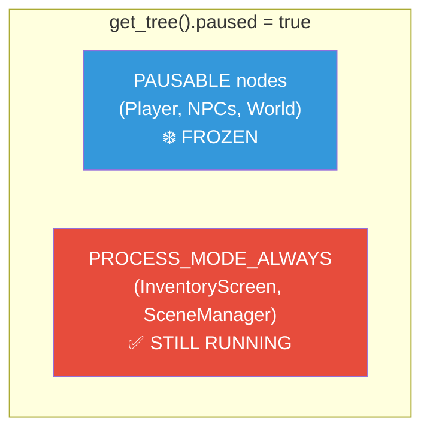
```mermaid
graph TD
    subgraph "get_tree().paused = true"
        Paused["PAUSABLE nodes\n(Player, NPCs, World)\n❄️ FROZEN"]
        Always["PROCESS_MODE_ALWAYS\n(InventoryScreen, SceneManager)\n✅ STILL RUNNING"]
    end

    style Paused fill:#3498db,color:#fff
    style Always fill:#e74c3c,color:#fff
```

---

## Module 14 — Battle Foundations

### Battle State Machine

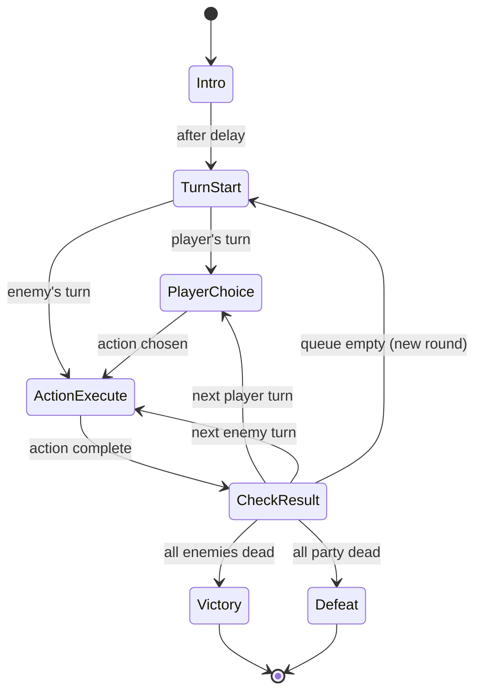
```mermaid
stateDiagram-v2
    [*] --> Intro

    Intro --> TurnStart : after delay

    TurnStart --> PlayerChoice : player's turn
    TurnStart --> ActionExecute : enemy's turn

    PlayerChoice --> ActionExecute : action chosen

    ActionExecute --> CheckResult : action complete

    CheckResult --> Victory : all enemies dead
    CheckResult --> Defeat : all party dead
    CheckResult --> PlayerChoice : next player turn
    CheckResult --> ActionExecute : next enemy turn
    CheckResult --> TurnStart : queue empty (new round)

    Victory --> [*]
    Defeat --> [*]
```

### Turn Queue Building

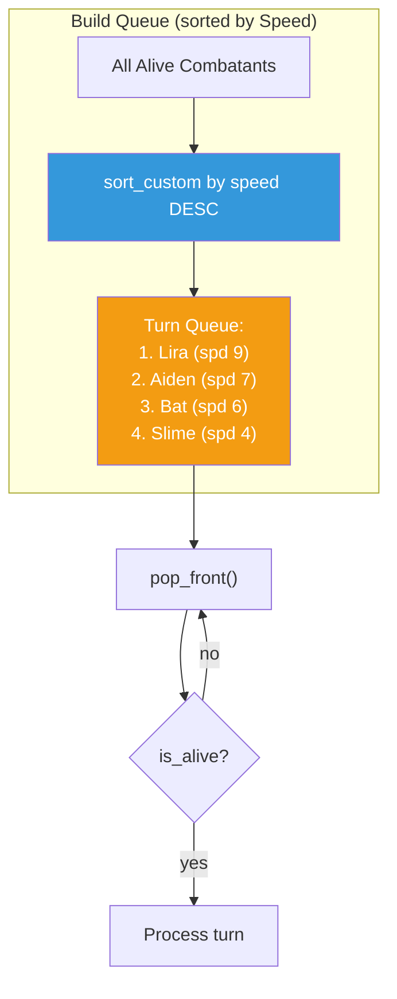
```mermaid
graph TD
    subgraph "Build Queue (sorted by Speed)"
        All["All Alive Combatants"]
        Sort["sort_custom by speed DESC"]
        Queue["Turn Queue:\n1. Lira (spd 9)\n2. Aiden (spd 7)\n3. Bat (spd 6)\n4. Slime (spd 4)"]
    end

    All --> Sort --> Queue

    Queue --> Pop["pop_front()"]
    Pop --> Alive{"is_alive?"}
    Alive -->|yes| Process["Process turn"]
    Alive -->|no| Pop

    style Queue fill:#f39c12,color:#fff
    style Sort fill:#3498db,color:#fff
```

### Battle Scene Layout

```mermaid
graph TD
    Battle["Battle (Node2D)"]
    BG["Background\n(ColorRect)"]
    PP["PartyPositions"]
    EP["EnemyPositions"]
    BUI["BattleUI\n(CanvasLayer)"]
    SM["StateMachine\n(BattleStateMachine)"]

    Battle --> BG
    Battle --> PP
    Battle --> EP
    Battle --> BUI
    Battle --> SM

    PP --> PS0["Slot0 (240,60)"]
    PP --> PS1["Slot1 (240,120)"]

    EP --> ES0["Slot0 (80,60)"]
    EP --> ES1["Slot1 (80,120)"]
    EP --> ES2["Slot2 (80,180)"]

    SM --> Intro
    SM --> TS["TurnStart"]
    SM --> PC["PlayerChoice"]
    SM --> AE["ActionExecute"]
    SM --> CR["CheckResult"]
    SM --> V["Victory"]
    SM --> D["Defeat"]

    style Battle fill:#2c3e50,color:#fff
    style SM fill:#e74c3c,color:#fff
    style PP fill:#3498db,color:#fff
    style EP fill:#c0392b,color:#fff
```

---

## Module 15 — Player Actions

### Command Pattern Flow

```mermaid
sequenceDiagram
    participant Menu as BattleMenu
    participant PC as PlayerChoice State
    participant TS as TargetSelect
    participant AE as ActionExecute State

    PC->>Menu: show_menu()
    Menu->>PC: action_chosen("attack")
    PC->>Menu: hide_menu()
    PC->>TS: show_targets(enemies)
    TS->>PC: target_selected(target)
    PC->>AE: transition with command dict
    Note over AE: {action: "attack",<br/>battler: aiden,<br/>target: slime}
    AE->>AE: Execute + animate
```

### Damage Formula

```mermaid
graph LR
    ATK["Attacker ATK"] --> Raw["Raw = ATK - DEF"]
    DEF["Target DEF\n+ defense_boost"] --> Raw
    Raw --> Var["+ randi_range(-2, 2)"]
    Var --> Min["max(1, result)"]
    Min --> DMG["Final Damage"]

    style ATK fill:#e74c3c,color:#fff
    style DEF fill:#3498db,color:#fff
    style DMG fill:#f39c12,color:#fff
```

---

## Module 16 — Crystal Cavern

### Dungeon Room Layout

```mermaid
graph LR
    E["Entrance"] --> MC["Main Corridor"]
    MC --> Fork["Fork"]
    Fork --> DE["Dead End\n🗃️ Treasure"]
    Fork --> DC["Deep Cavern"]
    DC --> SC["Save Crystal\n💎"]
    DC --> BR["Boss Room\n🚪 Locked Door"]

    style E fill:#2ecc71,color:#fff
    style DE fill:#f39c12,color:#fff
    style SC fill:#9b59b6,color:#fff
    style BR fill:#e74c3c,color:#fff
```

---

## Module 17 — Enemies and AI

### Encounter System Flow

```mermaid
graph TD
    Walk["Player walks"] --> Dist{"Moved 16px?"}
    Dist -->|no| Walk
    Dist -->|yes| Inc["step_count += 1"]
    Inc --> Thresh{"step_count >= threshold?"}
    Thresh -->|no| Walk
    Thresh -->|yes| Reset["Reset counter\nNew threshold: 8-20"]
    Reset --> Rate{"randf() < encounter_rate?"}
    Rate -->|no| Walk
    Rate -->|yes| Pick["Pick weighted encounter"]
    Pick --> Battle["Start battle!"]

    style Battle fill:#e74c3c,color:#fff
    style Pick fill:#f39c12,color:#fff
```

### Oddment Table (Weighted Selection)

```mermaid
pie title Encounter Probabilities
    "Cave Bats (w=1.0)" : 53
    "Crystal Slimes (w=0.6)" : 32
    "Stone Golem (w=0.3)" : 16
```

### AI Decision Trees

```mermaid
graph TD
    subgraph "AGGRESSIVE"
        A1["Find lowest HP target"] --> A2["Attack it"]
    end

    subgraph "CAUTIOUS"
        C1{"HP < 30%?"} -->|yes| C2["Defend"]
        C1 -->|no| C3["Attack random"]
    end

    subgraph "BALANCED"
        B1{"randf() < 0.3?"} -->|yes| B2["Defend"]
        B1 -->|no| B3["Attack random"]
    end

    style A2 fill:#e74c3c,color:#fff
    style C2 fill:#3498db,color:#fff
    style B2 fill:#3498db,color:#fff
```

---

## Module 18 — Victory and Leveling

### XP and Level-Up Flow

```mermaid
sequenceDiagram
    participant VS as Victory State
    participant CD as CharacterData
    participant IM as InventoryManager

    VS->>VS: Sum enemy XP, gold, drops
    VS->>CD: grant_xp(xp_per_member)

    loop While current_xp >= xp_for_level
        CD->>CD: level_up()
        CD->>CD: Apply growth + variance
        Note right of CD: HP +12-14, ATK +3-4<br/>DEF +1-2, SPD +1
    end

    CD-->>VS: Returns level_up results

    VS->>VS: sync_party_to_character_data()
    VS->>IM: add_gold(total)
    VS->>IM: add_item(drops)
    VS->>VS: Return to overworld
```

### XP Curve Shape

```mermaid
xychart-beta
    title "XP Required per Level (level² × 10)"
    x-axis "Level" [1, 2, 3, 4, 5, 6, 7, 8, 9, 10]
    y-axis "XP to Next" 0 --> 1100
    bar [10, 40, 90, 160, 250, 360, 490, 640, 810, 1000]
```

---

## Module 20 — Quest System

### Quest Lifecycle

```mermaid
stateDiagram-v2
    [*] --> NOT_STARTED

    NOT_STARTED --> ACTIVE : start_quest()
    ACTIVE --> COMPLETE : all objective_flags set
    COMPLETE --> TURNED_IN : turn_in_quest()

    state ACTIVE {
        [*] : Objectives tracked
        [*] : flag_changed checks progress
    }
    state COMPLETE {
        [*] : All flags met
        [*] : Awaiting NPC turn-in
    }
    state TURNED_IN {
        [*] : Rewards granted
        [*] : completion_flag set
    }
```

### Flag-Driven Reactive Dialogue

```mermaid
graph TD
    Talk["Player talks to Fynn"] --> Check1{"talked_to_fynn?"}
    Check1 -->|no| First["First meeting dialogue\nSet talked_to_fynn\nStart quest"]
    Check1 -->|yes| Check2{"pendant_found?"}
    Check2 -->|no| Wait["'Any luck finding it?'"]
    Check2 -->|yes| Check3{"pendant_returned?"}
    Check3 -->|no| TurnIn["'You found it!'\nTurn in quest → rewards"]
    Check3 -->|yes| Post["'Thanks again!'"]

    style First fill:#3498db,color:#fff
    style TurnIn fill:#2ecc71,color:#fff
```

---

## Module 21 — Party and Equipment

### Equipment Stat Pipeline

```mermaid
graph LR
    Base["Base Stats\n(CharacterData .tres)"] --> Eff["Effective Stats"]
    Equip["Equipment Bonuses\n(weapon.attack_bonus)"] --> Eff
    Eff --> Battle["BattlerData\ninitialize_from_character()"]
    Buff["Temp Buffs\n(defense_boost)"] --> Combat["Combat Calculation"]
    Battle --> Combat

    style Base fill:#3498db,color:#fff
    style Equip fill:#f39c12,color:#fff
    style Buff fill:#e74c3c,color:#fff
    style Combat fill:#2ecc71,color:#fff
```

### Autoload Architecture (Complete)

```mermaid
graph TD
    subgraph "Persistent Autoloads (/root)"
        SM["SceneManager\n(Module 7)"]
        IM["InventoryManager\n(Module 12)"]
        GM["GameManager\n(Module 20)"]
        QM["QuestManager\n(Module 20)"]
        PM["PartyManager\n(Module 21)"]
        SVM["SaveManager\n(Module 22)"]
        MM["MusicManager\n(Module 24)"]
        Pause["PauseMenu\n(Module 25)"]
    end

    subgraph "Scene (swapped at runtime)"
        Scene["Current Gameplay Scene"]
    end

    QM --> |"listens to flag_changed"| GM
    SVM --> |"serializes/restores"| GM
    SVM --> |"serializes/restores"| IM
    SVM --> |"serializes/restores"| PM
    SVM --> |"serializes/restores"| QM
    SM --> |"transitions"| Scene

    style SM fill:#e74c3c,color:#fff
    style IM fill:#e67e22,color:#fff
    style GM fill:#2ecc71,color:#fff
    style QM fill:#27ae60,color:#fff
    style PM fill:#3498db,color:#fff
    style SVM fill:#9b59b6,color:#fff
    style MM fill:#f1c40f,color:#000
    style Pause fill:#95a5a6,color:#fff
```

---

## Module 22 — Save and Load

### Save/Load Round-Trip

```mermaid
sequenceDiagram
    participant Crystal as Save Crystal
    participant SVM as SaveManager
    participant GM as GameManager
    participant IM as InventoryManager
    participant PM as PartyManager
    participant QM as QuestManager
    participant File as JSON File

    Note over Crystal: SAVE
    Crystal->>SVM: save_game(slot)
    SVM->>GM: to_save_data()
    SVM->>IM: to_save_data()
    SVM->>PM: to_save_data()
    SVM->>QM: to_save_data()
    SVM->>File: JSON.stringify → write

    Note over Crystal: LOAD
    SVM->>File: read → JSON.parse
    SVM->>GM: from_save_data(dict)
    SVM->>IM: from_save_data(dict)
    SVM->>PM: from_save_data(dict)
    SVM->>QM: from_save_data(dict)
    SVM->>SVM: change_scene + restore position
```

### World Object Persistence via Flags

```mermaid
graph TD
    Chest["TreasureChest\nscene_key + chest_id"]
    Open["_open()"]
    Flag["GameManager.set_flag\n('world.crystal_cavern.chest_01.opened')"]
    Ready["_ready() checks flag"]
    Skip["Already opened → skip prompt"]

    Chest -->|interact| Open
    Open --> Flag
    Flag -->|saved with game| Ready
    Ready -->|flag is true| Skip

    style Flag fill:#e74c3c,color:#fff
    style Chest fill:#f39c12,color:#fff
```

---

## Module 24 — Audio

### Music Crossfade System

```mermaid
sequenceDiagram
    participant MM as MusicManager
    participant PA as PlayerA
    participant PB as PlayerB

    Note over PA: Playing town_theme at 0 dB
    MM->>MM: play_music("forest_theme")
    MM->>PB: stream = forest_theme
    MM->>PB: volume = -40 dB, play()

    par Crossfade Tween
        MM->>PA: tween volume → -40 dB
        MM->>PB: tween volume → 0 dB
    end

    PA->>PA: stop()
    Note over PB: Now active player
```

### Audio Bus Routing

```mermaid
graph TD
    Master["Master Bus"]
    Music["Music Bus\n(BGM tracks)"]
    SFX["SFX Bus\n(attack hits, menus)"]

    Music --> Master
    SFX --> Master

    Slider1["Music Slider\n(0.0 → 1.0)"] -->|linear_to_db| Music
    Slider2["SFX Slider\n(0.0 → 1.0)"] -->|linear_to_db| SFX

    style Master fill:#2c3e50,color:#fff
    style Music fill:#8e44ad,color:#fff
    style SFX fill:#e67e22,color:#fff
```

---

## Module 25 — Title Screen and Game Flow

### Complete Game Loop

```mermaid
graph TD
    Title["Title Screen"]
    NG["New Game\n(fresh state)"]
    Cont["Continue\n(load save)"]
    WB["Willowbrook"]
    WW["Whisperwood"]
    CC["Crystal Cavern"]
    Boss["Boss Fight"]
    Vic["Victory"]
    Def["Defeat"]
    End["Ending"]
    Cred["Credits"]
    GO["Game Over"]

    Title -->|"New Game"| NG --> WB
    Title -->|"Continue"| Cont --> WB

    WB <-->|transition| WW
    WW <-->|transition| CC
    CC -->|boss trigger| Boss

    Boss -->|win| Vic
    Boss -->|lose| Def
    Vic --> End --> Cred --> Title
    Def --> GO
    GO -->|"Load Save"| Cont
    GO -->|"Return to Title"| Title

    subgraph "During Gameplay"
        Pause["Escape → Pause Menu"]
        Pause --> Inv["Inventory"]
        Pause --> Eq["Equipment"]
        Pause --> QL["Quest Log"]
        Pause --> Set["Settings"]
        Pause --> Quit["Quit to Title"]
        Quit --> Title
    end

    WB -.- Pause
    WW -.- Pause
    CC -.- Pause

    style Title fill:#8e44ad,color:#fff
    style Boss fill:#e74c3c,color:#fff
    style End fill:#f39c12,color:#fff
    style GO fill:#c0392b,color:#fff
    style Cred fill:#3498db,color:#fff
```
